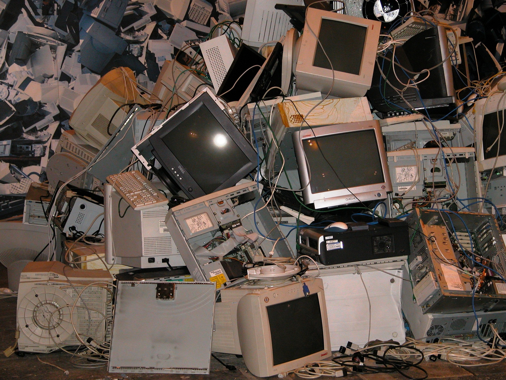
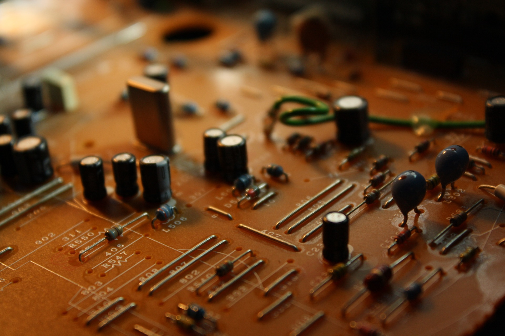
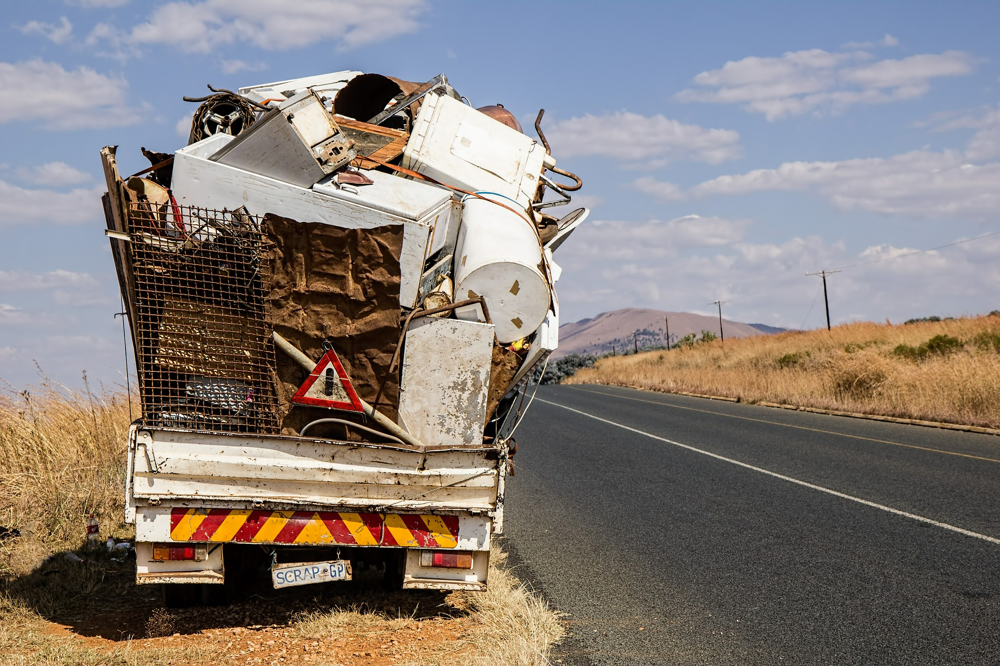
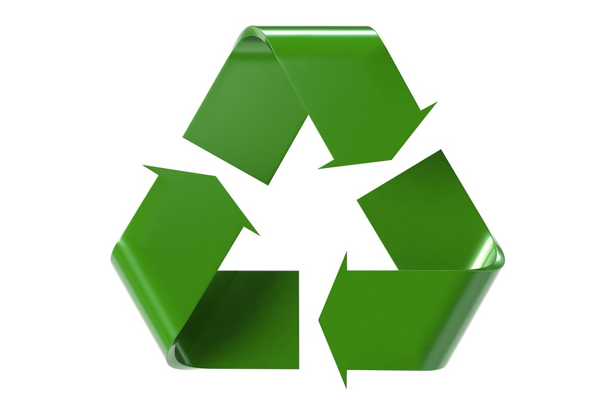

Одлагање дигиталног отпада и заштита животне средине
====================================================

Некада су се исти електронски уређаји користили годинама и трајали деценијама. Данас, услед велике брзине развоја нових технологија и нових сервиса, стално се израђују нови модели уређаја са бољим карактеристикама и напреднијим могућностима. 
Тако се лични рачунари практично користе у просеку од три до пет година, након чега се јавља потреба за њиховом заменом како би могли да подрже нови, напреднији и захтевнији софтвер. 
Мобилни телефони се мењају веома брзо услед праћења трендова и развоја нових апликација, па се тако најчешће замењују на мање од пет година. 
Шта се дешава са старим ИКТ уређајима које више не користимо због квара, застарелости или других разлога? 
Они представљају дигитални отпад којим се мора руковати опрезно.

ИКТ уређаје који се више не користе не треба држати у становима и кућама и не треба их одлагати у контејнере за смеће нити поред њих. Никако их не смемо бацати негде у природу нити у реке. 
За разлику од природног отпада, остатака хране, који временом у земљи иструли и не загађује природну средину, код електронског, односно дигиталног отпада то није случај јер се он неће разградити и може тако годинама стајати и угрожавати нашу животну средину. 
ИКТ уређаји садрже различите компоненте: штампане електричне плоче, батерије, тврде дискове, кондензаторе, отпорнике и тако даље. Ове компоненте у себи садрже тешке метале (живу, кадмијум и хром), арсен, азбест и сличне супстанце које могу угрозити животну средину. 
Непажљиво руковање дигиталним отпадом може довести до директних штетних утицаја на људско здравље као и до загађења животне средине, земљишта, подземних вода, биљака, па тако и до индиректног утицаја на људско здравље. 
На пример, олово, које се налази у мониторима и штампаним плочама, узрокује оштећење централног и периферног нервног система, кардиоваскуларног система, бубрега и репродуктивних органа. Жива, која се користи у екранима и у мобилним уређајима, може проузроковати оштећења мозга и бубрега. 
У том смислу треба бити свестан утицаја дигиталних технологија на животну средину и о важности квалитетног и исправног збрињавања дигиталног отпада у циљу отклањања здравствених ризика узрокованих ослобађањем опасних материја из њега.

Свако растављање или спаљивање дигиталног отпада има за последицу испуштање отрова, па је зато пожељно дигитални отпад уколико се не може поправити, рециклирати и тако поново користи, или га одлагати смештањем на посебне депоније. 
Под рециклажом одбачених ИКТ уређаја подразумевамо издвајање материјала из отпада и његово поновно коришћење. Рециклирање (од енглеске речи Recycle) је скуп активности које омогућавају поновно коришћење отпадних материјала. 
Процес рециклаже обухвата сакупљање отпада, његово раздвајање, прераду и израду нових производа од искоришћених ствари или материјала. То се обавља у посебним фабрикама које имају опрему за рециклажу. 
Уколико се делови ИКТ уређаја који се више не користе могу довести у функционално стање, преносе се у рециклажни центар на расклапање и растављање на саставне компоненте. Оно што се може рециклирати из ових уређаја су гвоздени делови рачунара и обојени метали из рачунара, док се стакло и пластика делимично могу поново применити. 
Овако обновљени уређаји се донирају или се враћају на тржиште. Компоненте које се не могу рециклирати привремено се складиште у веће посуде ради даљег поступка. Најпогоднији дигитални отпад за рециклирање јесу рачунарски штампачи и репроматеријал (тонери, траке, и слично) јер се они после рециклирања успешно могу поново користити. 
После извесног времена и ове компоненте се растављају како би се од њих искористили метал и пластика.

Све информације о томе како се може учествовати у рециклажи у Србији а самим тим и у чувању животне средине могу се пронаћи на интернет сајту еreciklaza.com <http://www.ereciklaza.com>

