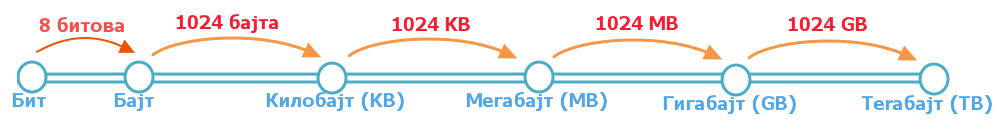

Хардвер, софтвер и сервиси
===========================

.. infonote::

 На овом часу ћемо говорити о:
    •	физичким деловима дигиталних уређаја (хардверу);
    •	програмима (софтверу) и услугама (сервисима);
    •	начину приказивања података;
    •	одржавању и правилној употреби дигиталних уређаја.

Људи свакодневно користе дигиталне уређаје на послу, у школи и код куће. 
Сваки дигитални уређаји састоје се од две основне компоненете: **хардвера** и **софтвера**. 

**Хардвер** је физички део дигиталног уређаја. Хардвер је енглеска реч (енг. *Hardware*) која у буквалном преводу значи гомила гвожђурије.

Док је **софтвер** програм или упутство које поручује хардверу шта треба да ради.

Хардвер
-------
Сви дигитални уређаји имају исти основни хардвер - тачније скуп делова који су неопходни за рад дигиталног уређаја. Неки од њих су смештени у кутији - кућишту (процесор, радна меморија, меморија за чување података, матична плоча, графичка и звучна картица), док су други видљиви (монитор, миш, тастатура, звучници). Постоји и велики број додатних уређаја (скенер, штампач, волан, џојстик) који ти омогућују да одређене задатке радиш брже и лакше. 

.. image:: ../../_images/L2S1.png
    :width: 700px
    :align: center  

На слици је приказано: 1 - скенер, 2 - процесор, 3 - радна меморија, 4 - картице за проширење, 5 - напајање, 6 – оптички диск, 7 – тврди диск, 8 – матична плоча, 9 – звучник, 10 – монитор, 11 – системски програм, 12 –кориснички програм, 13 – тастатура, 14 – миш, 15 – спољни тврди диск,  16 - штампач. Слика преузета са `линка <https://commons.wikimedia.org/wiki/File:Personal_computer,_exploded_6.svg>`_.

Најважнији делови дигиталних уређаја смештени су у кућиште. Кућиште је кутија направљена од челика или алуминијума, чија је улога да штити садржај од прашине и температуре, као и од случајног контакта са течношћу. 

Ако отворимо кућиште било ког дигиталног уређаја, можемо пронаћи следеће компоненте:
  
.. image:: ../../_images/L2S25.png
    :width: 800px
    :align: center 

**Процесор** je уређај који извршава наредбе и обрађује податке.

**Радна меморија** je уређај који чува податке и програме са којима процесор ради. Она омогућује процесору да брзо приступа потребним подацима и програмима. Када рачунар искључиш, процесор престаје са радом, а из радне меморије све се брише.

**Тврди диск** или **хард диск** представља уређај који у себи има врсту меморије која трајно чува податке и програме, без обзира да ли је рачунар укључен или не. 

Основна јединица изражава се у бајтим (B), тачније KB (килобајт), MB (мегабајт) и TB (терабајт). 

**Графичка картица** je уређај који је задужен да створи и контролише слику која се приказује на екрану дигиталног уређаја.

**Звучна картица** je уређај који, уз звучнике, обезбеђује да чујемо звук.

**Матична плоча** je уређај који повезује све делове рачунарског система у једну складну целину.

Врло су важни делови помоћу којих задајемо наредбе дигиталном уређају. То најчешће радимо коришћењем **тастатуре** и **миша**. 

Тастатура обезбеђује унос текста, бројева, знакова и инструкција. Код десктоп и лаптоп рачунара тастатура је физичка компонента, док је код „паметних“ телефона и таблета она виртуелна (слова, бројеве и знакове куцамо додиривањем одређених делова екрана).

Помоћу миша померамо курсор на екрану и задајемо наредбе.

Повратну информацију (одговор на наредбе, резултат) дигитални уређај нам саопштава на екрану. **Екран** је уређај који приказује слику – екран телефона, екран монитора, екран телевизора, екран таблета и лаптопа. Екран је осветљена плоча прекривена са два слоја филтера, један филтер контролише светлост, а други боју. Све боје на екрану добијене су мешањем три основне боје – црвене, зелене и плаве (енглески RGB, скраћени запис од red, green and blue). 
Таблети и већина телефона имају екране осетљиве на додир који имају додатни слој који је осетљив на најмање промене притиска које чинимо додиром прста, тако да их можемо користити и за давање инструкција. 

Слика коју видимо на екрану дигиталног уређаја сачињена је од **тачкица (пискела)**. Сваку слику можемо да замислимо као мозаик, састављен од пиксела распоређених по хоризонтали и вертикали. 

Број пиксела од којих је слика сачињена назива се **резолуција**. Квалитет слике приказане на екрану дигиталног уређаја зависи од квалитета графичке картице и екрана. Основна карактеристика графичких картица је максимална резолуција коју могу да прикажу. Боља графичка картица приказује више пиксела и приказује бољу слику. Осим резолуције, важан је и број боја које могу да се прикажу. 

У слици ниске резолуције пиксели су већи, па је потребно мање њих да испуне простор. То резултира сликама које изгледају блокадно или пикселирано. Слика високе резолуције има више пиксела, па изгледа много боље када је увећате или истежете. Слаба страна овако представљених слика је што ће величина датотеке бити већа.

Задатак 1:  
~~~~~~~~~~

Дата је слика:

.. image:: ../../_images/L2S4.jpg
    :width: 600px
    :align: center
 
чија је резолуција 1024x600 пиксела. 

.. fillintheblank:: L2P1

    Колико слика има тачкица по хоризонтали дигиталног уређаја? Унеси одговор. 

    Одговор: |blank|

    - :^1024$: Тачно
      :x: Одговор није тачан.

.. fillintheblank:: L2P2

    Колико слика има тачкица по вертикали дигиталног уређаја? Унеси одговор. 

    Одговор: |blank|

    - :^600$: Тачно
      :x: Одговор није тачан.

.. fillintheblank:: L2P3

    Колико је употребљено пиксела за приказивање ове слике? Унеси одговор. **Мала помоћ:** Подсети се како се израчунава површина правоугаоника. 

    Одговор: |blank|

    - :^614400$: Тачно
      :x: Одговор није тачан.

Начин приказивања података
--------------------------

Да би дигитални уређај могао да "ради" са подацима (слика, текст, број, звук) он користи електричне сигнале "укључено" и "искључено" и зато све податке види као низове бинарних бројева. Бинарни бројевни систем користи само две цифре - 1 и 0. Нула представља „искључен прекидач“, а јединица „укључен прекидач“. Свака слика коју направимо, свако преузимање са интернета, сваки дигитални снимак, свака веб страница представља само пуно битова. Ове бинарне цифре су оно што дигиталну технологију чини дигиталном! Осам битова чини бајт.
 

Репрезентација текста
---------------------

Притиском на било који тастер на тастатури, унети карактер се претвара у бинарни број како би рачунар могао да га обради. На екрану ће бити приказан знак који је унет са тастатуре.

Задатак 2:
~~~~~~~~~~

.. fillintheblank:: L2P4

    Пред тобом се налази решење 01010100 01110010 01100001 01110110 01100001 загонетке "Ја сам мала зелена, зечићу сам до рамена. Мене газе ноге босе, мене оштром косом косе." представљено у облику који рачунар разуме. Та реч је приказана преко бинарних бројева. 
    Унеси решење малим ћириличким писмом. 

    Одговор: |blank|

    - :^трава$: Тачно
      :x: Одговор није тачан.

Мала помоћ. Користи табелу за превођење текста у облик који људи разумеју:

.. image:: ../../_images/L2S6.png
    :width: 600px
    :align: center 

Репрезентација слике
--------------------

Као и текст, и слике морају да буду преведене у бинарне бројеве како би рачунар могао да их обрађује. Када их рачунар обради, на екрану корисник може да види дату слику. Као што смо већ приказали, дигиталне слике се састоје од пиксела. Сваки пиксел на слици представљен је бинарним бројевима. Ако кажемо да је 1 црна (или укључена), а 0 бела (или искључена), једноставна црно-бела слика може се креитати помоћу бинарне слике. Таква слика је представљена као мрежа пиксела, где се сваки ред пиксела преводи у бинарни број, у зависности од боје и положаја пиксела у мрежи. 
Погледај пример једне црно–беле слике, и њену бинарну репрезентацију. На доњој слици је приказан начин чувања црно-беле слике.

.. image:: ../../_images/L2S7.png
    :width: 600px
    :align: center 
 
У тренутку када се приказује резултат, дигитални уређај претвара бинарни запис слике, текста или звука у облик који је људима разумљив.

Задатак 3:
~~~~~~~~~~

Представите црно белу слику онако како је разуме рачунар, коришћењем бинарних бројева. 

.. image:: ../../_images/L2S9.png
    :width: 300px
    :align: center 

На слици су приказане две репрезентације горње слике:

.. image:: ../../_images/L2S15.png
    :width: 600px
    :align: center 

.. fillintheblank:: L2P5

    Унеси редни број слике која представља праву репрезентацију горње слике. 

    Одговор: |blank|

    - :^1$: Тачно
      :x: Одговор није тачан. 
  
Репрезентација звука
--------------------
Као и текст и слику, звук треба претворити у бинарни систем да бисмо га могли обрадити. Да бисте то учинили, звук се хвата - обично микрофоном - и затим претвара у дигитални сигнал.

Софтвер
-------

Рекли смо да реч хардвер у буквалном преводу значи гомила гвожђурије. Да би та гомила радила на правилан начин и да бисмо искористили сву њену снагу, неопходан је софтвер (енгл. software). Реч софтвер означава све оно што објашњава хардверу како да уради оно што се од њега очекује. Софтвер су пре свега програми, тј. скупови наредби које рачунар извршава да би обавио одређени посао. Са софтвером се срећемо сваки дан, било на паметном урећају или рачунару у школи или код куће. Мајнкрафт (Minecraft), Клеш Ројал (Clash Royal), ЛОЛ (League of Legends), Кантер (Counter Strike), Виндоуз (Windows), Aндроид (Android), ИОС (iOS) - све су то софтвери. 
Када су у питању мобилни уређаји (телефони и таблети) програме зовемо апликацијама (Apps).

Програми се деле на системске и апликативне. 

**Системски програми** контролишу рад самог дигиталног уређаја. У системске програме спадају: оперативни систем (Windows, Linux, Android, iOS,...) и драјвери. Оперативни систем је програм који препознаје, повезује и управља радом свих физичких делова дигиталног уређаја (хардвера). За повезивање додатних компоненти (џојстик, волан,...) неопходан је одговарајући драјвер. Драјвери су програми који омогућавају оперативном систему да на правилан начин користи постојеће или нове делове хардвера. 

**Апликативни програми** омогућују практичну примену дигиталног уређаја - то су они програми који ти посао на дигиталном уређају чине лакшим и интересантнијим: програми за обраду текста, слике, за разноврсне прорачуне, забаву....

Да би рачунар радио правилно, неопходна је синергија (јединство) свих његових компоненти: хардвера, драјвера (малих али неопходних упутстава оперативном систему), оперативног система и апликативног програма (свих оних дивних програма који нам живот чине лакшим и интересантнијим).

Сервиси
-------

У данашње време, дигитални уређаји су превазишли оквире софтвера и хардвера. 
Напредак технологије је омогућио да приступимо омиљеним садржајима и ако их немамо на рачунару, па чак и ако немамо рачунар. Колико пута до сада сте играли игрице на интернету? За играње таквих игрица није било потребно да буде инсталирана на рачунару, већ је био само потребан рачунар и веза ка интернету. Исто се односи на куцање текста или израде презентација. Телевизор више није уређај који само приказује ТВ програм. Чак и преко телевизора можемо да приступимо омиљеним видео спотовима или да погледамо омиљену серију коју смо пропустили, могуће је комуницирати са другима, и сл. Све те могућности имамо захваљујућу напретку технологије и њих једним именом називамо сервиси (услуге).
Захваљујући сервисима, постало је могуће дељење, чување и приступ документима са било ког места и у било које време. 

**Рад у облаку података** је сервис који подразумева сараднички рад и чување података на удаљеним рачунарима, уместо на личном дигиталном уређају. 
Компаније које обезбеђују сервисе често их унапређују. Сервисима приступамо коришћењем свог налога који садржи податке као што су име, презиме, држава у којој живимо и сл., и најчешће је везан за адресу електронске поште.
 
Правилно коришћење дигиталних уређаја
-------------------------------------

За рад дигиталних уређаја неопходна је струја. Када је уређај укључен, сваки додир са водом, као добрим проводником струје, могао би да изазове квар. Зато је јако важно да поред дигиталног уређаја не остављамо чашу са водом или слатким пићем. Поред тога, јако је важно да се редовно, бар једном годишње, рачунар носи у сервис на детаљно чишћење јер често прашина утиче на престанак рада појединих компоненти.

Поред прашине, вишесатно коришћење дигиталних уређаја може довести до престанка рада уређаја. Зато је добро да се након сат времена коришћења дигиталног уређаја направи пауза. 

Сасвим је природно да, након извесног времена, старе дигиталне уређаје заменимо новим. Електронски отпад спада у опасан отпад јер садржи отровне хемијске супстанце. Јако је важно да старе дигиталне уређаје никада не бацамо заједно са осталим отпадом. За одлагање електронског отпада постоје специјалне комуналне службе.

Да би уређаји правилно радили, важно је надограђивати (ажурирати) програме на дигиталном уређају.

.. infonote::

 **Шта смо научили?**
    •	да хардвер представља физичке делове (компоненте) рачунара или дигиталних уређаја;
    •	да софтвер објашњава хардверу како да уради оно што се од њега очекује;
    •	да је оперативни систем програм који препознаје, повезује и управља радом свих физичких делова дигиталног уређаја;
    •	да је драјвер програм који објашњава оперативном систему како да на правилан начин користи неки од постојећих или нови део хардвера;
    •	да интернет представља скуп умрежених рачунара;
    •	да сервиси представљају скуп услуга на интернету, помоћу којих је могуће чување и приступ документима са било ког места и у било које време;
    •	да је рачунарски облак сервис који подразумева смештање твојих података и информација на удаљене рачунаре, уместо на сопствене дигиталне уређаје.

