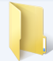

Организација података на рачунару
=================================

.. infonote::

 На овом часу ћемо говорити о:
    •	потреби да податаке организујемо;
    •	начинима организације података;
    •	управљању подацима.

У свом дому, ствари (фрижидер, телевизор, одећа, књиге, ...) имају своје место. У фрижидеру чувамо храну, док свеске и књиге слажемо у фиоке радног стола. Свеску из математике никада не тражимо у фрижидеру.
Исту логику треба да пренесемо и на свој дигитални уређај. 

Сваки дигитални уређај, било да се ради о десктоп рачунару, лаптопу, таблету или паметном телефону стално користи различите податке за обављање многих задатака. Због свега тога, подаци (слике, текст, видео и звучни записи, презентације, ...) треба да буду на свом месту (да буду организовани), увек лако и брзо доступни. 

Морамо имати на уму да су неорганизовани подаци налик радном столу на коме су свеске и књиге разбацане на све стране. Сигурно ћемо на таквом столу веома тешко за кратко време пронаћи оно што тражимо. Најбоље решење је да средимо сто.

**Датотека** (већина људи користи назив фајл) је место у које дигитални уређај уписује информације које желимо да сачувамо. У једну датотеку дигитални уређај може да смести било шта: програм, документ који смо сами креирали, податке важне за сам систем, ...
Свака датотека има своје име и екстензију (каже се и тип, или наставак). На пример: ``ikt.txt``, где је ``ikt`` име датотеке, а ``.txt`` тип, односно екстензија.

На основу екстензије, можемо да одредимо коју врсту података садржи датотека (слика, текст, видео, звук, презентација, извршни програм,...), а често и програм који ју је направио.
На следећој слици приказани су примери неколико врста датотека

.. image:: ../../_images/L4S1.png
    :width: 700px
    :align: center  

Као што видимо, иста врста података може да се чува у датотекама разлчитих типова. На пример, слике могу да се чувају у више различитих формата, којима одговарају типови датотека *.bmp*, *.gif*, *.jpg*, *.jpeg*, *.png* и други. Слично важи и за текст, звук и друге врсте података.

Пожељно је да све датотеке организујемо, тако што их смештамо у фасцикле, које се често називају фолдери. У једној фасцикли могу бити смештене друге фасцикле.

Фасциклу ћеш препознати по карактеристичној иконици која личи на картонску фасциклу |fascikla|.  Свака фасцикла има своје име. На пример: ``IKT``.

Имена датотека и фасцикли у Windows оперативном систему не смеју да садрже следеће знакове: < > : " /  \ | ? *

Задатак:
~~~~~~~~

.. image:: ../../_images/L4S5.png
    :width: 700px
    :align: center

.. parsonsprob:: L4P1

    Поређај датотеке и фасциклу у истом редоследу као на претходној слици.

    -----
    фасцикла
    датотека која садржи извршиви програм
    датотека која садржи слику
    датотека која садржи презентацију
    датотека која садржи текст

Сви оперативни системи садрже неколико основних (системских) фасцикли које можеш да користиш за организацију података. 

.. image:: ../../_images/L4S3.png
    :width: 200px
    :align: center  

Оперативни системи омогућавају организовање података коришћењем програма Explorer (Windows) који омогућава креирање, брисање, премештање и копирање датотека и фасцикли.

.. image:: ../../_images/L4S4.png
    :width: 700px
    :align: center  

Креирање  фасцикли 
-------------------
Најједноставнији начин да креирамо нову фасциклу је да кликнемо десним тастером миша на место где желимо да направимо фасциклу и одаберемо опцију Nеw (1) → Folder (2). 

.. image:: ../../_images/L4S6.png
    :width: 500px
    :align: center

Важно је да не заборавимо да именујемо нови фолдер укуцавањем жељеног имена, и притиском на тастер Ентер. 

Опис поступка за креирање фасцикле можете погледати на доњем видеу:

.. ytpopup:: a3wo2my4-wM
    :width: 735
    :height: 415
    :align: center

Koпирање и премештање датотека и фасцикли
------------------------------------------

Програми за организовање датотека и фасцикли омогућавају њихово копирање и премештање. Ове акције можемо да урадимо на више начина. 

Поступак копирања датотеке или фасцикле:

1.  одабир једне или више датотека /фасцикли;

2.  десни клик или дужи притисак на жељену датотеку/фасциклу;

3.  одабир опције Copy;

4.  бирање места (фасцикле) на које желимо да је копирамо;

5.  десни клик и одабир опције Paste.

Након акције копирања, одабране датотеке/фасцикле појављују се на два места (у фасцикли из које су копирани и у фасцикли у коју су копирани). 

Поступак премештања датотеке или фасцикле:
   
1. одабир једне или више датотека /фасцикли;

2. десни клик или дужи притисак на жељену датотеку/фасциклу;

3. одабир опције Cut;

4. бирање места (фасцикле) на које желимо да је копирамо;

5. десни клик и одабир опције Paste.

Опис поступка за копирање и премештање фасцикле и датотека можете погледати на доњем видеу:

.. ytpopup:: bDrkD2OOlo0
    :width: 735
    :height: 415
    :align: center

За разлику од копирања, након акције премештања, одабране датотеке/фасцикле појављују се само у фасцикли у коју су премештене.

Када копирамо или премештамо фасцикле, ми копирамо, односно премештамо, и све датотеке у оквиру тих фасцикли. 

**Важно:**

Одабир датотека и фасцикле које нису једна поред друге бирамо тако што, на тастатури држимо притиснут тастер **Ctrl**, а другом руком означавамо (левим тастером миша) жељене датотеке и/или фасцикле.

.. image:: ../../_images/L4S13_1.png
    :width: 180px
    :align: center

Одабир датотека и фасцикле које су једна поред друге бирамо тако што одаберемо прву датотеку/фасциклу, а затим на тастатури притиснемо и држимо притиснут тастер Shift, а другом руком кликнемо последњу у низу. 

.. image:: ../../_images/L4S14.png
    :width: 150px
    :align: center

Опис поступка за одабир фасцикли и датотека можете погледати на доњем видеу:

.. ytpopup:: fb5XIiBmCY0
    :width: 735
    :height: 415
    :align: center

Промена имена датотеке и фасцикле 
---------------------------------

Десним кликом миша на жељену датотеку и/или фасциклу (1) и одабиром опције Преименуј (Rename) (2), добијамо могућност да укуцамо ново име (3), које потврђујемо притиском на тастер Ентер на тастатури.
  
.. image:: ../../_images/L4S7.png
    :width: 500px
    :align: center

Опис поступка за преименовање фасцикле или датотека можете погледати на доњем видеу:

.. ytpopup:: jIVEKXJ3iFQ
    :width: 735
    :height: 415
    :align: center

Брисање датотека и фасцикли 
----------------------------

Датотеке/фасцикле бришемо тако што десним кликом миша означимо жељену датотеку/фасциклу (1) и одаберемо опцију Delete (2).

.. image:: ../../_images/L4S8.png
    :width: 300px
    :align: center
 
Корисницима дигиталних уређаја често се дешава да случајно или грешком обришу датотеку или фасциклу. 

Имајући у виду овакво искуство, оперативни системи нуде могућност брисања у два корака: 

- обрисана датотека/фасцикла смешта се у Канту за отпатке (Recycle Bin у Windows-у);

- неповратно брисање обавља се у Канти за отпатке, тако што десним кликом миша означимо жељену датотеку/фасциклу и одаберемо опцију Delete.

Канта за отпатке дизајнирана је тако да датотеке/фасцикле које се у њој налазе могу бити враћене у фасциклу из које су обрисане. Довољно је да кликнемо на опцију ``Restore the selected items`` (Windows).

Канту да отпатке можемо да испразнимо кликом на опцију Empty Recycle Bin (Windows). 
    
Важно је да се зна да, када се фасцикла обрише, биће избрисане све датотеке и фасцикле које се у њој налазе.

Опис поступка за брисање фасцикле или датотеке, као и за враћање избрисане фасцикле или датотеке, можете погледати на доњем видеу:

.. ytpopup:: c2CQJz-jQE0
    :width: 735
    :height: 415
    :align: center

Опис поступка за трајно брисање фасцикле или датотеке можете погледати на доњем видеу:

.. ytpopup:: ypfAtAlKYVY
    :width: 735
    :height: 415
    :align: center

Проналажење датотека и фасцикли 
-------------------------------

.. |pretraga| image:: ../../_images/L4S12.png
               :width: 30px

.. |pretraga1| image:: ../../_images/L4S11.png
               :width: 200px

Ма колико добро биле организоване датотеке и фасцикле, дешава се да заборавимо где се нека од њих налази. 
У оваквим ситуацијама треба да кориситиш претраживање |pretraga|. 
Простор за претраживање можеш пронаћи на линији послова или у оквиру прозора програма Explorer (Windows). 
Довољно је да у простор за претраживање |pretraga1| унесеш назив или део назива датотеке/фасцикле и притиснеш тастер Ентер са тастатуре.
Уколико претрагу вршиш коришћењем поља за претрагу на линији послова, проналажење датотека или датотеки се врши у свим фасциклама на рачунару и траје знатно дуже.
Међутим, ако за претрагу користиш програм Explorer, проналажење документа можеш да сведеш само на претрагу одређених фасцикли. Тиме ћеш знатно брже наћи датотеку или датотеке које тражиш.

Опис поступка за претрагу фасцикле или датотека можете погледати на доњем видеу:

.. ytpopup:: UJcp-mA1j7E
    :width: 735
    :height: 415
    :align: center

.. infonote::

 **Шта смо научили?**
    •	да се датотека (фајл) користи за смештање података;
    •	да је фасцикла (фолдер) место где се чувају датотеке;
    •	да је екстензија додатак на основу кога можемо да одредимо шта садржи фајл (текст, слику, програм итд.)