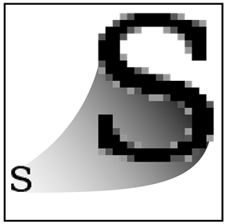
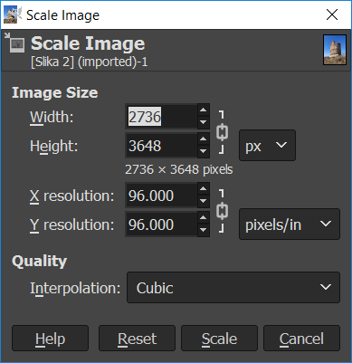
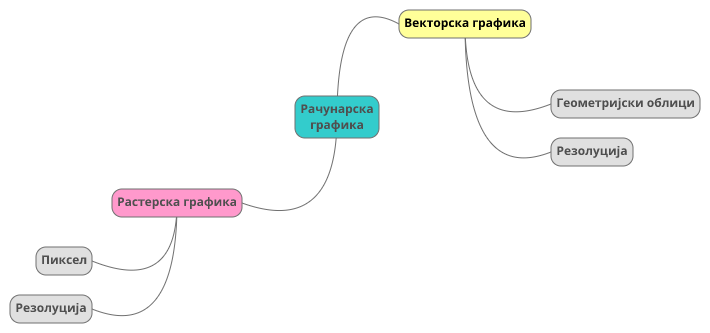

Рад са сликама 
==============

.. infonote::

 На овом часу ћемо говорити о:
    •	појму рачунарска графика;
    •	растерској и векторској графици;
    •	основним техникама рада у програму GIMP 2.

Визуелна репрезентација информација помоћу слика тј. боја и облика на екрану дигиталног уређаја назива се **рачунарска графика**. 

Постоје два веома различита начина дигиталног записа слика, позната као **растерска (битмап)**, где се памти боја сваког појединачног пиксела слике, и **векторска графика**, где се памте геометријски облици из које се слика састоји. 

Основни градивни елемент растерске графике је **пиксел**. Број пиксела одређује квалитет дигиталне слике. Тачније, растерска слика је слика састављена од тачака различитог нивоа осветљености или различитих боја. Што је већи број пиксела, то је квалитет слике бољи. Када се растерска слика увећа, број пиксела се не мења, број остаје исти, а слика постаје мутна, јер долази до увећавања пиксела.

На доњој слици је дат приказ увећане растерске графика.

Код векторске графике, градивни елементи су праве и криве линије, отворени и затворени, испуњени и неиспуњени геометријски облици који могу да се преклапају, прекривају или уклапају креирајући на тај начин слику. Када дигиталну слику увећамо она остаје оштра. Тачније, увећањем на било коју величину не губи се квалитет слике. Разлог томе је што се у процесу увећања геометријски облици поново исцртавају.
 
На доњој слици је дат приказ увећане векторске графике.

Рачунарски програми за обраду слике су алати помоћу којих се креирају и мењају дигиталне слике. За рад са растерском графиком можемо користити програме као што су Gimp, Microsoft Paint и Adobe Photoshop, а са векторском програме као што су Inkscape, Corel Draw и Adobe Illustrator. Наравно, постоје и други програми исте намене.

У петом разреду, бавићемо се основним техникама измене дигиталних слика у програму за растерску графику Gimp 2. 

Овај програм пружа бројне могућности за обраду слике, ради под оперативним системима Windows и Linux, и бесплатан је за преузимање и коришћење. 

Да бисмо инсталирали Gimp 2 на кућном рачунару, потребно је да посетимо интернет страницу https://www.gimp.org/downloads/ и одатле покренемо инсталацију. 

Опис поступка инсталације програма за растерску графику Gimp 2 можете погледати на доњем видеу:

.. ytpopup:: -jSiYBv9WeU
    :width: 735
    :height: 415
    :align: center

На овом часу ћемо се бавити обрадом (уређивањем) дигиталне слике користећи постојеће или креиране употребом фото-апарата или дигиталних уређаја. 

Отварање дигиталне слике 
------------------------

Поступак за отварање постојеће дигиталне слике је следећи:

1. Покрени програм Gimp 2;

2. Кликни на File → Open, а затим одабери жељену слику са рачунара;

3. Кликни на дугме Open.

Опис поступка отварања дигиталне слике у програму за растерску графику Gimp 2 можете погледати на доњем видеу:

.. ytpopup:: KK0tRQ26kN8
    :width: 735
    :height: 415
    :align: center

Сада ћемо на већ отвореној слици да применимо неколико техника. 

Промена димензија слике
-----------------------

Димензије слике могу бити изражене на различите начине (бројем пиксела, у центиметрима, милиметрима,..). 

Промену димензије слике вршимо тако што у изаберемо мени ``Image`` и у њему опцију ``Scale Image``. Где опција ``Width`` означава број пиксела по ширини, а ``Height`` број пиксела по висини слике.

Мала помоћ: Ланчић омогућава да се димензије равномерно мењају. Кликом на ланчић раскидаш/повезујеш мењање димензија слике.

Опис поступка промене димензије слике у програму за растерску графику Gimp 2 можете погледати на доњем видеу:

.. ytpopup:: aulKLLd7Xk8
    :width: 735
    :height: 415
    :align: center

Промена оријентације слике
--------------------------

Често се дешава да дигитална слика није окренута онако како желимо.

Оријентацију слике мењамо у дијалогу ``Image`` користећи опцију ``Transform``.

.. image:: ../../_images/L5S9.png
    :width: 400px
    :align: center

Опис поступка промене оријентације слике у програму за растерску графику Gimp 2 можете погледати на доњем видеу:

.. ytpopup:: v6XkSDLHIc8
    :width: 735
    :height: 415
    :align: center

Опсецање (кроповање) слике
--------------------------

Врло често се дешава да нам није потребна читава дигитална слика, већ само један њен део. Тада треба да применимо технику опсецања (кроповања слике). 

У програму Gimp, слику можемо да одсечемо на више начина. 

Овде су представљена два начина:

• Први начин: Одабирамо алатку за кроповање |krop|, означемо део слике који желимо да опсечемо и, на тастатури, притиснемо тастер Enter.
• Други начин: Одаберемо део слике коришћењем алатке за селекцију , а затим у менију ``Image`` одаберемо акцију ``Crop to Selection``.

Опис поступка одсецања дела слике у програму за растерску графику Gimp 2 можете погледати на доњем видеу:

.. ytpopup:: ckFV4T7Zlp0
    :width: 735
    :height: 415
    :align: center

Чување дигиталне слике
----------------------

За чување слике користимо опцију ``File`` → ``Export Аs`` → ``Export``. Када се кликне на дугме ``Export`` (1), отвориће се прозор у оквиру којег бирамо ниво квалитета слике.
У зависности од вредности коју постављамо коришћењем клизача (2) одређујемо квалитет слике. Кликом на дугме Export (3), бирамо место на рачунару где ће слика бити сачувана.

.. image:: ../../_images/L5S7.png
    :width: 600px
    :align: center

Опис поступка чувања дигиталне слике у програму за растерску графику Gimp 2 можете погледати на доњем видеу:

.. ytpopup:: qQ6cMiMe-Q4
    :width: 735
    :height: 415
    :align: center

Веома је важно нагласити да квалитетна дигитална слика заузима више меморијског простора од мање квалитетнe.

.. infonote::

 **Шта смо научили?**
    •	да је рачунарска графика стварање и приказивање слика уз помоћ рачунара;
    •	да је пиксел најмањи "део слике" на екрану дигиталног уређаја;
    •	да је растерска графика изграђена је од пиксела;
    •	да је векторска графика начин приказивања слике помоћу геометријских облика.

