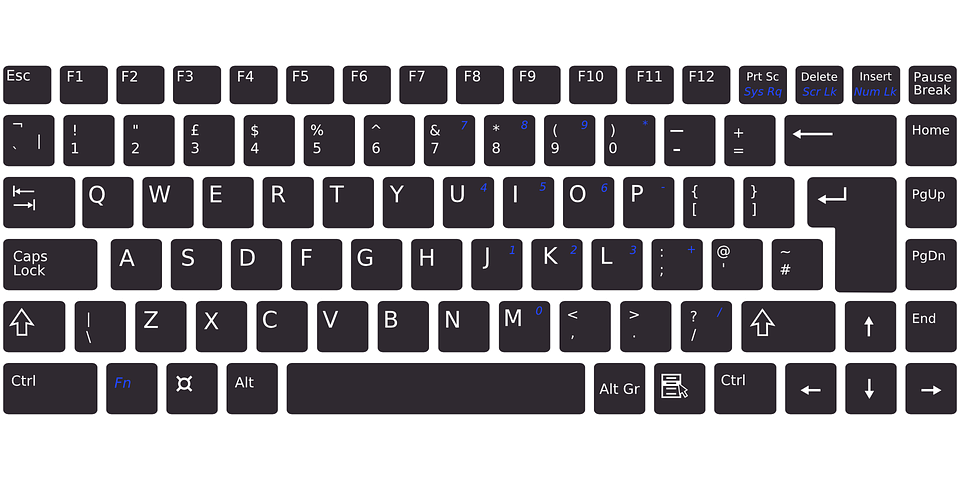

Рад са текстом
===============

.. infonote::

 На овом часу ћемо говорити о:
    •	уносу текста;
    •	дигитaлном правопису.

Дигитални уређај нам даје могућност да унесемо и сачувамо текст, без коришћења папира. 

Унос текста
-----------

Текст уносимо коришћењем тастатуре. Без обзира који програм за рад са текстом користимо, текст увек уносимо на исти начин. 
Распоред слова, бројева и знакова (кажемо и кодни распоред) на тастатури разликује се од модела до модела. 
Тастери неких тастатура немају: 

•	ћирилична слова ђ, ж, љ, њ, ћ, ч, џ, ш;

•	латинична слива č, ć, đ, š, ž.

Међутим, то не значи да их није могуће откуцати. Одабиром српског језика (ћириличног или латиничног писма), тастери добијају нове улоге.

Правила уноса:

•	велико слово куцамо тако што држимо притиснут тастер Shift и жељено слово; 
•	тастер Caps Lock укључујемо када желимо да сва слова која куцамо буду велика. Да би куцање малих слова било поново могуће, потребно је да га искључиш;  
•	размак између речи (спејс, бланко) куцамо притиском на тастер Space;
•	текст бришемо притиском на тастер Delete или на тастер Backspace.
•	знакове који су приказани у горњим угловима тастера са бројевима или знаковима куцамо тако што држимо притиснут тастер Shift;
•	за прелазак у нови ред користимо тастер Enter;
•	за увлачење новог реда користимо тастер Tab.

Често се дешава да се уноси текст тако што, на крају сваког реда притискају тастер Enter. За тим не постоји потреба. 

**Текст треба да уносимо не размишљајући о преласку у нови ред. Рачунар аутоматски наставља исписивање текста у наредном реду. Тастер Enter треба да притиснемо само када желимо да пређемо у нови пасус или када ти је нови ред потребан због управног говора, уметања слике,...**

Дигитални правопис
------------------

Јако је важно да се и у дигиталном и реалном свету правилно изражавамо и говорним и писаним путем.

Дигитално писмена особа, примењује сва граматичка правила и има знања везана за дигитални свет. 

Дигитално писмен човек:

•	после знакова интерпункције (зареза, тачке, узвичника, упитника, двотачке,...) увек куца један размак (спејс, бланко);

•	испред и иза заграде куца размак - први знак (слово, број или било који други знак) у загради приљубљен је уз отворену заграду, а последњи знак уз затворену заграду;

•	испред и иза наводника куца размак - први знак оставља приљубљен уз отворене наводнике, а последњи знак уз затворене наводнике;

•	косу црту пише без размака пре и после ње ако жели да раздвоји две речи;

•	косу црту пише са размаком пре и после ње ако жели да раздвоји две фразе које се састоје од више речи; 

•	цртицу пише без размака пре и после ње када жели да напише полусложенице које садрже две речи или  слово и реч;

•	цртицу пише са размаком пре и после ње када жели да напише полусложенице које садрже више речи.

.. infonote::

 **Шта смо научили?**
    •	да текст уносимо користећи тастатуру. Без обзира који програм за рад са текстом користимо, текст уносимо на исти начин;
    •	да дигитално писмена особа, поред тога што примењује граматичка правила, има и знања везана за дигитални свет. 

