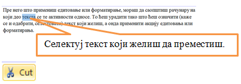

Час. Рад са текстом
====================

.. infonote::

 На овом часу ћемо говорити о:
    •	обради текста.

Програми за унос и обраду текста су бројни. Најчешће коришћен је Microsoft Office Word (MS Word). За коришћење овог програма потребно је да имамо лиценцу (програм се плаћа). 
Поред MS Word-а, често се користе и бесплатни програм Libre Office Writer (LO Writer) и сервис Google Docs. 
Рад у једном од оваквих програма стичемо знања и вештине за рад у другим програмима исте намене. 

Обрадити текст значи изменити га. Када су измене у питању, важно је да знамо да постоје две основне категорије – **едитовање** (енг. edit) и **форматирање** (енг. format).

**Едитовање** је суштинско мењање текста. Ако прочитамо текст пре и после едитовања, видећемо да његов садржај није исти. 

**Форматирање** је промена изгледа текста. Ако прочитамо текст пре и после форматирања, видећемо да је садржај остао исти.

Пре него што применимо едитовање или форматирање, морамо да означимо на који део текста се те активности односе. 
То ћемо урадити тако што ћемо означити (каже се и одабрати, селектовати) текст који желимо, а онда применити акцију едитовања или форматирања.

Текст означавамо тако што кликнемо испред првог знака и, држећи притиснут леви тастер миша, обележимо све што желимо. 

Најважније акције едитовања приказане су у доњој табели.

.. |a1| image:: ../../_images/L7S1.png
          :width: 300px

.. |a2| image:: ../../_images/L7S2.png
          :width: 200px

.. |a3| image:: ../../_images/L7S4.png
          :width: 300px

.. |a4| image:: ../../_images/L7S5.png
          :width: 500px

.. |a5| image:: ../../_images/L7S6.png
          :width: 500px

.. |a6| image:: ../../_images/L7S7.png
          :width: 500px

.. |a8| image:: ../../_images/L7S9.png
          :width: 30px

.. list-table:: Основне акције едитовања
   :widths: 100 100 100
   :header-rows: 1

   * - Акције едитовања
     - Корак пре примене акције едитовања
     - Примењена акција едитовања

   * - Брисање текста (помоћу тастера Delete)
     -  |a1|
     -  |a2|

   * - Брисање текста (помоћу тастера Backspace)
     -  |a3|
     -  |a2|

   * - Дописивање текста
     -  |a4|
     -  |a5|

   * - Копирање текста
     -  |a6|
     -  одаберемо место у тексту где желимо да копирамо текст и притиснемо |a8|
    
   * - Одсецање текста
     -  |a7|
     -  одаберемо место у тексту где желимо да преместимо текст и притиснемо |a8|

Најважније акције форматирања приказане су у доњој табели.

.. |b1| image:: ../../_images/L7S10.png
          :width: 300px

.. |b2| image:: ../../_images/L7S11.png
          :width: 300px

.. |b3| image:: ../../_images/L7S12.png
          :width: 300px

.. |b4| image:: ../../_images/L7S13.png
          :width: 300px

.. |b5| image:: ../../_images/L7S14.png
          :width: 300px

.. |b6| image:: ../../_images/L7S15.png
          :width: 300px

.. |b7| image:: ../../_images/L7S16.png
          :width: 300px

.. |b8| image:: ../../_images/L7S18.png
          :width: 300px

.. |b9| image:: ../../_images/L7S19.png
          :width: 300px

.. |b10| image:: ../../_images/L7S20.png
          :width: 300px

.. |b11| image:: ../../_images/L7S21.png
          :width: 300px

.. |b12| image:: ../../_images/L7S22.png
          :width: 300px

.. |b13| image:: ../../_images/L7S23.png
          :width: 300px

.. |b14| image:: ../../_images/L7S24.png
          :width: 300px

.. |b15| image:: ../../_images/L7S25.png
          :width: 300px

.. |b16| image:: ../../_images/L7S26.png
          :width: 300px

.. |b17| image:: ../../_images/L7S27.png
          :width: 300px

.. |b18| image:: ../../_images/L7S28.png
          :width: 300px

.. |b19| image:: ../../_images/L7S29.png
          :width: 300px

.. |b20| image:: ../../_images/L7S30.png
          :width: 300px

.. |b21| image:: ../../_images/L7S31.png
          :width: 300px

.. |b22| image:: ../../_images/L7S32.png
          :width: 300px

.. |b23| image:: ../../_images/L7S33.png
          :width: 300px

.. |b24| image:: ../../_images/L7S34.png
          :width: 300px

.. |b25| image:: ../../_images/L7S35.png
          :width: 300px

.. |b26| image:: ../../_images/L7S36.png
          :width: 300px

.. |b27| image:: ../../_images/L7S37.png
          :width: 300px

.. |b28| image:: ../../_images/L7S38.png
          :width: 300px

.. list-table:: Основне акције форматирања
   :widths: 100 100 100
   :header-rows: 1

   * - Акције форматирања
     - Корак пре примене акције форматирања
     - Примењена акција форматирања

   * - Промена врсте фонта
     -  |b1|
     -  |b2|

   * - Промена величине фонта
     -  |b3|
     -  |b4|

   * - Промена боје фонта
     -  |b5|
     -  |b6|

   * - Истицање текста
     -  |b7|
     -  |b8|
    
   * - Искошавање текста
     -  |b9|
     -  |b10|
   
   * - Подвлачење текста
     -  |b11|
     -  |b12|

   * - Промена слова из малих у велика 
     -  |b13|
     -  |b14|
    
   * - Промена слова из великих у мала 
     -  |b15|
     -  |b16|

   * - Набрајање тачкицама
     -  |b17|
     -  |b18|
   
   * - Набрајање бројевима
     -  |b19|
     -  |b20|

   * - Текст поравнат са леве стране 
     -  |b21|
     -  |b22|
    
   * - Текст је центриран, постављен на средину 
     -  |b23|
     -  |b24|

   * - Текст поравнат са десне стране
     -  |b25|
     -  |b26|
    
   * - Текст поравнат са леве и десне стране 
     -  |b27|
     -  |b28|

Интересантно је да различити програми за рад са текстом користе врло сличне иконице за означавање акција едитовања и форматирања. У питању је стандардизација.

Програми за рад са текстом нуде ти да одабереш „дигитални рукопис“ - фонт. 

**Фонтови** су фамилије слова, бројева и знакова карактеристичног изгледа. Никада не губи из вида да је основна сврха текста да информише читаоца. Људи воле да читају прегледне текстове. Зато, бирај лако читљиве фонтове који не заузимају превише места на страни. 

Опис поступка едитовања у програму за обраду текста можете погледати на доњем видеу:

.. ytpopup:: 5Aoqhp_iOKQ
    :width: 735
    :height: 415
    :align: center

Опис поступка форматирања у програму за обраду текста можете погледати на доњем видеу:

.. ytpopup:: 9xDDBLxe2eo
    :width: 735
    :height: 415
    :align: center

**Напомена**: Документ се чува извођењем следећих акција:

•	кликни на File → Save As;

•	у прозору који се отворио, имаш могућност да откуцаш име фајла и место на коме ћеш га сачувати;

•	потврди чување документа кликом на дугме Save. 

Опис поступка за чување текстуалног документа у програму за обраду текста можете погледати на доњем видеу:

.. ytpopup:: rGgwSdBzZ2Y
    :width: 735
    :height: 415
    :align: center

Уметање слике у текст 
---------------------

Правилно одабране слике олакшавају разумевање текста. 

Графички елементи (слике, графикони) које је могуће додати на страницу налазе се у опцији Уметање (енг. Insert). 

Процес додавања слике је веома једноставан: одаберемо опцију Insert (1), отвара се прозор у коме одабирамо жењену слику (2), и кликнемо на дугме Insert (3).

.. image:: ../../_images/L7S39.png
    :width: 800px
    :align: center
 
Слике се у различитим програмима за обраду текста додају на сличан начин. 

Опис поступка уметања слике у текст у програму за обраду текста можете погледати на доњем видеу:

.. ytpopup:: dP055FJdSvk
    :width: 735
    :height: 415
    :align: center

О овом тренутку, положај слике на страници подешавамо на исти начин као што поравнавамо текст. У наредним разредима детаљније ћемо се бавити овом темом.

Текстуални документ можемо да одштампамо одабиром опције Start → Print (File → Print). 

Опис поступка штампања документа можете погледати на доњем видеу:

.. ytpopup:: w0RPXVxxFmQ
    :width: 735
    :height: 415
    :align: center

Рад у апликацији, односно сервису Google Doc омогућава: 
    •	 писање текстовa док смо у покрету, чак и без интернет конекције.
    •	 дељење документа и рад са другим људима, у исто време, али са различитих локација.
    •	 све што напишемо аутоматски сачувамо у облаку података.
    •	 отварамо, дорађујемо и чувамо документе креиране у другим програмима за обраду текста.   

.. image:: ../../_images/L7S40.png
    :width: 700px
    :align: center

Значајно је нагласити да није важно у ком програму за рад са текстом радимо. 
Свако ко познаје принцип рада у једном, способан је да користи сваки од њих!  

Опис поступка едитовања и форматирања текста у сервису Google Doc можете погледати на доњем видеу:

.. ytpopup:: HVfwjBP8Xbg
    :width: 735
    :height: 415
    :align: center

Опис поступка дељења документа у сервису Google Doc можете погледати на доњем видеу:

.. ytpopup:: rSMV-PO1RwQ
    :width: 735
    :height: 415
    :align: center

.. infonote::

 **Шта смо научили?**
    •	да je eдитовање суштинско мењање текста;
    •	да је форматирање промена изгледа текста;
    •	да су фонтови фамилије слова, бројева и знакова карактеристичног изгледа.

.. image:: ../../_images/L7S41.png
    :width: 800px
    :align: center