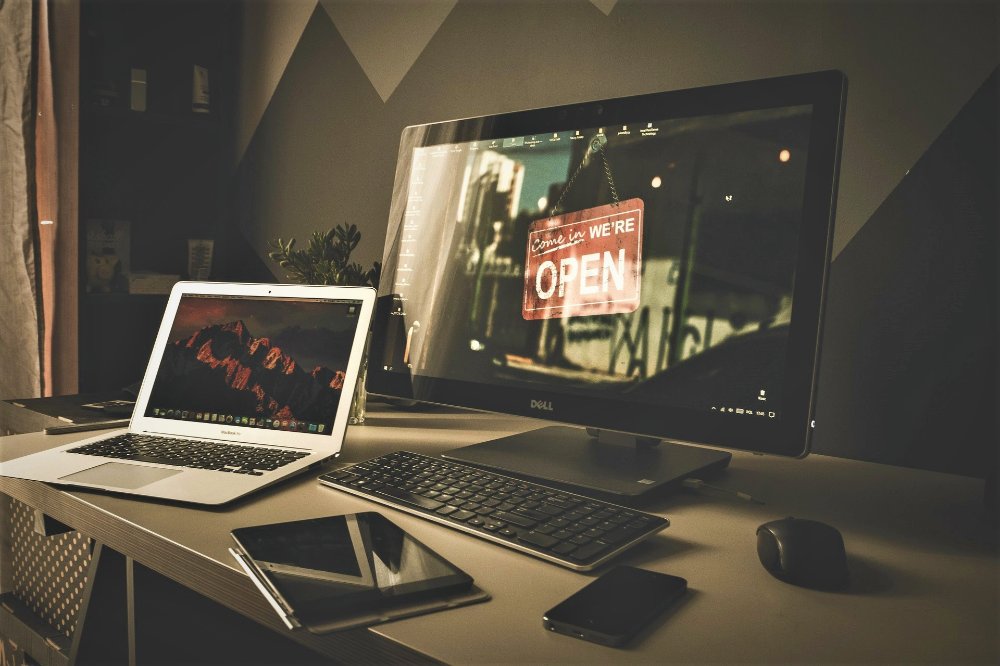
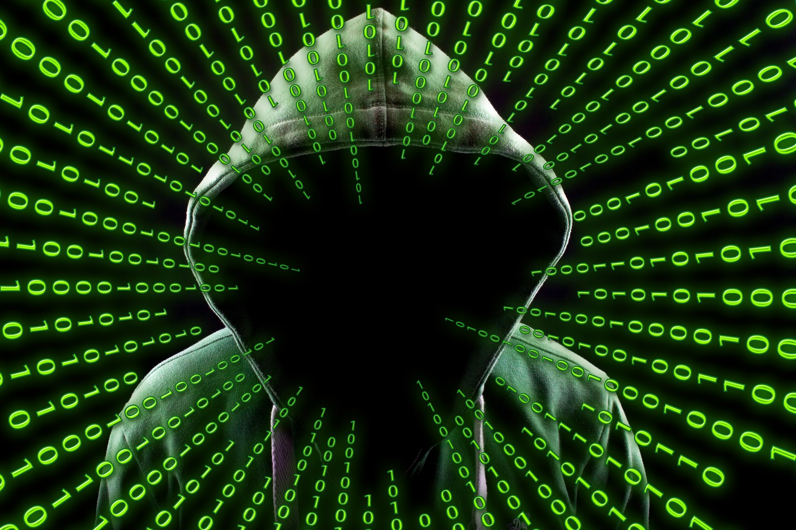

Исправно реаговање у потенцијално небезбедној ситуацији у коришћењу ИКТ уређаја
===============================================================================

.. infonote::

 На овом часу ћемо говорити о:
    •	ИКТ уређајима;
    •	исправном реаговању када се дође у потенцијално небезбедну ситуацију приликом коришћења ИКТ уређаја;
    • значају правилног одлагања дигиталног отпада за заштиту животне средине;

Које уређаје називамо ИКТ уређајима? **ИКТ** је скраћеница која се користи за **информационо-комуникационе технологије**. 
На енглеском језику ова се скраћеница означава као ICT (од Information and Communications Technology). 
Све уређаје које користимо за преношење информација и долажење до њих, као и за комуникацију једним именом називамо информационо-комуникационим уређајима или ИКТ уређајима. 
У ову врсту уређаја убрајамо рачунаре, преносне (лаптоп) рачунаре, таблет уређаје, мобилне телефоне, телевизоре, радио апарате, али и комуникационе уређаје као што су рутери, свичеви, рисивери итд.
Шта значи безбедно коришћење ових уређаја? То значи да ИКТ уређаје користимо на одговоран и сигуран начин тако да за време коришћења, али и након њиховог коришћења не постоји опасност за наше здравље као ни опасност за нашу животну средину.

Ви сте се родили и одрастате у време коришћења савремених техничких уређаја који су саставни део вашег свакодневног живота. ИКТ уређаје користите свакодневно како у школи, тако и код куће и на осталим местима. 
Ти уређаји се веома брзо мењају, развијају и настају нови уређаји или нови унапређени модели постојећих. Они нам омогућују различите удобне и лаке начине комуницирања, учења и забаве, али са собом носе и нове, често прикривене врсте опасности, ризика, па и насиља. 
Због тога морате имати развијену свест о томе како ове уређаје да користите на одговоран и сигуран начин како би вам олакшали рад, учење и комуникацију и учинили их забавним, а да вам притом не проузрокују проблеме.
Ви их сигурно користите интуитивно, истражујући различите опције и могућности које пружају, без да сте претходно прочитали њихово упутство за употребу. Баш из тог разлога често несвесно и случајно можете да доведете себе у неугодну ситуацију, 
па је потребно да познајете поступке које треба применити да бисте били сигурни приликом коришћења ИКТ уређаја и тако заштитили себе, своје физичко и психичко здравље, као и резултате свог рада. 

Потенцијалне небезбедне ситуације у коришћењу ИКТ уређаја
---------------------------------------------------------

Када говоримо о потенцијално небезбедним ситацијама приликом коришћења ИКТ уређаја, ту можемо да посматрамо различите аспекте.
Први аспект се односи на **начин руковања уређајима** како не бисте директно угрозили своје здравље, попут ситуације да мокрим рукама рукујете уређајима који су прикључени директно на електрично напајање, или их користите у влажним просторијама попут купатила. 
Такође, уколико уређаје укључујете или искључујете на погрешан начин не поштујући потребну процедуру или не користите њихове делове и опције на начин како је предвиђено, можете трајно оштетити сам уређај. 
Због тога је потребно да пре коришћења уређаја прочитате и придржавате се упутстава произвођача за његову употребу, иако сте можда претходно већ користили сличан уређај. 
Најбоље је да сваки квар на ИКТ уређајима које користите пријавите наставнику или родитељу, а не да покушавате сами или са друговима да поправите квар, јер на тај начин можете да проузрокујете још већу штету.

Други аспект небезбедних ситуација се односи на **коришћење ИКТ уређаја у мрежном окружењу** односно у коришћењу интернета. Прилком коришћења интернета изложени смо бројним опасностима којих најчешће нисмо довољно свесни. 
То могу бити злонамерно коришћење интернета од стране особа, тзв. хакера (енгл. hacker) у циљу неовлашћеног приступа нашим личним подацима на неком од наших налога или приступа нашем рачунару да би га “хаковала” односно угрозила наше датотеке (докумената, фотографије и сл.).  
Поред тога тако може да направи и низ других проблема попут неконтролисаног слања електронских порука са нашег рачунара, постављање злонамерног софтвера којим може да контролише наш рачунар, да украде новац са нашег банковног рачуна, или да украде наш дигитални идентитет (корисничко име и лозинке за различите налоге).  
Из тог разлога, да бисмо били што више заштићени од таквих хакерских напада, потребно је да користимо различите програме који могу да осујете и спрече такве нападе. Таква врста софтвера се најчешће назива антивирусни софтвер. 
Његова улога је да надзире рачунар и ако у њему нађе неки злонамерни или потенцијално опасни програм, упозори нас о томе и даје нам могућности да га контролишемо тако што ћемо га блокирати или уклонити из рачунара.  
Једна од препоручених мера заштите од оваквих злонамерних програма јесте и то да се не преузима непознати и непроверени софтвер са интернета који често може бити упакован у атрактиван дизајн или да бесплатно нуди неке погодности. Такође, савет је и да се не отварају прилози електронских порука са сумњивих електронских адреса или да се посећују линови у њима. 
За све такве ситуације када нисте сигурни и имате било какве сумње најбоље је да се обратите наставнику или родитељима за савет. 
Честа појава на интернету која представља криминалну активност јесте **Пецање** (енгл. phishing). Наиме, хакери направе **лажне веб-сајтове** који изгледају баш као и оригинални сајтови. Са тих лажних сајтова шаљу електронску пошту при чему је тешко уочити да она не долази са оригиналних сајтова, у којој се обично тражи да потврдите ваше личне податке попут имена, презимена, адресе, корисничког имена и лозинке као и броја банковног рачуна. 
На тај начин када кликнете на неки линк у електронској пошти он вас аутоматски води на лажни сајт који служи за прикупљање личних података и тако криминалци дођу у посед ваших лозинки и налога на који се оне односе. Против овог „пецања” се предузимају многе мере заштите које се или појављују као самостални програми или као компоненте уграђене у антивирусни софтвер. 
Један од могућих начина да препознате да ли се ради о правом сајту или о појави „пецања” јесте да у сумњивој поруци поставите миша на понуђену везу ка некој веб адреси и проверите на дну екрана да ли је то заиста адреса веб-сајта о коме се ради или је реч о некој сасвим другој веб адреси. 

Затим, можемо бити изложени различитим опасним и за нас непримереним садржајима на интернету који могу озбиљно нарушити наше психичко здравље. Такође, можемо бити изложени и различитим насилним облицима понашањима током комуникације на интернету а врло често и не препознајемо да то јесте насилно понашање.
У то спада сваки облик понашања које се догодило једном или се понавља, а чији је циљ да се намерно нанесе психички или физички бол другој особи. 
Такво насиље у коме неко користи електронске уређаје (мобилни телефон, рачунар, камеру...) и интернет да би некога намерно уплашио, увредио, понизио или га на неки други начин повредио назива се **дигитално насиље**.
У дигитално насиље спада:
 * недозвољено саопштавање и дељење туђих приватних информација; 
 * промена туђих лозинки или њихова крађа и хаковање налога; 
 * слање и ширење рачунарских вируса и осталих злонамерних програма; 
 * постављање узнемирујућих, увредљивих или претећих порука, слика или видео-снимака или слање тих материјала системом кратких порука, такозваним СМС-ом (енгл. Short message system), инстант порукама (Messenger, Viber, WhatsUp, Instagram),  е-поштом и на друге начине; 
 * непримерено коментарисање туђих објава, постова, слика, порука на друштвеним мрежама; 
 * подстицање мржње по различитим основама (националне, верске, територијалне, полне и др.);
 * снимање и дистрибуција слика, порука и материјала сексуалног садржаја.

У случају било које врсте насиља, препоручује се да се обратиш родитељема, наставницима или одраслима у које имаш поверења и затражиш помоћ јер је то најбољи начин да се насиље заустави.

Један од честих облика насиља на интернету је **сексуално насиље**. Сексуално насиље или злостављање је када се особа наводи на неки облик сексуалних активности које она не жели, које не схвата или за које није довољно одрасла а то се постиже на силу, преваром или уценом. 
За то се често могу употребити фотографије, видео-снимци, снимак са веб-камере или снимак екрана преписке. Због тога је неопходно да будете веома опрезни када постављате своје фотографије на мрежу, када случајно или намерно песећујете сајтове неприкладног садржаја и када комуницирате путем интернета са непознатим особама. 
Са обзиром на то да ви улазите у период пубертета када откривате и упознајете своју сексуалност природно је да имате интересовања за ту тему. Међутим, морате бити обазриви када комуницирате са неким на интернету о томе. 
Често се дешава да се на интернету непознате особе које су много старије од вас представљају као ваши вршњаци, нуде да вам буду пријатељи и покушавају да сазнају информације о вама и вашем животу постављајући вам многа лична питања. 
Када ви упутите слична питања њима обично дају неодређене одговоре или избегавају да одговоре па то треба да вам буде неки знак да прекинете такву комуникацију. Уколико се догоди да ти нека непозната особа тражи да се сусретнете обавезно се посаветуј са родитељима или неким од наставника или другом одраслом особом којој верујеш.
Оно што је важно да знате јесте да је сексуално насиље недозвољено и да није кривица оне особе која му је изложена, па уколико вам се догоди не треба да се осећате кривим, уплашеним и да вас је стид, већ о томе треба да отворено разговарате са родитељима или са наставницима и да потражите њихову помоћ.

За више информација о дигиталном насиљу, како да га препознаш и да правилно реагујеш на њега, предлажемо ти да посетиш сајт УНИЦЕФ-а https://www.unicef.org/serbia/zaustavimo-digitalno-nasilje и научиш како да зауставиш дигитално насиље.
Такође, у дигиталној библиотеци сајта **Паметно и безбедно** (https://pametnoibezbedno.gov.rs/files/file_upload/fajl/156_Brosura_Cyberbullying_nova_verzija-converted.pdf), можеш да погледаш и преузмеш брошуру о Cyberbullying-у и информишеш се о **вршњачком насиљу преко интернета** и како да реагујеш на њега.