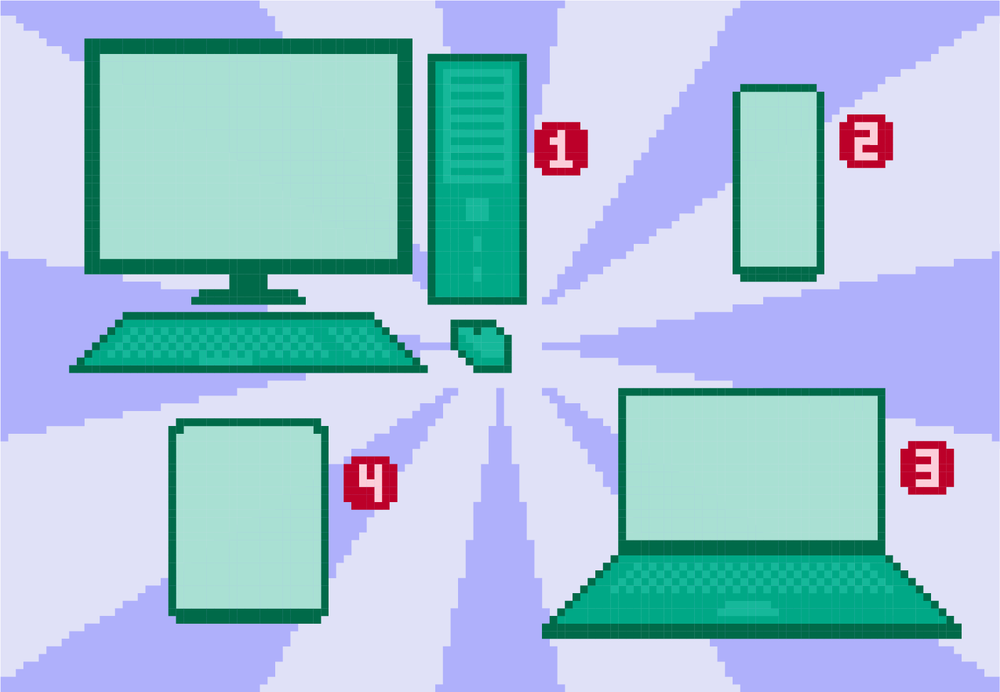
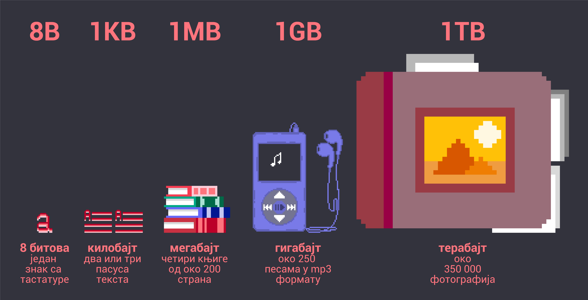

Дигитални уређаји
=================

Дигитални уређаји ти нису потпуно непознати, јер управо користиш један дигитални уређај да би могао да приступиш овој лекцији. 

На који начин пролазиш кроз курс информатике и рачунарства? Да ли користиш мобилни телефон, таблет, лаптоп или рачунар са тастатуром и монитором?

Можеш ли мало детаљније да опишеш уређај који управо користиш? Шта стварно знаш о њему?

Рачунаре – стоне и лаптоп, паметне телефоне, таблете и друге сличне уређаје једним именом зовемо **дигитални уређаји**. За све њих је карактеристично да у себи имају делове који 
**чувају, обрађују** или **размењују податке у дигиталном облику**, односно дигиталне податке.

    Дигитални уређаји: 1. стони (десктоп) рачунар, 2. телефон, 3. лаптоп, 4. таблет.

**Шта је то дигитални податак?**

Дигитални уређаји, приликом обраде, прво "преведу" податке у низ нула и јединица. Овако преведени подаци су разумљиви рачунарима иако нама изгледају потпуно необично. 

За податке записане помоћу цифри 0 и 1 се каже да су у **бинарном запису или бинарном облику**. 

Бинарни запис је јединствен за све уређаје. Mожемо то упоредити са неким универзалним 
језиком који користе сви рачунари.

Најмања количина информација коју може да памти и обрађује рачунар назива се **бит**. Бит може бити или 1 или 0.

Битови се групишу у скупове од по осам битова и тај скуп називамо **бајт**. Данас рачунари обрађују и чувају много већу количину информација и података од једног бајта. 
У табели су приказане величине које се користе а веће су од бајта, поређане по величини. Свака следећа величина је око 1000 пута већа од претходне.

|

Подаци унети у рачунар коришћењем тастатуре, миша или на неки други начин се преводе у низ битова. На тај начин сваки знак унет са тастатуре има јединствену комбинацију цифара 0 и 1 
а најпознатији начин представљања је **АСКИ кôд** (*ASCII*). 

У школи ћеш можда учити како се бројеви записани у декадном систему (са цифрама од 0 до 9) записују у бинарном бројном систему (са цифрама 0 или 1). 
На интернету се могу пронаћи `странице <https://www.rapidtables.com/convert/number/ascii-to-binary.html>`_ где постоје *конвертори* (претварачи) који могу речи (текст) претворити у бинарни запис.

Реч ШКОЛА у бинарном запису гласи 11010000 10101000 11010000 10011010 11010000 10011110 11010000 10011011 11010000 10010000

|

.. questionnote:: 

 Колико знакова користимо да бисмо написали реч ШКОЛА азбуком а колико бинарним цифрама?

.. reveal:: Odgovor1
	:showtitle: Провери одговор 
	:hidetitle: Сакриј одговор
	
	Потребно је пет знакова ако користимо азбуку а осамдесет ако користимо бинарни запис.
	
	
| 

.. questionnote:: 

 Колико битова постоји у бинарном запису речи ШКОЛА а колико бајтова?

.. reveal:: Odgovor2
	:showtitle: Провери одговор 
	:hidetitle: Сакриј одговор
	
	Осамдесет битова, односно десет бајтова.

|

.. questionnote::
 Зашто рачунари користе бинарни запис ако је потребно употребити много више знакова него ако, на пример, користимо нашу азбуку?

.. reveal:: Odgovor3
	:showtitle: Провери одговор 
	:hidetitle: Сакриј одговор
	
	**Бинарни запис је једноставан**, постоје само два стања – нула и јединица. Можемо га упоредити са сијалицом, она или светли или не светли. Бинарни запис је својом једноставношћу и омогућио настанак рачунара, јер би они иначе морали да буду знатно сложенији. Пошто рачунари раде огромном брзином, велики број нула и јединица које се обрађују није толики проблем, као што би био човеку.

