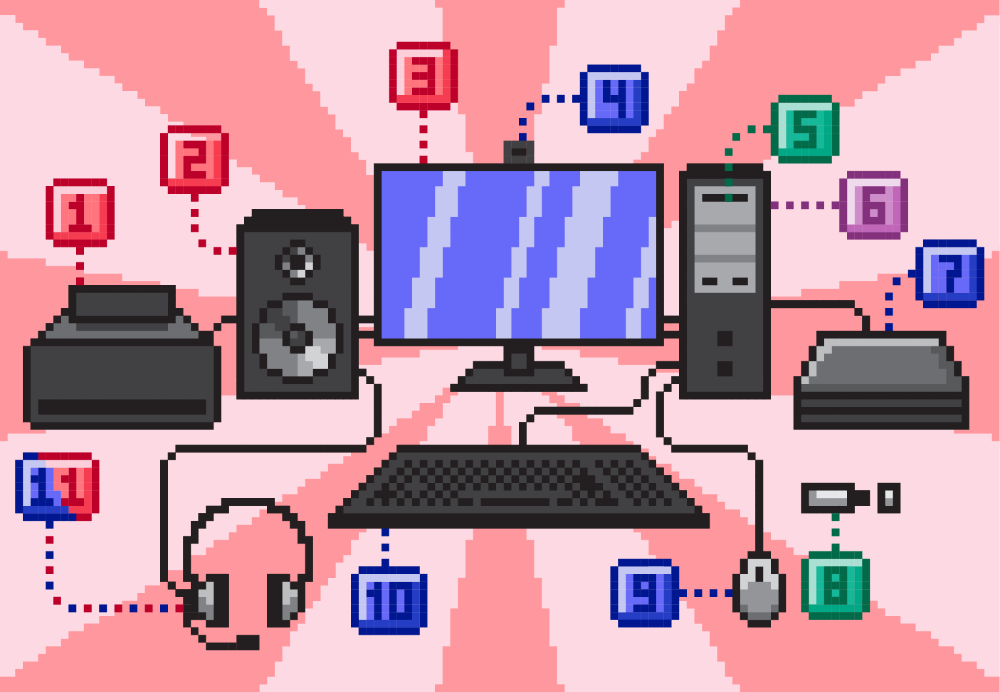

Хардвер и софтвер
=================

.. infonote::

 На овом часу ћеш научити:
 
 - нешто више о физичким деловима рачунарског система (хардверу),
 - разлику између системских и корисничких програма који припадају софтверу,
 - шта обухвата софтвер као сервис.

Хардвер
-------

Рачунар није уређај са којим се данас први пут сусрећеш. Док читаш ову лекцију користиш неки од рачунара па тако и познајеш његове делове.

Поједини делови рачунара су лако видљиви и њихову улогу није тешко одредити. Погледај мало пажљивије рачунар који је испред тебе.

Одговори на следећа питања. Ако проучаваш ову лекцију у школи, упореди своје одговоре са одговорима других ученика а затим и са објашњењима која су дата у лекцији.

.. questionnote::

 - Наброј које све делове рачунара можеш да видиш.
 - Шта је тастатура и чему служи?
 - Шта је миш?
 - Чему служи монитор (или уграђени екран)?
 - Опиши кућиште рачунара.

**Тастатура** је уређај помоћу кога уносимо текст и податке. Она има тастере на којима су исписани или угравирани знакови (слова, бројеви, интерпункцијски знаци и сл.). За унос неких симбола довољно је притиснути само један тастер, али постоји много ситуација када истовремено морамо притиснути два или чак три тастера. Помоћу тастатуре можемо задавати одређене наредбе (инструкције) рачунару. Тастери са знаковима на тастатурама имају увек исти распоред према одређеним правилима које називамо стандард. На тај начин је омогућено да особе науче брзо да куцају. Можда си имао прилике да видиш различите тастатуре, на пример са означеним  латиничким и ћириличким словима.

**Миш** је уређај помоћу којег управљамо радом рачунара. Када померамо миша, помера се и **курсор** на екрану. На месту курсора (или показивача) на екрану појавиће се симбол који уносимо са тастатуре. Како изгледа курсор на твом екрану, ког је облика? Курсори могу имати различите облике, најчешће је то усправна црта налик слову ``I``, рука са испруженим кажипрстом или стрелица. 

**Монитор** има екран и кућиште, али може бити и уграђен, као код лаптопа. На екрану се приказују подаци, слике и активности које обављамо.

**Кућиште рачунара** је део рачунара у коме се налазе делови које најчешће не можемо да видимо и није препоручљиво отварати га. Уколико наставник има могућности, може ти показати како изгледа унутрашњост кућишта. 

У кућишту се налазе делови рачунара који омогућавају да он извршава врло сложене операције над подацима које уносимо, да се на екрану приказује слика, да се у њему чува велики број података и слично. Део рачунара где се чувају подаци назива се **меморија**. При раду, рачунар се загрева па се унутар кућишта налази и вентилатор који омогућава хлађење.

Миш и тастатура се заједно називају **улазним уређајима** јер помоћу њих уносимо податке и задајемо упутства рачунару. Осим њих, ту спадају још и камера, микрофон, скенер, џојстик…

Монитор је **излазни уређај**, а осим њега у ову групу спадају још и звучник, слушалице, пројектор…

.. questionnote::

 Шта од улазних а шта од излазних уређаја имаш на рачунару који користиш?

Рачунар је врло сложена машина састављена од мноштва сложених делова, уколико се једнога дана одлучиш да твој посао буде рад повезан са рачунарима, учићеш много више о томе.

На слици је приказан **рачунарски систем** састављен од више различитих делова. Препознајеш ли неке? 

.. dragndrop:: umetanje_linka
    :feedback: Tвој одговор није тачан. Покушај поново!
    :match_1: 1|||штампач
    :match_2: 2|||звучници
    :match_3: 3|||монитор
    :match_4: 4|||веб-камера
    :match_5: 5|||ЦД (компакт-диск) читач
    :match_6: 6|||кућиште
    :match_7: 7|||скенер
    :match_8: 8|||УСБ флеш меморија
    :match_9: 9|||миш
    :match_10: 10|||тастатура
    :match_11: 11|||слушалице са микрофоном
	
    Провери своје знање спајањем назива уређаја са одговарајућим бројем који се налази поред слике тог уређаја.

.. questionnote::
 
 Да ли набројани делови рачунарског система припадају улазним уређајима, излазним уређајима или служе за чување и обраду података?
 
У улазне уређаје спадају веб-камера, миш, тастатура и скенер.

У излазне уређаје спадају монитор, штампач и звучници.

Слушалице са микрофоном, какве се данас најчешће производе, истовремено су и улазни (микрофон) и излазни (слушалице) уређај.

На УСБ флешу и ЦД-у чувамо податке а у кућишту рачунара се налазе бројни уређаји који врше обраду података, као и њихово чување.

Напоменимо још да сваки рачунарски систем мора да има и **напајање** јер му је неопходна електрична енергија за рад. Код стоних рачунара кућиште и монитор су кабловима стално повезани на напајање из градске мреже. Лаптоп, таблет и телефон имају батерију која се пуни и могу се користити на различитим местима, због чега их још називамо и **преносним дигиталним уређајима**.

Све делове рачунара који заједно чине рачунарски систем зовемо **хардвер**.
