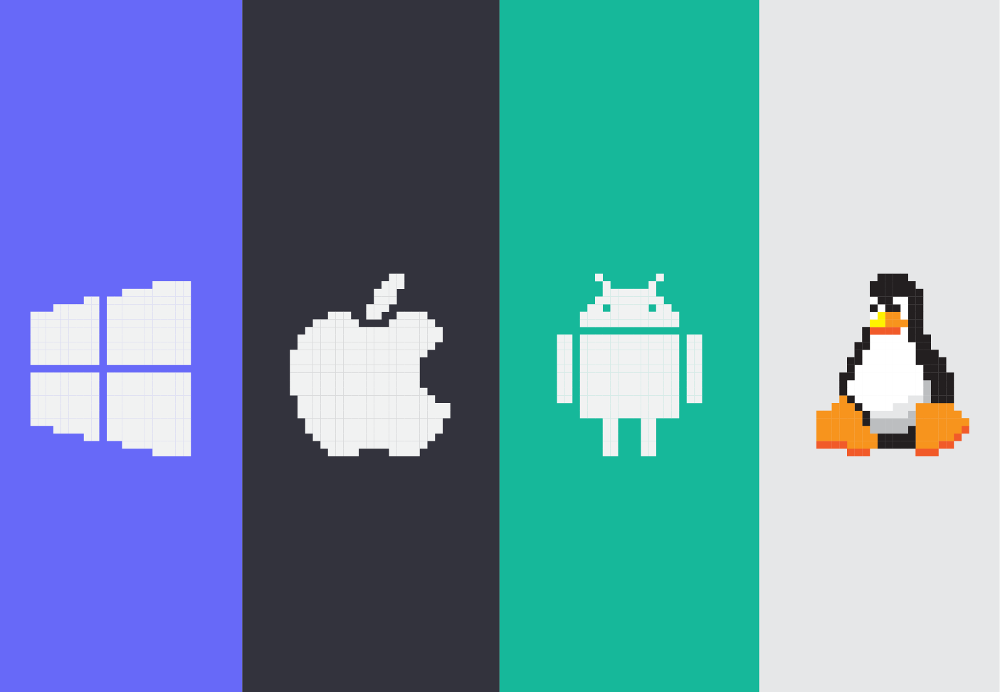
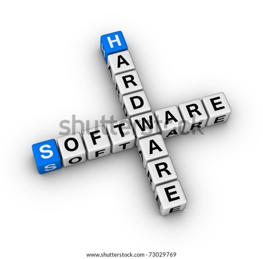

Софтвер
=======

Да би рачунар или дигитални уређај могао да ради, неопходно је да осим физичких делова (хардвера) има и програме, који представљају упутства за рад рачунару. 
Све програме заједно називамо **софтвер**.

Много различитих програма користимо на рачунару. Програми могу бити за рад са текстом, сликама, филмовима, за приступ интернету, за играње видео игара, за прорачуне, за цртање и слично. 

Постоји програм чији рад не видимо директно али који омогућава да други програми несметано раде као и да рачунар ”разуме” сва упутства која му задајемо. Овај програм назива се **оперативни систем**.

Без оперативног система рачунар не може да се користи. Различити дигитални уређаји користе разне оперативне системе. Неки познати оперативни системи су *Windows*, *Linux*, *Android* и *iOS*.

    Иконице за оперативне системе: *Windows*, *Android*, *iOS*  и *Linux*.

.. questionnote::
 Који оперативни систем има рачунар који користиш?

Оперативни систем, са још неким програмима који омогућавају да рачунар функционише, називамо **системски софтвер**. Када рачунар или телефон има системски софтвер, он је спреман за рад.

Програме које свакодневно користимо за обављање различитих задатака зовемо **кориснички програми** или **кориснички софтвер**. То су програми који нам омогућавају да радимо разне спрецифичне ствари - да уређујемо текстове, слике, звучне и видео записе, да правимо интернет сајтове, да обављамо прорачуне и планирања, да правимо нове програме или презентације, да претражујемо интернет, да читамо текстове, гледамо филмове, слушамо музику и још много тога. Поменимо да су и рачунарске игре такође програми. 

Корисничне програме можемо по потреби сами да инсталирамо на рачунар док оперативни систем инсталира стручна особа или је он инсталиран фабрички.

.. infonote::
 **Рачунар је употребљив за рад само у комбинацији одговарајућег хардвера и софтвера.**

	

На интернету постоје програми које можемо да користимо, а да их не инсталирамо на свој рачунар или телефон. 

Програме које не инсталирамо на свој дигитални уређај него их користимо преко интернета, зовемо софтвер као услуга, или **софтвер као сервис**. 
Овакви програми се још називају и **онлајн програми**. Сви они су инсталирани на неким, од нас удаљеним, рачунарима и о одржавању и постављању новијих верзија 
програма брине неко други. Неки од тих програма - сервиса су бесплатни за употребу, а за неке се плаћа претплата.
Програми - сервиси нам често омогућавају да оно што у њима направимо, такође чувамо на удаљеном рачунару (такве удаљене рачунаре називамо **рачунарски облак**). 
Да би могло да дође до тих података и програма, обично је потребно да се изврши пријава **корисничким именом** тј. да се **улогује**.

.. image:: ../../_images/login.png
    :width: 780px
    :align: center
	

.. infonote::
 Шта смо научили?
 
 - физичке делове (компоненте) рачунара зовемо **хардвер**;
 - програме који се извршавају на рачунару зовемо **софтвер**;
 - **оперативни систем** је главни програм на рачунару или телефону, који омогућава функционисање рачунара и извршавање других програма;
 - **сервиси** представљају скуп услуга на интернету, као што је коришћење програма из рачунарског облака и чување података у облаку;

