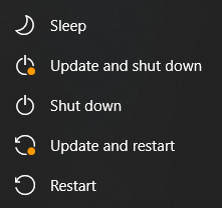
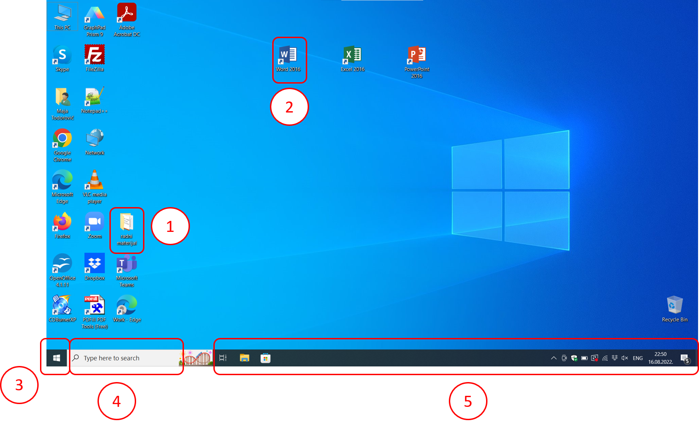

Подешавање радног окружења
===========================

.. infonote::

    На овом часу ћеш научити:
    •	који су основни елементи радне површине,
    •	како се врши подешавање позадинске слике на екрану и миша,
    •	како да урадиш језичка подешавања.

Први програм који се покреће када се укључи дигитални уређај је оперативни систем. На екрану ће се појавити **радна површина** (енг. *desktop*) на којој се могу наћи различити објекти (документи, фасцикле и програми) представљени малим сликама које се називају **иконе** (или иконице).

У наредним примерима користићемо оперативни систем Windows, јер је вероватно он инсталиран на твом школском рачунару.

Након покретања оперативног система, у доњем левом углу може се уочити **Старт дугме**. Кликом на ово дугме отвара се **мени**.

.. dragndrop:: funkcije_kompa
    :feedback: Tвој одговор није тачан. Покушај поново!
    :match_1: Sleep|||Искључују се монитор и још неки делови у кућишту рачунара ради уштеде струје или батерије на преносном рачунару у краћем периоду када се рачунар не користи.
    :match_2: Update and shut down|||Преузимање нових верзија и искључење
    :match_3: Update and restart|||Преузимање нових верзија и поновно покретање рачунара
    :match_4: Shut down|||Потпуно искључење рачунара
    :match_5: Restart|||Поновно покретање рачунара без искључивања напајања

    
    Повежи назив дугмета и његову функцију 

Погледај пажљиво како изгледа радна површина – десктоп рачунара на коме радиш. Упореди са радном површином која је приказана на слици:

    
1. На радној површини се налазе **иконе** – сличице које служе за покретање програма или отварање датотека или фасцикли. Једна од њих, икона за фасциклу, обележена је на слици са 1.
2. Ако икона има стрелицу у доњем левом углу, називамо је **икона–пречица**. Она представља везу до програма, фасцикле или датотеке. Једна од њих је обележена бројем 2.
3. **Старт дугме**
4. Поље за претрагу
5. **Трака задатака** или **линија послова** приказује активне програме, отворене датотеке, избор писма, датум и време и сл.

.. suggestionnote::
    
    Радну површину рачунара треба одржавати уредном и прегледном, односно треба водити рачуна о броју икона које се на њој налазе, без обзира на то да ли је реч о личном рачунару или о рачунару у школском кабинету.

    Уколико је на радној површини велики број икона. тешко ћеш моћи да их организујеш, а самим тим и да их користиш.

Различитим подешавањима можемо значајно да олакшамо коришћење рачунара и прилагодимо га себи. Наравно, када рачунар користи више особа, као што је школски рачунар, подешавања треба да одговарају већини ученика и о томе можете разговарати са наставником.
У основна подешавања, која се често користе, спада подешавање екрана и датума, времена и језика.
