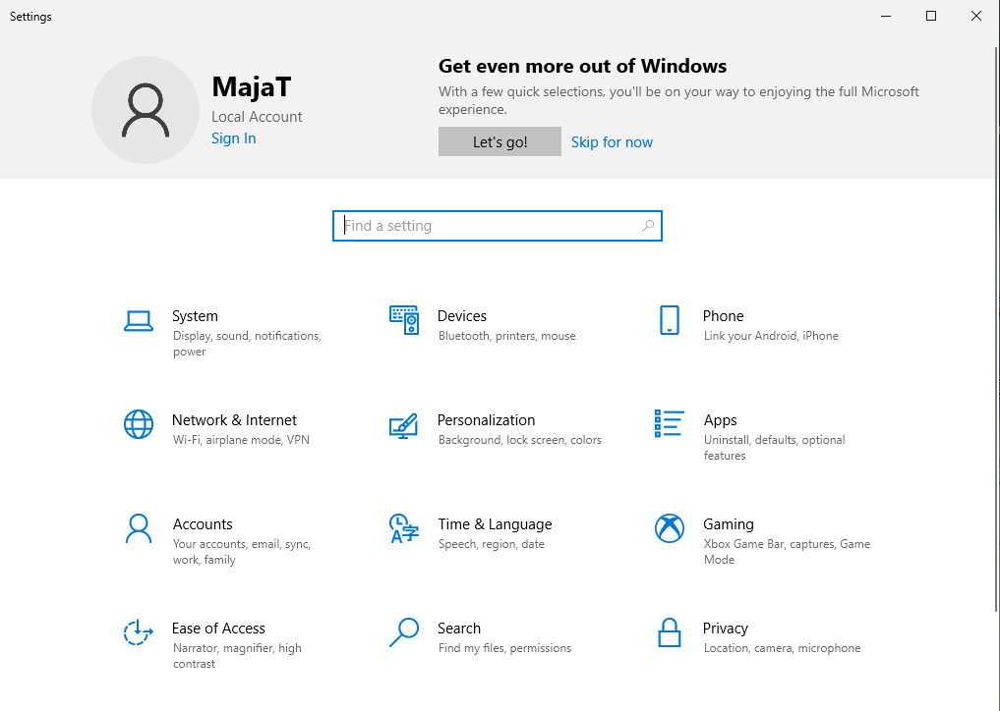

Контролна табла
===========================

У основна подешавања, која се често користе, спада подешавање екрана и датума, времена и језика.

Да бисмо извршили подешавања екрана морамо приступити контролној табли (енг. Control Panel). Кликом на мени Start и избором Settings долазимо до контролне табле:

Контролна табла има много опција. Погледај иконице које их илуструју и текст исписан испод. Размисли о њиховом значењу.

.. dragndrop:: funkcije_kompa1
    :feedback: Tвој одговор није тачан. Покушај поново!
    :match_1: System|||Подешавање екрана, звука, обавештења
    :match_2: Network & Internet|||Подешавање притупа интернету
    :match_3: Accounts|||Подешавање и креирање налога за различите кориснике
    :match_4: Ease of Access|||Подешавање опција за олакшан приступ
    :match_5: Devices|||Подешавање уређаја као што је миш, штампача и слично.
    :match_6: Phone|||Повезивање телефона са рачунаром
    :match_7: Time& Language|||Подешавање времена и језика
    :match_8: Apps|||Рад са апликацијама
    :match_9: Gaming|||Подешавање опција за видео игре
    :match_10: Privacy|||Подешавање локације, камере и микрофона

    Повежи назив иконице на контролној табли са улогом.

.. reveal:: Погледај решење

    .. csv-table:: 
        :header: "назив иконице", "улога"
        :align: left

        "System", "Подешавање екрана, звука, обавештења"
	    "Network & Internet", "Подешавање приступа интернету"
	    "Accounts", "Подешавање и креирање налога за различите кориснике"
        "Ease of Access", "Подешавање опција за олакшан приступ"
	    "Devices", "Подешавање уређаја као што је миш, штампач и слично"
	    "Personalization", "Подешавње позадинске слике, боје, закључавање екрана и сл."
        "Time & Language", "Подешавање времена и језика"
        "Search", "подешавање начина претраге"
        "Phone", "Повезивање телефона са рачунаром"
        "Apps", "Рад са апикацијама"
        "Gaming", "Подешавање опција за видео игре"
        "Privacy", "Подешавање локације, камере и микрофона"

Као што можеш да приметиш, постоји велики број могућности за прилагођење на рачунару. Изглед контролне табле и понуђених опција се може разликовати у зависности од верзије оперативног система који користимо.

Oпис поступка за приступ системским подешавањима можеш погледати на доњем 

.. ytpopup:: KQ8tYL31eHc
    :width: 735
    :height: 415
    :align: center
