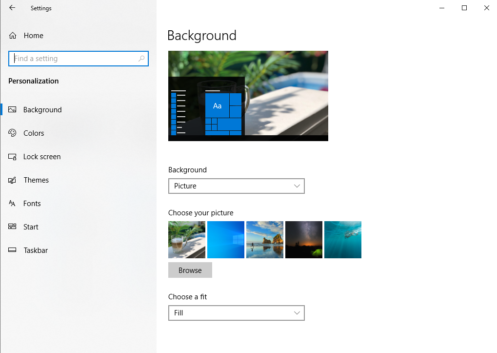

Подешавање позадинске слике
============================

Позадинску слику можеш да подесиш ако на контролној табли изабереш опцију **Personalization**. На овај начин може се подесити позадина (слика која ће се приказивати на радној површини)  - **Background**, закључавање екрана - **Lock Screen** и могу се мењати боје - **Colors**.

Из менија изаберемо **Background**, затим одаберемо **Picture**. У делу **Choose your picture** можеш да одабереш понуђене слике или другу слику са рачунара кликом на дугме **Browse**. На крају, из падајуће листе **Choose a fit** потребно је да одаберемо да слика попуњава цео екран одабиром опције **Fill**.

Позадинска слика може бити једна од фотографија, може бити једнобојна  а може се састојати од низа фотографија које се смењују.

Опис поступка за промену позадинске слике можете погледати на доњем видеу:

.. ytpopup:: S2Vj9_j8PqU
    :width: 735
    :height: 415
    :align: center

Промени позадинску слику на свом рачунару. Уколико користиш школски рачунар, провери са наставником коју слику би могао да поставиш као позадинску.