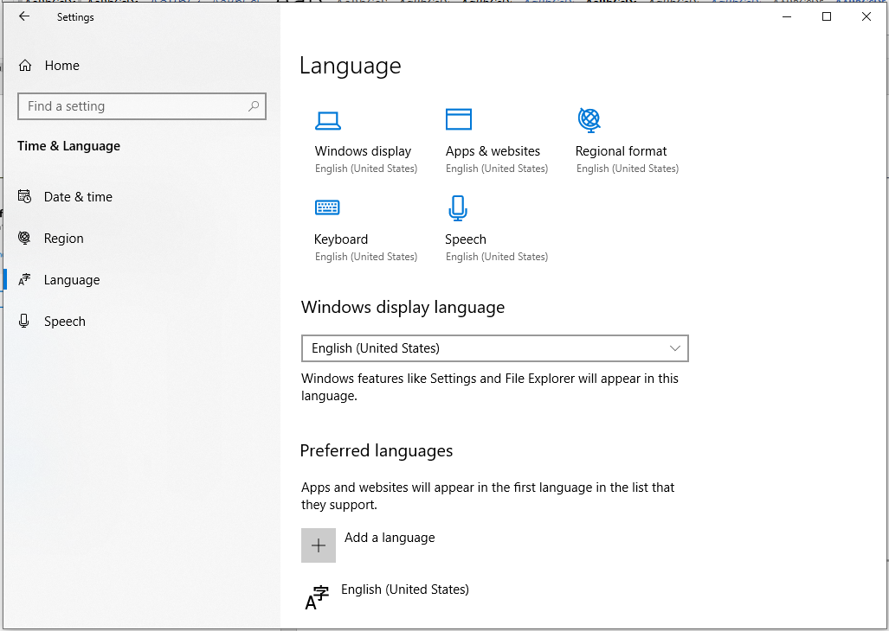
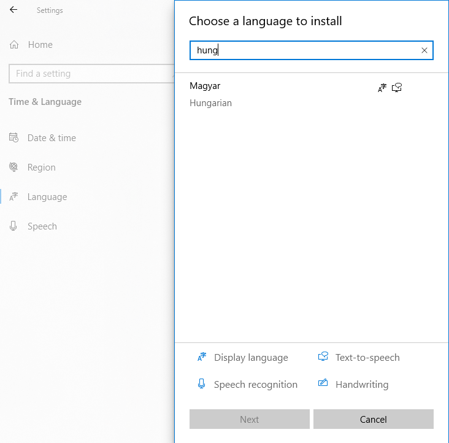

Регионална и језичка подешавања
===============================

**Подешавања језика** су веома важна јер омогућавају да се на истој тастатури уносе слова различитих језика. На школским рачунарима је најчешће додата српска ћирилица и латиница, као и енглески алфабет. Често је потребно додати немачки или француски, као и језике националних мањина које живе у Србији.

Као и приликом промене позадинске слике, подешавање језика вршимо из менија контролне табле, избором **Time & Language** а затим **Language**.

Нови језик додајемо са **Add a language**. У поље за претрагу можемо унети првих пар слова језика који тражимо као на слици испод.

Даље је потребно да изабереш **Next** и **Install**, и тражени језик ће се инсталирати.
Такође сада можеш да провериш листу језика који су инсталирани на рачунар.

Након инсталације, у доњем десном углу сада можеш применити додате језике.
Ако користиш енглеску тастатуру, променом језика и притиском на исти тастер на екрану ће се исписати различита слова.

Опис поступка за промену језика тастатуре можеш погледати на доњем видеу: 

.. ytpopup:: 9jLy9okd1O4
    :width: 735
    :height: 415
    :align: center

Шта смо научили?
•	да је радна површина место које можеш да прилагодиш својим потребама;
•	да подешавање позадинске слике вршимо у оквиру контролне табле оперативног система у опцији Settings.
•	да језичка и регионална подешавања вршимо у оквиру контролне табле оперативног система у опцији Settings;
•	да оперативни системи имају велики број опција за подешавање
