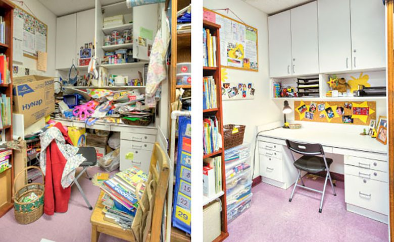
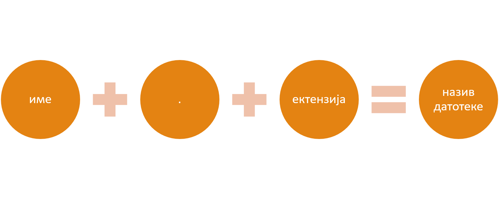
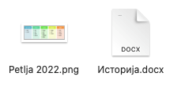

Организација података на рачунару
=================================

На овом часу ћеш научити:
    •	зашто је потребно да организујемо податаке,
    •	на који начин се подаци организују у рачунарима,
    •	како можеш да управљаш подацима.

У свом дому, ствари (фрижидер, телевизор, одећа, књиге...) имају своје место. У фрижидеру чувамо храну, док свеске и књиге слажемо у фиоке радног стола. Свеску из математике никада не тражимо у фрижидеру. 

Слично је и са стварима, односно подацима које чувамо на рачунару.

Сваки дигитални уређај, било да је реч о десктоп рачунару, лаптопу, таблету или паметном телефону, стално користи различите податке за обављање многих задатака. Због свега тога, подаци (слике, текст, видео и звучни записи, презентације и сл.) треба да буду на свом месту, увек лако и брзо доступни.

Неорганизовани подаци на рачунару налик су радном столу на коме су свеске и књиге разбацане на све стране. Сигурно ћемо на таквом столу веома тешко за кратко време пронаћи оно што тражимо. Најбоље решење је да средимо сто.

Пажљиво погледај фотографију. Може ли се учити у соби приказаној на слици десно?

Сређујеш ли свој простор за рад? Колико често то радиш? 

Веома је важно да подаци на рачунару буду организовани тако да увек можеш да их пронађеш и да им приступиш. 

Датотеке и фасцикле
-------------------

У датотеке (или *фајл*, енг. *file*) могу бити да смештени различити садржаји: текст, бројеви, слике, видео и звучни записи, програми и сл.

Назив сваке датотеке има своје **име** и **екстензију** (каже се и тип) који су раздвојени тачком.  Име датотеке задајемо према садржају тако да  лако препознамо шта се у датотеци налази. На пример, ако се у датотеци налазе слике са излета можеш је назвати **2020 Slike – Tara**, ако се налази текст са примерима падежа, можеш је назвати **Padezi**. 

Избор назива датотеке је важан јер се током рада на рачунару датотеке се умножавају и биће ти све теже да се сналазиш. Од знакова, у имену датотеке се могу наћи слова и бројеви, ћирилица и латиница, као и неки знаци интерпункције. Различити оперативни системи имају различита правила али оперативни систем Windows забрањује коришћење следећих знакова као делова имена датотеке: < > : ” / | ? *

.. infonote::
    
    Екстензија нам говори о ком типу (врсти) датотеке је реч и не можеш је самостално бирати. На основу екстензије можеш да одредиш коју врсту података садржи датотека (слика, текст, видео, звук, презентација, извршни програм...), а често и програм који ју је направио. На следећој слици приказани су примери неколико врста датотека

.. image:: ../../_images/L4S1.png
    :width: 700px
    :align: center  

Као што видимо, иста врста података може да се чува у датотекама различитих типова. 

Датотеке се могу приказати као низ знакова:

| Beograd.jpg
| Математика.docx
| Skolska_predstava_2022.mp3

или као иконице:

Датотеке организујемо тако што их смештамо у фасцикле (директоријуме или *фолдере*, енг. *folder*).

Фасцикле можеш да замислиш као кутије у које можемо сместити датотеке, али и друге фасцикле.

Фасциклу ћеш препознати по карактеристичној иконици која личи на картонску фасциклу.

Фасциклама додељујемо имена на сличан начин као и датотекама. Свака фасцикла има своје име. На пример: IKT.

.. mchoice:: fascikle
    :answer_a: Imena-ucenika.docx
    :feedback_a: Тачно    
    :answer_b: Ocene/polugodiste/2022.txt
    :feedback_b: Нетачно
    :answer_c: слика 5-1.jpg
    :feedback_c: Тачно
    :answer_d: električni materijali.png
    :feedback_d: Тачно
    :answer_e: Српски:одговори на питања.docx
    :feedback_e: Нетачно
    :correct: a, c, d, 

    Обележи исправно написане називе фасцикли и датотека у оперативном систему Windows.

Сви оперативни системи садрже неколико основних (системских) фасцикли које можеш да користиш за организацију података.

.. image:: ../../_images/L4S3.png
    :width: 200px
    :align: center  

Оперативни системи омогућавају организовање података коришћењем програма Explorer (Windows) који омогућава креирање, брисање, премештање и копирање датотека и фасцикли.

.. suggestionnote::

    У фасцикли Desktop чувај само најважније фасцикле и датотеке или оне на којима тренутно радиш. Није препоручљиво да већину својих датотека чуваш овде.
    
    Све што преузимаш са интернета, аутоматски се смешта у фасциклу Downloads.

    Препорука је да датотеке и фасцикле чуваш у фасцикли Documents или Local Disk.

.. image:: ../../_images/L4S4.png
    :width: 780px
    :align: center  