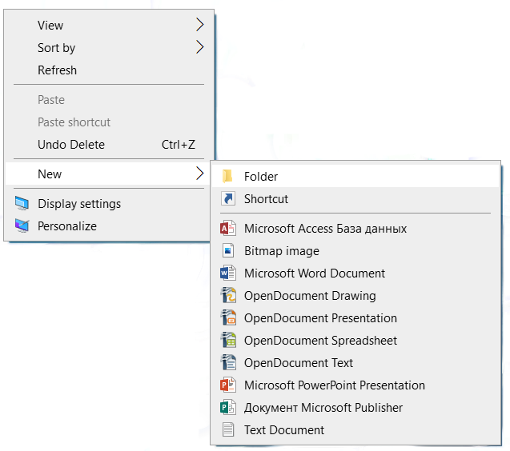
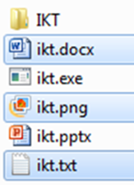
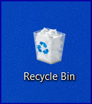

Рад са датотекама и фасциклама
==============================

Креирање фасцикле
-----------------

Најједноставнији начин да креираш нову фасциклу је да кликнеш десним тастером миша на место где желиш да направиш фасциклу и одабереш опцију Nеw (1) → Folder (2).

Програми за организовање датотека и фасцикли омогућавају њихово копирање и премештање. Ове акције можеш да урадиш на више начина. 

Важно је да не заборавиш да именујеш нови фолдер укуцавањем жељеног имена, и притиском на тастер **Enter**. 

Опис поступка за креирање фасцикле можеш погледати на доњем видеу:

.. ytpopup:: a3wo2my4-wM
    :width: 735
    :height: 415
    :align: center

.. infonote::

    Важно је да сви документи и све фасцикле буду организовани тако да им лако приступаш и да их једноставно проналазиш. Погрешно је све фасцикле смештати на радну површину, јер ће, после неког времена бити веома тешко за организацију. На радној површини можеш чувати само оне фасцикле и документа на којима тренутно радиш али када завршиш, пожељно је да их преместиш на неку другу локацију на рачунару.

Koпирање и премештање датотека и фасцикли
------------------------------------------

Фасцикле и датотеке можеш копирати и премештати, као што их можемо и брисати. Постоји више различитих начина да то урадиш, ми овде показујемо једну од њих.

Поступак копирања датотеке или фасцикле:
    1.	одабереш једну или више датотека /фасцикли,
    2.	десни клик или дужи притисак на жељену датотеку/фасциклу,
    3.	одабереш опције **Copy**,
    4.	изабереш место за датотеку (фасцикле) на које желиш да је копираш,
    5.	десни клик и одабир опције **Paste**.

Након акције копирања, одабране датотеке/фасцикле појављују се на два места (у фасцикли из које су копирани и у фасцикли у коју су копирани).

Поступак премештања датотеке или фасцикле:
    1.	одабереш једну или више датотека /фасцикли,
    2.	десни клик или дужи притисак на жељену датотеку/фасциклу,
    3.	одабир опције **Cut**,
    4.	изабереш место за датотеку (фасцикле) на које желиш да је преместиш,
    5.	десни клик и одабир опције **Paste**.

.. ytpopup:: bDrkD2OOlo0
    :width: 735
    :height: 415
    :align: center

За разлику од копирања, након акције премештања, одабране датотеке/фасцикле појављују се само у фасцикли у коју су премештене, дакле на једном месту.
Када копираш или премешташ фасцикле, ти копираш, односно премешташ, и све датотеке у оквиру тих фасцикли.

.. suggestionnote::

    Одабир датотека и фасцикли које нису једна поред друге вршиш тако што на тастатури држиш притиснут тастер Ctrl, а другом руком означаваш (левим тастером миша) жељене датотеке и/или фасцикле.

Одабир датотека и фасцикли које су једна поред друге вршиш тако што одабереш прву датотеку/фасциклу, а затим на тастатури притиснеш и држиш притиснут тастер Shift, а другом руком кликнеш последњу у низу.

.. image:: ../../_images/L4S14.png
    :width: 150px
    :align: center  

Промена имена датотеке и фасцикле 
---------------------------------

Десним кликом миша на жељену датотеку и/или фасциклу (1) и одабиром опције ``Преименуј (Rename)`` (2), добијаш могућност да укуцаш ново име (3), које потврђујеш притиском на тастер **Enter** на тастатури.
  
.. image:: ../../_images/L4S7.png
    :width: 500px
    :align: center

Опис поступка за преименовање фасцикле или датотека можеш погледати на доњем видеу:

.. ytpopup:: jIVEKXJ3iFQ
    :width: 735
    :height: 415
    :align: center

Брисање датотека и фасцикли 
----------------------------

Датотеке/фасцикле бришеш тако што десним кликом миша означиш жељену датотеку/фасциклу (1) и одабереш опцију ``Delete`` (2).

.. image:: ../../_images/L4S8.png
    :width: 300px
    :align: center

Може ти се догодити да фасциклу или датотеку случајно обришеш. Из тог разлога, све обрисане датотеке/фасцикле се смештају у Канту за отпатке (Recycle Bin) и можеш их одатле поново преместити на одговарајуће место, односно, на место на коме је била пре брисања. Уколико обришеш датотеку или фасциклу из Канте, она ће бити трајно обрисана.

.. infonote::

    Важно је да се знаш да, када фасциклу обришеш, биће избрисане све датотеке и фасцикле које се у њој налазе.

Опис поступка за брисање фасцикле или датотеке, као и за враћање избрисане фасцикле или датотеке, можеш погледати на доњем видеу:

.. ytpopup:: c2CQJz-jQE0
    :width: 735
    :height: 415
    :align: center

Проналажење датотека и фасцикли 
-------------------------------

.. |pretraga| image:: ../../_images/L4S12.png
               :width: 30px

.. |pretraga1| image:: ../../_images/L4S11.png
               :width: 200px

Ма колико добро биле организоване датотеке и фасцикле, дешава се да заборавиш где се нека од њих налази. 
У оваквим ситуацијама треба да користиш претраживање |pretraga|. 
Простор за претраживање можеш пронаћи на линији послова или у оквиру прозора програма Explorer (Windows). 
Довољно је да у простор за претраживање |pretraga1| унесеш назив или део назива датотеке/фасцикле и притиснеш тастер **Enter** са тастатуре.

Опис поступка за претрагу фасцикле или датотека можеш погледати на доњем видеу:

.. ytpopup:: UJcp-mA1j7E
    :width: 735
    :height: 415
    :align: center
