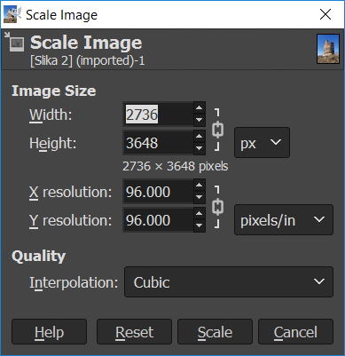

Програм за обраду слике -- Gimp 
===============================

Овај програм пружа бројне могућности за обраду слике. Gimp је бесплатан за преузимање и коришћење. 

.. technicalnote::
    
    Да бисмо инсталирали Gimp 2 на кућном рачунару, потребно је да посетимо интернет страницу https://www.gimp.org/downloads/ и одатле покренемо инсталацију. 

Опис поступка инсталације програма за растерску графику Gimp 2 можете погледати на доњем видеу:

.. ytpopup:: -jSiYBv9WeU
    :width: 735
    :height: 415
    :align: center

.. suggestionnote::

    Треба имати на уму да је поступак инсталације овог програма исти или врло сличан, без обзира на нове верзије које се често појављују. У овом тренутку (август 2022) актуелна је верзија  2.10.32 (2022-06-12) -– у загради је датум када је пуштена у рад. Верзије програма, не само овог, се стално надограђују и побољшавају, али ако научиш да користиш једну верзију, лако ћеш моћи да користиш и наредне.

Отварање дигиталне слике 
------------------------

Поступак за отварање постојеће дигиталне слике је следећи:

1. покрени програм Gimp 2,
2. кликни на File → Open, а затим одабери жељену слику са рачунара,
3. кликни на дугме Open.

Опис поступка отварања дигиталне слике у програму за растерску графику Gimp 2 можете погледати на доњем видеу:

.. ytpopup:: KK0tRQ26kN8
    :width: 735
    :height: 415
    :align: center

.. questionnote::

    Након што погледаш видео, отвори једну слику помоћу програма Gimp 2.

Промена димензија слике
-----------------------

Димензије слике могу бити изражене на различите начине (бројем пиксела, у центиметрима, милиметрима...). 

Промену димензије слике вршимо тако што изаберемо мени ``Image`` и у њему опцију ``Scale Image``. Oпција ``Width`` означава број пиксела по ширини, а ``Height`` број пиксела по висини слике.

.. infonote::

    Напомена: "Ланчић", који се налази са десне стране димензија слике, омогућава да се обе димензије равномерно мењају (ако је ланчић укључен истовремено се мењају и ширина и висина слике). Кликом на ланчић активираш или деактивираш ову опцију. Зашто нам је ова могућност важна? Ако мењаш димензију слике, најбоље је да ширину и висину мењаш сразмерно како се слика не би изобличила.

Опис поступка промене димензије слике у програму за растерску графику Gimp 2 можете погледати на следећем видеу:

.. ytpopup:: aulKLLd7Xk8
    :width: 735
    :height: 415
    :align: center

.. questionnote::

    Промени димензију отворене слике. Провери како изгледа слика ако истовремено мењаш и ширину и висину, а како када промениш само један од та два параметара.

Опсецање (кроповање) слике
--------------------------

Врло често се дешава да нам није потребна читава дигитална слика, већ само један њен део. Тада треба да применимо технику опсецања (кроповања слике). 

У програму Gimp, слику можемо да одсечемо на више начина. 

Овде су представљена два начина опсецања слике:

• Први начин: Одаберемо алатку за кроповање |krop|, означимо део слике који желимо да опсечемо и, на тастатури, притиснемо тастер Enter.
• Други начин: Означимо део слике коришћењем алатке за селекцију, а затим у менију ``Image`` одаберемо опцију ``Crop to Selection``.

Опис поступка одсецања дела слике у програму за растерску графику Gimp 2 можете погледати на доњем видеу:

.. ytpopup:: ckFV4T7Zlp0
    :width: 735
    :height: 415
    :align: center

.. questionnote::

    Одсеци део слике коју си отворио.

Чување дигиталне слике
----------------------

Након што смо унели измене, слику је потребно сачувати на рачунару.

За чување слике у .jpg или .png формату у програму Gimp користи се опција ``File`` → ``Export Аs``. Код примене ове опције потребно је поставити квалитет слике (на пример на 100), а затим кликнути на дугме ``Export``.

Препоручујемо ти да за чување слика користиш опцију ``File`` → ``Export Аs``. Након што изабереш ову опцију, отвара се прозор у којем бираш име слике и место у рачунару на којем ће слика бити сачувана. Када кликнеш на дугме ``Export`` (1), отвориће се прозор у оквиру којег бираш ниво квалитета слике. У зависности од вредности коју постављамо коришћењем клизача (2) одређујемо квалитет слике. Кликом на дугме ``Export`` (3) слика ће бити сачувана на одабраном месту.

.. image:: ../../_images/L5S7.png
    :width: 600px
    :align: center

Опис поступка чувања дигиталне слике у програму за растерску графику Gimp 2 можете погледати на доњем видеу:

.. ytpopup:: qQ6cMiMe-Q4
    :width: 735
    :height: 415
    :align: center

.. infonote::
    
    Веома је важно нагласити да квалитетна дигитална слика заузима више меморијског простора од мање квалитетнe.

.. questionnote::

    Отвори изабрану слику на рачунару помоћу програма Gimp 2. Промени јој димензију, промени оријентацију, опсеци неки део. Сачувај је у формату .xcf и при том јој додели име Slika – ver 1. Oтвори поново ову сачувану слику помоћу програма Gimp 2, али је сада сачувај под именом Slika – ver 1 у формату .jpg.
    Анализирај која је разлика када слику Slika – ver 1. jpg отвориш у програму Gimp 2   и када отвориш Slika – ver 1.xcf  у истом програму.

Онлајн програми за уређивање слика
----------------------------------

Понекад ти може затребати да измениш слику на рачунару на којем нема инсталираног програма Gimp, а немаш дозволу да инсталираш нови програм. На пример, ако радиш на пројекту у школској библиотеци или користиш рачунар родитеља за израду презентације.

Уколико на рачунару постоји инсталиран програм Paint, онда у њему можеш урадити основне корекције слике: отварање дигиталне слике (опција ``File`` → ``Open``), промена димензија (опција ``Resize``), промена оријентације слике (``Rotate``), опсецање (опција ``Crop``) и чување дигиталне слике у одабраном формату (опција ``File`` → ``Save As``).

.. image:: ../../_images/L5S11.png
    :width: 600px
    :align: center

Постоји велики број онлајн програма за обраду слика.

Ове програме није потребно инсталирати и доступни су са било ког рачунара који има приступ интернету. Неки од ових програма су бесплатни за коришћење (на пример, програм Pixlr, који је доступан на веб-адреси https://pixlr.com/rs/).

Опције које имају су врло сличне као и описани Gimp 2.

.. image:: ../../_images/L5S10.png
    :width: 700px
    :align: center

.. infonote::

    **Шта смо научили?**
 
    •	да је рачунарска графика стварање и приказивање слика уз помоћ рачунара,
    •	да број пиксела одређује квалитет дигиталне слике,
    •	да је растерска графика изграђена је од пиксела,
    •	да програм Gimp даје бројне могућности за обраду слика и бесплатан је за коришћење,
    •	да се у онлајн програмима за уређивање слика могу урадити основне измене слике: промена димензија, промена оријентације слике, опсецање (кроповање) и чување дигиталне слике у одабраном формату.

