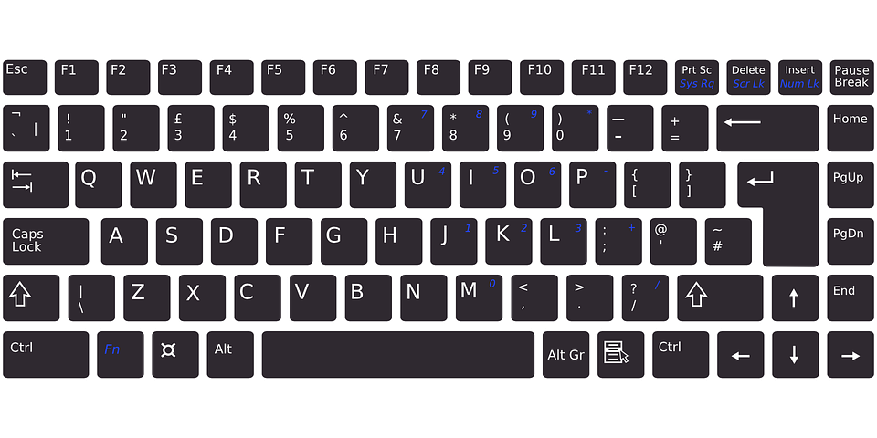

Рад са текстом
==============

.. infonote::

    **На овом часу ћеш научити:**
    
    •	како се уноси текст у рачунар,
    •	шта је дигитални правопис који треба поштовати приликом уноса текста.

Појава дигиталних уређаја и њихова масовна употреба је омогућила да људи у кућним уловима могу да креирају текст, а затим га и одштампају. Прошло је много времена од појаве првих штампарских машина, када су књиге и штампани материјали били права драгоценост.

Различити дигитални уређаји ти дају могућност да напишеш и сачуваш текст без коришћења папира. 

Програми за унос и обраду текста су бројни. Најчешће коришћен је **Microsoft Office Word (MS Word)**. За коришћење овог програма потребно је да имамо лиценцу (програм се плаћа). Поред MS Word-а, често се користе и бесплатни програм **Libre Office Writer** (LO Writer) и сервис **Google Docs** (Гугл документи). Ако се упознаш са једним од ових програма, једноставније ћеш користити остале програме или унапређене верзије истог програма.

Унос текста
-----------

Текст се уноси коришћењем тастатуре. Тастатура може бити **физичка** (какву вероватно имаш у школском кабинету) или **виртуелна**.

    Физичка тастатура 

Виртуелне тастатуре се често користе у уређајима који имају екране осетљиве на додир.

    Виртуелна тастатура на таблету 

    matt buchanan, CC BY 2.0 <https://creativecommons.org/licenses/by/2.0>, via Wikimedia Commons

    Виртуелна тастатура на равној површини

    Jinho Jung from Seoul, South Korea, CC BY-SA 2.0 <https://creativecommons.org/licenses/by-sa/2.0>, via Wikimedia Commons

Постоје уређаји који приказују слику тастатуре на некој равној површини, на пример на столу, а затим помоћу камере и нарочитог софтвера препознају који тастер је "притиснут".

На тастерима неких тастатура нису исписана: 

•	ћириличка слова ђ, ж, љ, њ, ћ, ч, џ, ш,
•	латиничка слова č, ć, đ, š, ž.

    
Међутим, то не значи да их није могуће откуцати. Одабиром српског језика (ћириличког или латиничког писма), тастери добијају нове улоге.

Правила уноса:

•	велико слово куцамо тако што држимо притиснут тастер **Shift** и жељено слово,
•	тастер **Caps Lock** укључујемо када желимо да сва слова која куцамо буду велика; када је овај тастер укључен, мало слово можемо откуцати тако што држимо притиснут тастер **Shift** и жељено слово. На куцање малим словима се враћаш искључивањем тастера **Caps Lock**, 
•	размак између речи (спејс, бланко) куцамо притиском на тастер **Space**,
•	текст бришемо притиском на тастер **Delete** или на тастер **Backspace**,
•	знакове који су приказани у горњим угловима тастера са бројевима или знаковима куцамо тако што држимо притиснут тастер **Shift**,
•	за прелазак у нови ред користимо тастер **Enter**,
•	за увлачење новог реда користимо тастер **Tab**.

.. infonote::
    
    Текст треба да уносимо не размишљајући о преласку у нови ред. Рачунар аутоматски наставља исписивање текста у наредном реду. Тастер **Enter** треба да притиснеш само када желиш да пређеш у нови пасус или када ти је нови ред потребан због исписивања наслова, управног говора, уметања слике...
