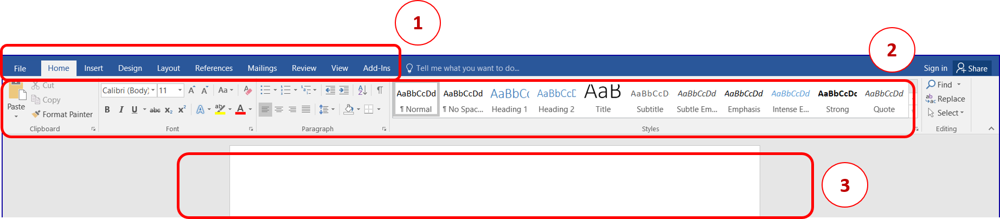
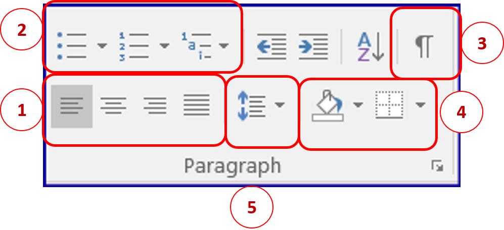

Рад са текстом - едитовање и форматирање текста
===============================================

.. infonote::

 На овом часу ћеш научити:
    •	која је разлика између уређивања (едитовања)  и форматирања текста;
    •	како да урадиш измене у откуцаном тексту;
    •	које су могућности и на који начин можеш да промениш изглед текста.

Обрадити текст значи изменити га. Када су измене у питању, важно је да знамо да постоје две основне категорије – **едитовање** (енг. edit) и **форматирање** (енг. format).

**Уређивање (едитовање)** значи измену текста, брисање неких делова и додавање нових речи. Ако прочитамо текст пре и после едитовања, видећемо да његов садржај није исти.

**Форматирање** је промена изгледа текста. Ако прочитамо текст пре и после форматирања, видећемо да је садржај остао исти, али је изглед текста другачији.

Један од најпопуларнијих програма за обраду текста је свакако **Microsoft Office Word** па ће сви примери бити показани на њему.

Документа израђена у MS Wordu-у се састоје од листова, налик књизи. Величиа тих листова се може подешавати али је најчешће подешена на величину А4 (ширина 20,99 mm, висина 29,7 mm).

Покретањем програма MS Word-у добијаш празан лист за унос садржаја, Уколико је текст који уносиш дужи од једне стране, аутоматски ће се додавати нове стране.

1 - основне картице за рад у програму
2 – алатке изабране картице
3 – простор за унос текстуалног садржаја

Основне картице у Word-у су:
    1. Home – Почетак, почетна картица са основним алаткама за уређивање текста
    2. Insert – Уметање различитих садржаја (табела, слика, облика и сл.)
    3. Design – Дизајнирање изгледа читавог документа
    4. Page layout – Распоред на страници, изглед и оријентација стране
    5. References – Референце за креирање аутоматског садржаја, фуснота и др.
    6. Mailings − Пошиљке
    7. Review – Редиговање, преглед документа
    8. View – Приказ, увеличан или умањен, приказ лењира, броја страна и др.
    9. Add–ins – Додаци
    10. File – картица за рад са документом

.. questionnote::

    
    Са следећег линка преузми Word документ са текстом. На том тексту ћеш испробати основне функције овог програма. 

Пре него што примениш едитовање или форматирање, мораш да изабереш на који део текста се то односи. То ћеш урадити тако што ћеш означити (каже се и одабрати, а најчешће селектовати) текст који желиш, а онда применити акцију едитовања или форматирања.

Текст означаваш тако што кликнеш испред првог знака и, држећи притиснут леви тастер миша, превучеш преко текста који желиш да означиш. У тексту се може означити и само једно слово, реч, реченица, пасус, али и цео текст. Цео текст можеш означити тако што ћеш на тастатури истовремено притиснути тастере **Ctrl** и **A**. Селектовани текст је сиве боје.

Најосновније акције едитовања су:
    -	брисање можеш обавити помоћу тастера **Delete** (брише цео селектовани текст или карактер по карактер на десно од положаја курсора) или тастера **Backspacе** (брише карактер по карактер на лево од курсора)
    -	дописивање текста обављаш тако што поставиш курсор на позицију где желиш да допишеш текст
    -	копирање текста вршиш помоћу алатке **Copy** коју примењујеш на селектовани текст; 
    -	одсецање текста подразумева да се селективани текст са обрише и истовремено копира и за то користиш алатку **Cut**
    -	премештање копираног или одсеченог текста вршиш применом алатке **Paste**

.. infonote::

    Опције копирање, одсецања и премештања се веома често користе па је могуће извршити их истовреним коришћењем следећих тастера на тастатури:

        - **CTRL** + **X** = Cut
        - **CTRL** + **c** = Copy
        - **CTRL** + **V** = Paste
        

Опис поступка едитовања у програму за обраду текста можете погледати у следећем видеу:

.. ytpopup:: 5Aoqhp_iOKQ
    :width: 735
    :height: 415
    :align: center

Када пишемо оловком на папиру свако од нас исписује слова и бројеве на посебан начин. Неко има врло уредан рукопис, неко пише слова више искошено и слично. Програми за рад са текстом нуде ти да одабереш „дигитални рукопис“ - фонт (на пример, *Times New Roman, Arial, Cambria...*) 

**Фонтови** су фамилије слова, бројева и знакова карактеристичног изгледа. Н

.. suggestionnote::

    Основна сврха текста је да информише читаоца. Људи воле да читају прегледне текстове. Зато, бирај лако читљиве фонтове који не заузимају превише места на страни.

Приликом форматирања текста можемо унапред одабрати све параметре, након тога они ће бити примењени на текст који уносимо или можемо селектовати већ откуцан текст а затим на селектовани део применити жељене промене.

Најважније акције форматирања су:
    1.	Избор типа фонта 
    2.	Промена величине слова
    3.	Наглашавање текста (подебљана - Bold, искошена - Italic или подвучена - Underline слова)
    4.	Промена боје слова

.. questionnote::

    Уреди текст који си преузео на следећи начин:
    
    .. image:: ../../_images/word_zadatak1.png
        :width: 600px
        :align: center
    
    Употребљени фонт је Candara а величина 16.

.. questionnote::

    Прекуцај следећи текст и уреди га како је приказано (фонт можеш изабрати по жељи, приказани је Cambria):
    
    .. image:: ../../_images/word_zadatak2.png
        :width: 600px
        :align: center
    
Уређивање пасуса
----------------

Пасус (или параграф) је самостални део текста који има одређени смисао а у Word-у га често дефинишемо као низ знакова непрекинутим тастером **Enter**.

Дакле, да би прешао у нови пасус потребно је користиш тастер **Enter**.

Основне акције форматирања параграфа су:

1.	Креирање листе са набрајањем
2.	Поравњање текста (са леве стране, централно, са десне стране и обострано)
3.	Подешавање размака између редова
4.	Подешавање боје позадине слова или целог пасуса и оквира
5.	Показивач пасуса (када је укључен показује знак ¶ на свим местима где је притиснут тастер Enter)

Опис поступка форматирања у програму за обраду текста можете погледати на доњем видеу:

.. ytpopup:: 9xDDBLxe2eo
    :width: 735
    :height: 415
    :align: center

**Листе са набрајањем** могу почињати неким знаком или бројем. Након преласка у наредни ред притиском на Enter аутоматски ће се поставити знак или следећи наредни број.

.. questionnote::

    Прекуцајте следећи текст и употребите листе са набрајањем.

    Гроздана Олујић била је српска:
        •	списатељица, 
        •	есејисткиња,
        •	преводитељка
        •	антологичарка.
    Легат Гроздане Олујић налази се у Адлигату. Као романсијер, објавила је шест романа: 
            1.	Излет у небо, 
            2.	Гласам за љубав, 
            3.	Не буди заспале псе, 
            4.	Дивље семе, 
            5.	Гласови у ветру и 
            6.	Преживети до сутра

.. questionnote::

    Прекуцајте следећи текст и употребите листе са набрајањем.

    .. image:: ../../_images/word4.png
        :width: 600px
        :align: center

.. questionnote::

    Откуцај следећи текст и форматирај како је приказано (укључи опцију ¶).

    .. image:: ../../_images/word5.png
        :width: 600px
        :align: center