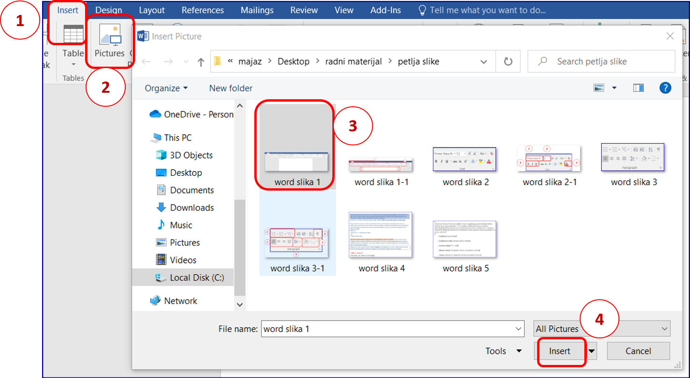
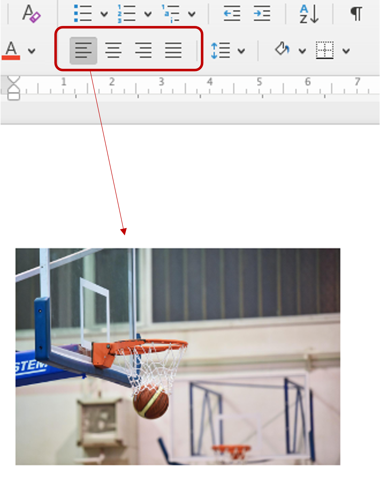

Уметање слике у текст
======================

Осим основне картице Home, најчешће ћеш користити картицу **Insert** (Уметање) за додавање различитих графичких елемената у текст – слике, видеа, коментара, посебних графичких облика, потписа, формула и сл.

Процес додавања слике је веома једноставан: одаберемо картицу **Insert** (1), затим **Picture** (2) чиме се отвара прозор у коме бирамо жељену слику (3), и на крају кликнемо на дугме **Insert** (4).

Опис поступка уметања слике у текст у програму за обраду текста можете погледати на доњем видеу:

.. ytpopup:: dP055FJdSvk
    :width: 735
    :height: 415
    :align: center

Положај слике на страници можеш подесити на исти начин као што поравнаваш текст. 

Селектовањем слике, добијаш могућност да је поставиш уз леву страну маргине (као на слици изнад), на средини или уз десну страну маргине – као као вршиш поравњање текста.

Текстуални документ можеш да **одштампаш** одабиром опције File → Print.
Опис поступка штампања документа можеш погледати на доњем видеу:

.. ytpopup:: w0RPXVxxFmQ
    :width: 735
    :height: 415
    :align: center

.. learnmorenote::

    Рад у апликацији, односно сервису Google Doc омогућава да:

    • пишемо текстове, чак и без интернет конекције,
    • делимо документе и радимо на њима у исто време са другим људима, али са различитих локација,
    • све што напишемо аутоматски буде сачувано у облаку података,
    • отварамо, дорађујемо и чувамо документе креиране у другим програмима за обраду текста.

    .. image:: ../../_images/L7s40.png
        :width: 720px
        :align: center
    
    Значајно је нагласити да није важно у ком програму за обраду текста радимо. Свако ко познаје принцип рада у једном, способан је да користи сваки од њих!

    Опис поступка едитовања и форматирања текста у сервису Google Doc можете погледати на доњем видеу:

    .. ytpopup:: HVfwjBP8Xbg
        :width: 735
        :height: 415
        :align: center

    Опис поступка дељења документа у сервису Google Doc можете погледати на доњем видеу:

    .. ytpopup:: rSMV-PO1RwQ
        :width: 735
        :height: 415
        :align: center

**Шта смо научили?**

• да je eдитовање измена садржаја текста,
• да је форматирање промена изгледа текста,
• да су фонтови фамилије слова, бројева и знакова карактеристичног изгледа.
