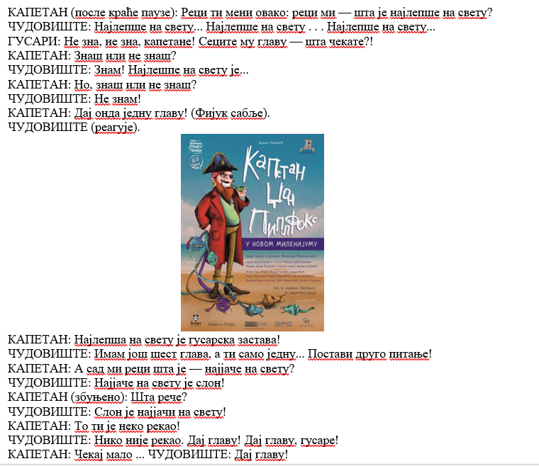
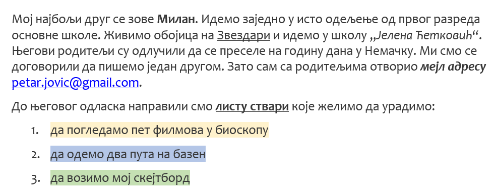

Задаци. Рад са текстом
======================

.. infonote::

    У овом делу биће представљени задаци за вежбање:

    • едитовања текста,
    • форматирања текста.

Задатак 1.
~~~~~~~~~~

Покрени програм за обраду текста и откуцај следећи текст.

.. image:: ../../_images/L7S43.png
    :width: 800px
    :align: center

Форматирај га да изгледа овако:

.. image:: ../../_images/L7S45.png
    :width: 800px
    :align: center

Сачувај документ у фасцикли Documents, под именом MaliPrinc.docx.

Решење овог задатка можеш да погледаш на следећем видеу:

.. ytpopup:: lY9sukkgTvY
    :width: 735
    :height: 415
    :align: center

Задатак 2.
~~~~~~~~~~

Преузми слику са следећег `линка <../../piplfoks.jpg>`_.

Откуцај текст како је приказано и додај преузету слику.

Задатак 3.
~~~~~~~~~~

Откуцај следећи текст онако како је приказано на слици.

