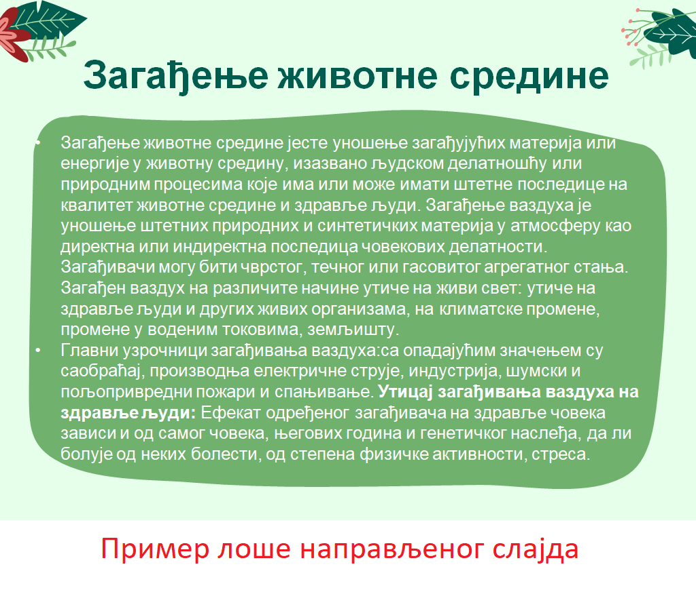
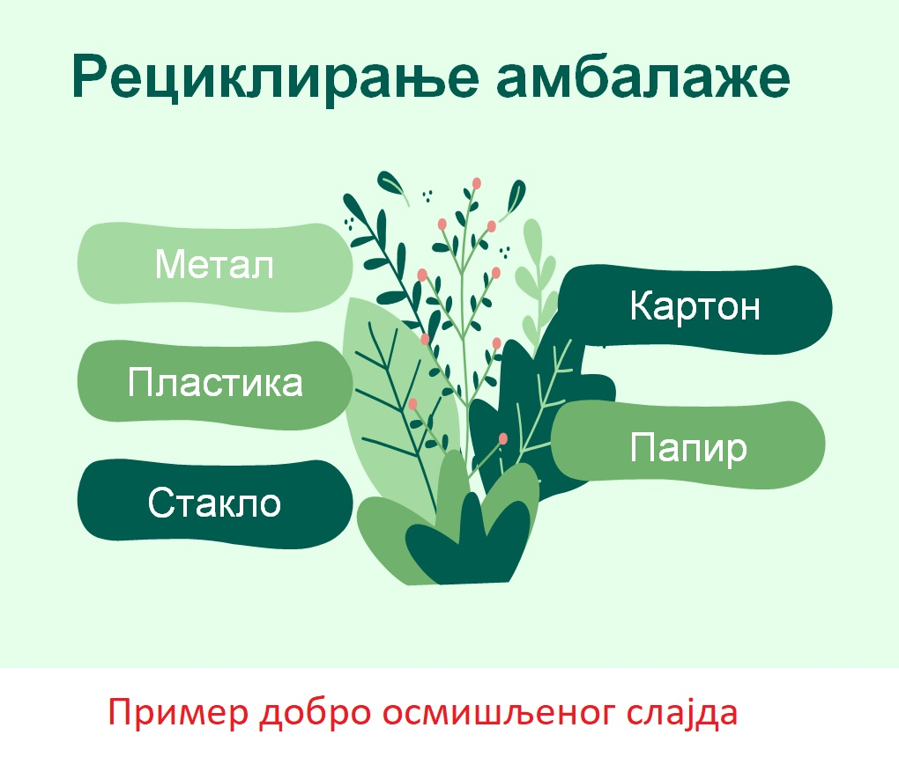

Рад са слајд презентацијама
============================

.. infonote::

    На овом часу ћеш научити:

    • шта је мултимедијaлна презентација,
    • које су одлике квалитетне мултимедијaлане презентације,
    • како да креираш добру мултимедијaлну презентацију.

Мултимедијалне презентације
---------------------------

Појам **презентација** означава процес представљања неке теме публици. Током презентације, **презентер** користи помоћна средства (најчешће рачунар) да би што боље објаснио садржај о коме говори и појачао утисак који оставља на публику. Рачунар доприноси квалитету презентације зато што обезбеђује **мултимедијалност** – омогућава представљање информација не само у виду текста и графике (слика), већ и у облику звука, видео-записа и анимираних (покретних) слика.

Наравно, презентација се може обавити и без рачунара, уз помоћ постера, зидних новина или само речима. Ипак, ако је презентација мултимедијална, то ће допринети њеној занимљивости.

Постоји велики број програма за  креирање мултимедијалних презентација, оних које се инсталирају на рачунару и оних које се користе онлајн.

Ми ћемо креирање презентације показати на примеру програма Microsoft Power Point из пакета MS Оffice.

Као и за MS Word, за коришћење MS Power Point-а потребна је лиценца (програм се плаћа). Поред Power Point-а, често се користи бесплатни програм Libre Office Impress, као и сервис Гугл Презентације (енг. *Google Slides*).

Презентације се састоје из слајдова, слично ако што се Word документ састоји од страна.
Често ове презентације називамо слајд-презентације.

Важно је нагласити да слајдови не смеју да буду важнији од особе која презентује садржај. Присутна публика је дошла са намером да чује оно што презентер говори. Способност да презентер исприча причу и пренесе основну поуку приче не треба да остане у сенци компликованих и претрпаних слајдова.

Да би презентација заиста допринела квалитету представљања неке идеје, тј. преношењу одређене поруке, пожељно је да број слајдова одговара намени презентације, дужини трајања излагања, као и публици којој је презентација намењена. Постоје одличне презентације које трају сат времена а презентер употреби свега неколико слајдова.

Ако покушаш да на интернету пронађеш савете за креирање добре презенације, наићи ћеш на много текстова о томе и много различито формулисаних савета. Ипак постоји неколико универзалних, којих се треба придржавати:

1. Презентација треба да буде организована
(треба да има насловни слајд, понекад уводни који упознаје публику са темом, слајдове са садржајем и закључни слајд; сваки слајд треба да има наслов, чак и ако се наслови понављају на више слајдова).

2. Никако не постављати превише садржаја (слика, текстова) на један слајд 
(слајд мора бити прегледан, са јасном поруком и сврхом; пожељно је користити листе са набрајањем; избегавати форму реченице, осим када је то смислено и неопходно).

3. Форматирање текста треба да је у функцији презентовања
(немојте користити различите фонтове; величину слова прилагодите простору за текст – за садржај обично 24-28 pt, за наслове 36-40 pt; користити једну до две боје за истицање, као и подебљана или подвучена слова; избегавати искошена и само велика слова).

4. Коришћење сведеног, готовог дизајна за слајдове је увек боље од превише шарених слајдова
(никада не користити превише боја или различит дизајн у оквиру једне презентације, осим ако то треба да пошаље посебну поруку публици; користити једноставне, једнобојне позадине које су у контрасту у односу на слова).

Мултимедијална презентација има сврху само ако на примерен начин подржава твоје усмено излагање. На следећим сликама можеш видети пример једног лоше направљеног слајда са превише текста и један добро осмишљен слајд.

    

    
Успех презентације зависи не само од изгледа, већ и од начина на који је садржај презентован. Читање са слајдова је погрешан начин презентовања. Потребно је да се презентер припреми и да добро познаје садржај презентације, а да се на самом слајду налазе најважнији појмови у вези са темом о којој прича. Пожељно је, ако је то могуће, укључити и публику у дискусију.

Да би презентација оставила на публику жељени утисак, потребно је да:
    •	добро проучиш тему коју презентујеш,
    •	увежбаш усмено излагање, најбоље пред укућанима или огледалом (текст не треба да учиш напамет),
    •	оствариш контакт очима са публиком током излагања,
    •	никако не читаш са слајдова,
    •	не окрећеш леђа публици током излагања,
    •	оставиш публици довољно времена за питања.

.. infonote::
    
    Веома је важно разумети да, ако знамо да радимо у једном од оваквих програма, стичемо знања и вештине за рад у другим програмима исте намене.
