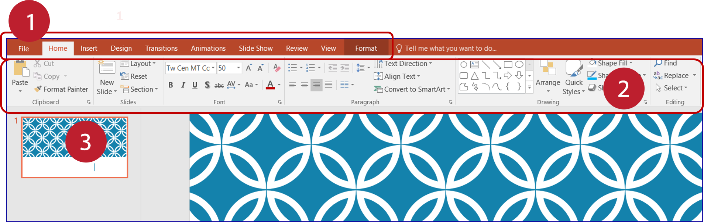
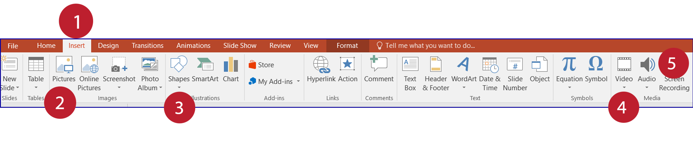
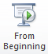
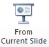
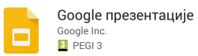

Презентације у MS Power Point-у
===============================

Програм MS Power Point у Windows оперативном систему покрећемо кликом на Start → All Programs → Microsoft Office → Microsoft Office Power Point.

Отвориће се радно окружење које садржи само један, празан слајд. 

1. основне картице за рад у програму,
2. алатке изабране картице,
3. умањени приказ једног слајда.

Основне картице у Power Point-у су:

1. Home -- Почетак, почетна картица са основним алаткама за уређивање текста.
2. Insert -- Уметање различитих садржаја (табела, слика, облика и сл.).
3. Design -- Дизајнирање изгледа читаве презентације.
4. Transitions -- Начини прелаза с једног слајда на други.
5. Animations -- Анимирање објеката на слајду (начин појављивања, понашање на слајду и начин нестајања).
6. Slide Show -- Начин приказивања презентације.
7. Review -- Редиговање, преглед документа.
8. View -- Начини приказа слајдова, приказ лењира и др. 

.. suggestionnote::

    Примети да су неке картице и њихове алатке врло сличне као и у Word-у .

Додавање новог слајда
---------------------

Нови слајд додајеш кликом на дугме **New Slide**. У падајућој листи, испод дугмета New Slide, можемо да одаберемо распоред елемената -- **Layout** (текста, слика, звучних и видео-записа) на слајду. На пример, можемо изабрати да слајд садржи само наслов и поднаслов или слику и текст и слично.
 
.. figure:: ../../_images/pp2.png
    :width: 800px
    :align: center
    :class: screenshot-shadow

1.  додавање новог слајда,
2. избор типа слајда (са насловом и поднасловом, са насловом и листом за набрајање, празног слајда и сл.).

Чим додаш нови слајд, са леве стране ће бити његов умањен приказ.

.. suggestionnote::

    Најбоље је да користиш понуђена поља за унос текста. На тај начин, док не стекнеш мало више искуства, имаћеш презентације са добро постављеним текстом. Текст који уносиш на слајд можеш да едитујеш и форматираш на исти начин као и у програму за обраду текста.

Додавање слика, видео и звучних записа
--------------------------------------

На слајд се, осим текста, могу додати и други садржаји: слика, звучни запис, видео-запис, графикони, цртежи и сл. коришћењем алатки на картици **Insert**.
 

1 – картица Insert,
2 – Pictures – за додавање слике,
3 – Shapes – за додавање графичких облика (стрелице, квадрата, круга, правоугаоника и сл.),
4 - Video -- за додавање видео-записа,
5 – Audio -- за додавање звучног записа.

Опис поступка додавања новог слајда и уређивање слајдова у мултимедијалној презентацији можете погледати на доњем видеу:

.. ytpopup:: PYx59pBNloo
    :width: 735
    :height: 415
    :align: center

Опис поступка додавања слика у мултимедијалној презентацији можете погледати на доњем видеу:

.. ytpopup:: 2o-tzRQJOeg
    :width: 735
    :height: 415
    :align: center

Опис поступка за уметање звука у програму за креирање мултимедијалних презентација можете погледати на доњем видеу:

.. ytpopup:: OwAUUkZo3yA
    :width: 735
    :height: 415
    :align: center

На сличан начин у презентацију се може додати видео-запис. Видео-датотеку можемо да додамо из фасцикле са рачунара или неког спољњег уређаја (флеш-меморије, телефона и сл.).

Неки сајтови, као што је Youtube, дозвољавају да се видео-запис дода (угради) на слајдове. Овај начин додавања видео-датотека је погодан ако желимо да смањимо величину датотеке презентације. Међутим, сваки пут када користимо презентацију у којој је уграђен видео-запис, рачунар мора да буде повезан са интернетом како би видео могао да буде пуштен. Као и код звука, и видео-датотеку можеш да репродукујеш аутоматски или кликом на њу.

Опис поступка за уметање видео-записа у програму за креирање мултимедијалних презентација можете погледати на доњем видеу:

.. ytpopup:: y-7Qp_FWNuM
    :width: 735
    :height: 415
    :align: center

Чување презентације
-------------------

Кликом на картицу **File**, која се налази у горњем левом углу прозора, добијаш могућност да сачуваш презентацију, али и да креираш нову или отвориш постојећу.

Опис поступка за чување мултимедијалне презентације можете погледати на доњем видеу:

.. ytpopup:: p6ImC-1gr0k
    :width: 735
    :height: 415
    :align: center

.. suggestionnote::
    
    Да би презентација радила и на другим дигиталним уређајима, пожељно је да звучне и видео записе које смо уградили у презентацију, сместимо у исту фасциклу где се налази презентација.

Опис поступка за чување мултимедијалне презентације за рад на различитим дигиталним уређајима можете погледати на доњем видеу:

.. ytpopup:: xKui0wev_QM
    :width: 735
    :height: 415
    :align: center

Покретање презентације
----------------------

Презентацију покрећемо:

• помоћу тастатуре, притиском на тастер ``F5``,
• одабиром опције ``Slide Show`` → ``From Beginning`` |taster1|,
• одабиром опције ``Slide Show`` → ``From Current Slide`` |taster2|.

**Шта смо научили?**

• да je презентација процес представљања неке теме публици,
• да је мултимедијална презентација представљање информација у виду текста, графике (слика), звука, видео-записа и анимираних (покретних) слика,
• да се презентације састоје од слајдова,
• да je слајд страница презентације,
• да успех презентације не зависи само од изгледа, већ и од начина на који је садржај презентован,
• да садржаји слајдова треба да су у складу са следећа четири принципа: 

  - користи слику уместо текста, 
  - један слајд -- једна порука, 
  - избегавати набрајања,
  - да буде што једноставнији.
