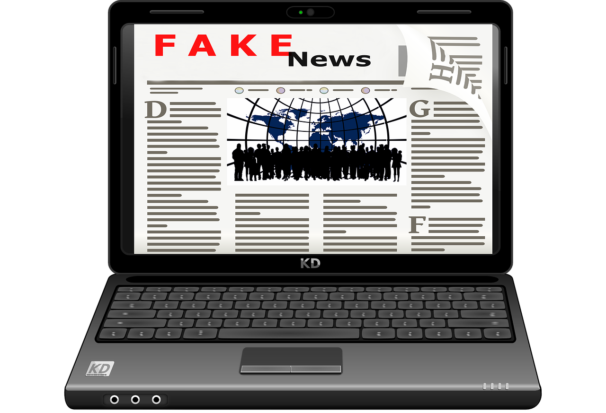

Критички приступ информацијама на интернету
============================================

Када је у питању количина расположивих информација о најразличитијим темама, веб је одавно превазишао све библиотеке. Међутим, оно о чему морамо да водимо рачуна када су у питању информације које добијамо преко интернета јесте њихова **релевантност**. 
Информације на вебу нису нужно тачне, па када је у питању квалитет информација веб није превазишао библиотеке. Ипак, то не значи да на интернету нема веома квалитетних информација, само оне не би требало да се узимају безрезервно и увек их треба проверити из више извора и по потреби проверити их користећи библиотеке. 
Данас је веома лако поставити информације на веб, и то се може урадити тако да се не види **јасна намера и циљ постављања информација**. Информације су често подложне медијским манипулацијама у циљу спиновања јавног мњења, односно утицања на нечије ставове, процене и изборе на основу доступних информација, што се често злоупотребљава у маркетиншке сврхе од стране рекламних агенција. 

На који начин можемо утврдити релевантност информација на интернету и проценити њихову веродостојност? 
 * Најпре да проверимо сајт на коме су информације и која је циљна група тог сајта, коме је намењен јер публика којој је намењен сајт има директан утицај на садржај тог сајта. Ако је сајт намењен деци онда ће језик и илустрације на њему бити прилагођени њима тако да лако могу пратити и разумети садржај. Ако се ради о сајту намењеном стручњацима у некој области (нпр. лекарима, адвокатима, инжењерима) онда ће свакако садржати стручну терминологију коју може у потпуности да разуме само та циљна група.
 * Затим да пронађемо ко је аутор информација. Име аутора можемо да пронађемо обично на врху или на дну веб стране. Можемо употребити веб-претраживач да бисмо пронашли квалификације и компетенције аутора за садржај и теме о којима пише, на основу којих можемо проценити колико су информације меродавне. 
 * Затим, да проверимо колико је информација актуелна. Обично на врху или на дну веб-стране стоји датум последње промене или ажурирања (освежавања) информације. 
 * У циљу провере веродостојности, тачности и објективности информација, треба проверити да ли су наведени извори информација релевантни тако да се информација може проверити и на другом месту. У веб адреси сајта често се може налазити наговештај о томе чији је сајт, у зависноти од домена коме припада (нпр. да ли је у питању .edu домен или .com). Препоручује се да се информације које су нађене на веб-сајту увек провере упоређивањем са информацијама из другог извора.
 * На крају потребно је критички проценити са којом намером се информације пласирају. Сагледавањем те намере може се објаснити да ли је реч о реклами, о спонзорисаној веб-страници, да ли је у питању лична веб-страница или иза веб-странице стоји организација, дакле колико су информације објективне.