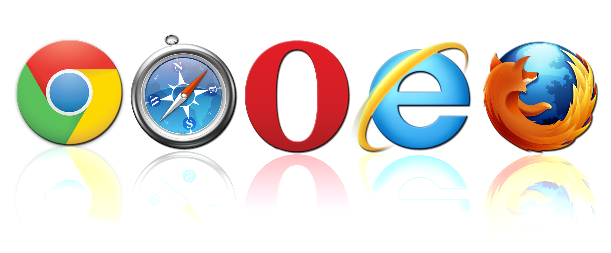

Претраживање Интернета, одабир резултата и преузимање садржаја
==============================================================

.. infonote::

 У овој лекцији ћеш научити:
    •	који су уобичајени начини приступа интернету;
    •	да самостално претражујеш интернет и проналазиш информације у дигиталном окружењу;
    •	преузимаш датотеке са интернета на свој уређај;
    • критички приступаш информацијама на интернету.

Приступање интернету
---------------------

Под приступом интернету у физичком смислу подразумева се способност појединаца или организација да се повежу на интернет коришћењем ИКТ уређаја и да користе услуге које нам интернет пружа, попут електронске поште или веба. 
**Веб** или **WWW** (енгл. World Wide Web – светска мрежа) представља међусобно повезане документе који су смештени на различитим рачунарима широм света, при чему сваки од њих има јединствену веб-адресу која се назива **URL адреса** (енгл. Uniform Resource Locator) или јединствени локатор ресурса на интернету.
Међусобно повезани текстуални документи и мултимедије чине светску мрежу веб-страница, а URL адресе су јединствене и омогућавају да се они лако и брзо пронађу на мрежи. 

Физички приступ интернету може се остварити:
 * жичаним путем (*wired*) преко телефонске линије или преко кабловског интернета (када се користи посебан кабл) или 
 * бежичним путем (*wireless*) односно бежичном технологијом, мобилним телефоном или сателитским преносом.
 
Сваки од ових начина приступа интернету има своје предности и недостатке са аспекта брзине преноса информација, поузданости, расположивости и цене.

За приступање услугама које нам интернет пружа потребно је на рачунару имати посебну врсту апликативног програма који се назива **веб (интернет) прегледач** или читач – енгл. *browser*. То је апликација која нам омогућава прегледање веб-страница и мултимедијалних садржаја на њима (текста, слика, звучних и видео-записа).
Веб је изумео Тим Бернерс Ли (Tim Berners-Lee) 1989. године, радећи у ЦЕРН-у у Швајцарској. Он је написао и први веб-читач. Веб и веб-читач имају огромни значај у развоју савременог информационог друштва и представљају основу која је омогућила милијардама људи да се повежу користећи интернет, стављајући у центар и наглашавајући знање.

Актуелни и најчешће коришћени веб-прегледачи су:
 * *Internet Explorer* - бесплатни веб-прегледач фирме Мајкрософт;
 * *Microsoft Edge* - веб-прегледач који се инсталира уз оперативни систем Windows 10;
 * *Google Chrome* - бесплатни веб-прегледач фирме Google пројектован с идејом да искористи све могућности Гуглових услуга;
 * *Mozilla Firefox* - бесплатни веб-прегледач; 
 * *Оpera* - бесплатан веб-прегледач фирме Оpera software и 
 * *Safari* - бесплатни веб-спрегледач фирме Apple.

Сви наведени прегледачи су графички што значи да могу приказивати визуелне садржаје и текст. Међутим, постоје и само текстуални прегледачи и специјализовани говорни прегледачи за слепе или слабовиде особе.

Претраживање и машине за претраживање интернета
-----------------------------------------------

С обзиром на то да је интернет непрегледан и практично неисцрпан извор информација, без постојања посебних машина за претраживање интернета (енгл. *web search engine*) или **претраживача веба** било би немогуће пронаћи тражене информације. 
На који начин ћемо поставити питање интернет претраживачу? Питање које постављамо претраживачу веба зове се упит. Када се покрене претраживач, у његово одговарајуће поље за претрагу унесе се упит у облику кључних реч. Као одговор на упит претраживач даје списак веб-страница које садрже кључну реч која се тражи упитом. 
Свака од излистаних веб-страница чије су адресе (и кратки описи) дати као одговор на упит може се посетити кликом мишем на име те странице на приказу који даје претраживач.

Познатији претраживачи су:
 * Google https://www.google.rs,
 * Yahoo https://yahoo.com,
 * Bing https://www.bing.com/ ,
 * Teoma https://www.teoma.com,
 * Yandex https://yandex.ru/,
 * Lycos https://www.lycos.com (садржи и претраживач),
 * Крстарица https://www.krstarica.com (садржи и претраживач).

Проналажење информација и њихово преузимање на уређај
----------------------------------------------------------

Појам који претражујемо на интернету уноси се у поље за претраживање као **упит** састављен од једне или више кључних речи или целе реченице. 
На основу унетог упита интернет претраживач бира странице које садрже тражени појам (унете кључне речи) или су повезане с њим и приказује нам њихов списак са називом, адресом и кратким садржајем.

Погледајте у наредним видео лекцијама како можете претражити информације и преузети датотеке са интернета.