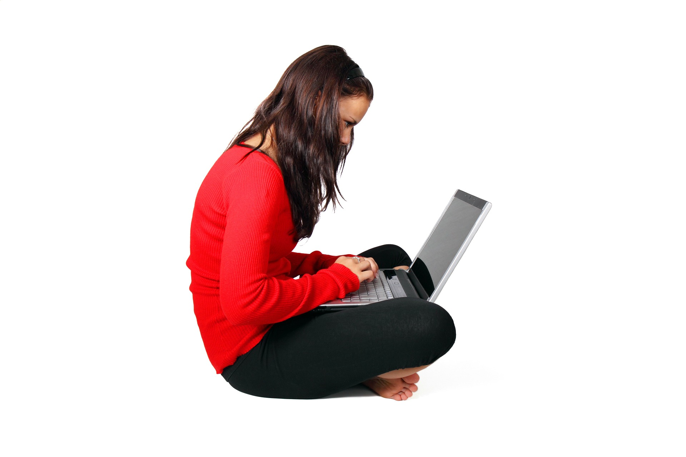

Заштита здравља, ризик зависности од технологије и управљање временом
=====================================================================

.. infonote::

 У овој лекцији ћемо говорити о:
    •	препознавању ризика зависности од технологије; 
    •	утицају неправилне и прекомерне употребе технологије на људско здравље;
    •	рационалном управљању временом које проводиш у раду са технологијом и на интернету.

Најчешће док користимо ИКТ уређаје ми уопште не размишљамо о томе како они утичу на наше здравље. На пример уколико сатима седимо радећи на рачунару или у полулежећем ставу радимо на лаптопу можемо након тога осећати **болове у леђима или врату**, или нас може болети **лакат или зглоб шаке**. 
Осим тога можемо осећати **главобољу** или **пецкање очију**. Можда сте и сами приметили код себе неке од ових симптома који настају као последица дуготрајне и неправилне употребе рачунара. Уколико се ИКТ уређаји користе дуги низ година не водећи рачуна о правилном начину коришћења и времену проведеном у њиховом коришћењу, ови штетни утицају могу трајно оштетити наше здравље. Дуготрајно и неправилно коришћење тастатуре може изазвати оштећења нерава, тетива или мишића у ручном зглобу или прстима, мишића у лактовима, раменима, врату или леђима. 
Позната је повреда лакта под називом „тениски лакат” која настаје услед неправилног дуготрајног коришћења миша.
Поред тога, као последица прекомерног дуготрајног коришћења рачунара могу се јавити **гојазност**, услед недовољне физичке активности, затим **главобоље** као и **оштећење вида**. Поред физичког здравља, дуготрајно коришћење рачунарских уређаја може имати утицај и на психичко здравље услед смањивања или одсуства комуникације са вршњацима или са породицом. 
Да бисмо избегли или бар ублажили све ове негативне последице потребно је да се придржавамо неких правила приликом коришћења ИКТ уређаја која су заснована на ергономским решењима. **Ергономија** је научна дисциплина која се бави дизајнирањем опреме и радног окружења тако да буду максимално прилагођене људској природи и потребама како би рад био ефикаснији а здравствени ризици смањени на што мању меру или у најбољем случају отклоњени. 
Коришћење ИКТ уређаја је неизбежно, а посебно у случају обављања посла путем интернета или похађања наставе путем интернета. Управо из тог разлога морамо све време бити свесни **здравствених ризика** и поштовати **мере за правилно коришћење ИКТ уређаја** у циљу заштите здравља. 

Неке од тих мера које смањују или отклањају неповољан утицај коришћења рачунара на здравље су следеће:
 * Очи би требале да буду 45–60 центиметара удаљене од монитора (отприлике толико износи дужина руке одрасле особе);
 * Горња ивица монитора треба да је мало испод висине наших очију;
 * Док радимо на рачунару требало би да седимо на столици са наслоном, са исправљеним леђима, ногама савијеним у коленима и стопалима на поду. Рамена би требало да буду паралелна са монитором а руке ослоњене, савијене у лактовима;
 * Светло би требало да буде са стране како екран монитора не би рефлектовао светлост и стварао бљесак;
 * При дуготрајном раду на рачунару важно је периодично правити паузе од 10 до 15 минута. За време паузе не треба да гледамо телевизију или телефон, већ да одмарамо своју кичму и очи тако што ћемо гледати у даљину кроз прозор, протегнути се и кретати;
 * Температура у просторији у којој је рачунар не треба бити висока и оптимално је да одговара просечној собној температури.

Зависност од технологије
------------------------

Дигитални уређаји нам пружају веома атрактивне доживљаје и често нисмо свесни колико времена проведемо уз њих у комуникацији на друштваним мрежама, прегледу видео клипова, гледању филмова и серија или игрању игрица. 
Тако несвесно потискујемо неке друге животне потребе и активности. Такво понашање показује да постоји **зависност од дигиталних уређаја**.
Зависност је прекомерна подложност некој штетној навици (попут конзумирања цигарета, алкохолних пића или дроге) и спада у болести или бар у проблеме. Зависност може бити
физичка, психичка или комбинација ова два облика. Зависност од технологије је један од облика психичке зависности у којем особа прекомерно посвећује своју пажњу и време неком  техничком уређају (рачунар, мобилни телефон, лаптоп, таблет, телевизор, плејстејшн).

Зависност од технологије може имати различите облике. Неки од њих су:
 * зависност од рачунара,
 * зависност од интернета,
 * зависност од рачунарских игара.

.. image:: ../../_images/social-media.jpg
   :width: 350px   
   :align: right 

**Зависност од рачунара и интернета** јесте стално присутна жеља да се проводи прекомерно време уз рачунар или на интернету занемарујући друге животне активности, као што су дружење, учење, кућне обавезе. 
Психолози сматрају да је разлог уживања у игрицама то што оне вешто активирају нашу жељу за добијањем награде: ако убијемо „чудовиште“ – добићемо додатне поене, ако пређемо на виши ниво – добићемо олакшице у игрању и нове поене или ће се чути весела музика, а ако победимо добићемо честитке, аплауз и осећај задовољства. 
Међутим, играјући рачунарске игре ми смо углавном све време пасивни и напети. Често у играма располажемо оружјем, пуцамо, уништавамо све више и агресивније. Постоји тежња да будемо све бољи и бољи у томе и постижемо све бољи резултат. 
Последице тога су да уместо задовољства у игрању, ако не победимо играмо још једном, па још једном, и тако у недоглед такимичећи се сами са собом. Познати су случајеви да без родитељског надзора нека деца тако дочекају јутро са погледом у екран. Последице су умор, поспаност и губитак концентрације целог дана.
Код овакве игре изостаје дружење у току и после играња, па немамо ни могућности успостављања правих пријатељства.

Неки од **симптома** који се испољавају код особа које имају један од ових проблема зависности су:
 * осећање напетости, нервозе или депресије када није уз рачунар или на интернету;
 * проводи много сати уз рачунар или на интернету и стално после тога разговара о утисцима;
 * заборавља сопствене животне потребе као што су исхрана, сан, хигијена;
 * радије бира да се игра за рачунаром него да се игра са братом, сестром или школским друговима;
 * Мобилни телефон држи стално у џепу или у видном пољу;
 * Спава са мобилним телефоном, прво што ујутру уради кад се пробуди прегледа мобилни телефон;
 * стално се осећа уморном и изолованом од заједнице; 
 * може осећати главобољу, бол у леђима, имати проблеме са видом, имати проблеме са спавањем.

Које су последице зависности од мобилних телефона, рачунара или интернета? Најчешће постоји зависност од свега тога заједно. Последице у нашем животу и по наше здравље су бројне.  
**Технологија** вешто **управља нашим временом** па тако никад немамо довољно времена ни за кога другог – за школу, друштво, породицу. Посебно опасно је то што често када постанемо зависни ми тога нисмо ни свесни, не примећујемо и поричемо да смо занемарили породицу, пријатеље и школске обавезе. 
На тај начин полако сами себе удаљујемо из друштва, све своје време посвећујемо мобилном телефону или рачунару и постајемо усамљени а да то и не приметимо. Наше дружење постаје „дружење преко мобилног телефона“. Треба настојати да више времена проводимо уживо са пријатељима уместо комуникације са њима путем друштвех мрежа. Бољи је осећај када уживо гледамо саговорника, његово лице, осмех, очи, покрете тела јер ту невербалну комуникацију не можемо заменити писањем порука. 
Често је узрок проблема зависности у стварном животу, несуочавање са правим проблемом и жеља да се побегне од свакодневног живота. Играње игрица, гледање садржаја на интернету и друштвене мреже нису начин да се проблем реши. Треба наћи прави начин да се са тим проблемом суочимо и решимо га.

.. image:: ../../_images/woman.jpg
   :width: 600px   
   :align: center 

Са обзиром на то да су последице зависности од ИК технологија озбиљне и несагледиве, морамо пронаћи начин како да их спречимо. Како то можемо учинити? Тако што ћемо бирати праву игру и дружење са другарима и породицом, боравити у природи, бавити се спортом уместо да гледамо по цео дан у мобилни телефон или рачунар.
У данашње време је веома тешко одупрети се прекомерном коришћењу ИКТ уређаја. Деца не могу и не би требало да се сама боре са тим. Пронађите време да се заједно забавите са родитељима и квалитетно проведете време, лепо и забавно а без телефона и рачунара. 
Уколико приметите неке од симптома зависности код свог друга или другарице, упозорите их да су постали зависници или да ће постати уколико већ нису. Уколико не можете да се сами изборите са зависности од игрица као и од ИК технологије, није срамота потражити помоћ. Опорављање је понекад дуготрајно и тешко. 

Управљање временом
------------------

.. image:: ../../_images/addiction.jpg
   :width: 350px   
   :align: right 

Кажемо да смо зависни од технологије када дозволимо да она управља нашим временом и нашим могућностима. Један од симптома зависности од технологије јесте прекомеран број сати проведених уз рачунар или на интернету. Кажемо да просечна особа осам сати дневно ради, осам сати одмара и осам сати спава.
Ако је просечно слободно време седам до осам сати дневно, а нека особа на интернету проведе четири сата, практично за све остале активности које чине свакодневни чивот тој особи остаје само три сата. Да ли је то довољно за неки спортски тренинг, за шетњу, разговор са пријатељима, одлазак у позориште, концерт, галерију, куповину и слично?
Због тога је веома важно знати како **управљати својим временом**. Управљање временом је коришћење времена тако да се остваре жељени циљеви у животу. Заправо потребно је да научимо да управљамо собом у времену. Потребно је да размотримо чему желимо посветити време и да идентификујемо које су наше битне дневне активности. 
Временом се управља ако се све активности обављају онда када су испланиране и ако им се посвећује онолико времена колико је планирано. Дакле, потребно је придржавати се плана трошења времена с циљем да се оствари равнотежа жељених активности. У томе је потребно јасно поставити циљеве и вредности. 
Циљеви су резултати које желимо да остваримо (нпр. да добро урадим контролни задатак...), а вредности су оно што нам је у животу важно (породица, дружење, учење, читање, ...). Када смо јасно поставили циљеве и вредности, потребно је сагледати активности које воде њиховом остварењу. 
Зато је добро направити **приоритет активности** односно редослед и препознавање оних које су важније од других. У савремено доба када дигиталне технологије несумњиво представљају важан и саставни део нашег свакодневног живота, важно је знати управљати временом, а не дозволити да технологије управљају нама.

