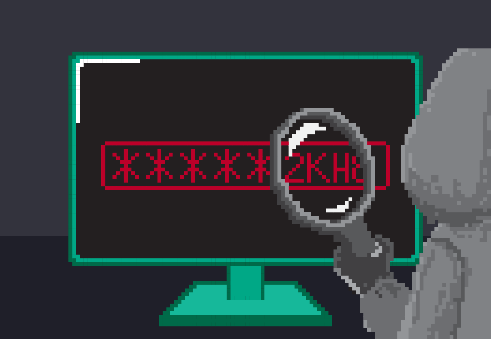

Ситуације које могу бити небезбедне при коришћењу ИКТ уређаја
=============================================================

Постоји, нажалост, много ситуација које могу бити небезбедне па и опасне уколико не користиш правилно рачунаре и друге ИКТ уређаје. Најчешће је то последица лошег и неправилног руковања самим уређајем, проблема који настају приликом прикључења уређаја на интернет и штетног утицаја садржаја којима особа може бити изложена.

.. suggestionnote:: Савети за безбедно руковање уређајем:

   -	мокрим рукама не треба додиривати електричне уређаје, самим тим ни ИКТ уређаје, поготово ако су прикључени на напон градске мреже
   -	немој да користиш уређаје у влажним просторијама попут купатила,
   -	укључивање и искључивање се мора обављати како је прописано упутством,
   -	обавезно користи оригиналне каблове за прикључивање уређаја на напајање или напон градске мреже,
   -	сваки квар који уочиш обавезно пријави одраслој особи,
   -	никако немој да користиш оштећене каблове за прикључивање уређаја на напајање,
   -	немој да користиш храну и пиће у околини рачунара, уколико ти се нешто проспе по уређају, то може трајно да га оштети.

Постоји могућност да неко неовлашћено приступи твом рачунару са циљем да оштети или преузме датотеке или фасцикле са подацима. Овакав поступак зове се **хаковање**.

Када се у рачунару чувају важни подаци, као што су, на пример, лозинке или подаци о банковним рачунима и платним картицама, поверљиви подаци о особама као што су лични или здравствени подаци, онда овакве крађе и упади могу да изазову веома велику штету.

Приликом преузимања података, слика, докумената или програма може се догодити да преузмеш и нежељени софтвер. Овакви софтвери могу пореметити или потпуно онемогућити рад рачунара, обрисати датотеке или фасцикле, закључати програме и сл. **Непожељне и опасне софтвере зовемо вируси**. Вирус се може пренети и коришћењем „заражене“ УСБ флеш-меморије.

Да би били заштићенији од таквих хакерских напада, потребно је да користимо различите програме који могу да спрече штету. Таква врста софтвера се најчешће назива **антивирусни софтвер**. Његова улога је да надзире рачунар и, ако у њему нађе неки злонамерни или потенцијално опасни програм, упозори нас о томе и да нам могућности да га контролишемо тако што ћемо га блокирати или уклонити из рачунара. 

.. suggestionnote:: Савети за безбедно коришћење интернета:

   -	неопходно је да водиш рачуна којим интернет страницама приступаш,
   -	приступај само оним страницама и садржајима који су примерени твом узрасту,
   -	посебно обрати пажњу при преузимању садржаја са интернет страница,
   -	никада и нигде не остављај личне податке  као ни лозинке,
   -	провери са особом која одржава рачунар да ли је инсталирана антивирусна заштита,
   -	уколико се у било ком тренутку осећаш угрожено или непријатно, обрати се одраслој особи којој верујеш.

Развојем интернета подаци и садржаји који се могу пронаћи се свакодневно увећавају. Нажалост, нису сви садржаји ни истинити, ни пријатни ни добронамерни.
Неки од њих могу озбиљно нарушити твоје психичко здравље. 
Такође, можеш бити изложен и различитим насилним облицима понашањима током комуникације на интернету. Понекада је тешко препознати дигитално насиље.

**У дигитално насиље спадају**:

• недозвољено саопштавање и дељење туђих приватних информација,
• промена туђих лозинки или њихова крађа и хаковање налога,
• слање и ширење рачунарских вируса и осталих злонамерних програма,
• постављање узнемирујућих, увредљивих или претећих порука, слика или видео-снимака или слање тих материјала на било који начин,
• непримерено коментарисање туђих објава, постова, слика, порука на друштвеним мрежама,
• подстицање мржње по различитим основама (националне, верске, територијалне, полне и др.),
• снимање и дистрибуција слика, порука и материјала сексуалног садржаја (са било каквом сексуалном конотацијом попут слика нагог тела, интимних делова тела или нуђења и описа сексуални активности).

Један од честих облика насиља на интернету је **сексуално насиље**. Сексуално насиље или злостављање је када се особа наводи на неки облик сексуалних активности које она не жели, које не схвата или за које није довољно одрасла, а то се постиже на силу, преваром или уценом. За то се често могу употребити фотографије, видео-снимци, снимак са веб-камере или снимак екрана преписке. Због тога је неопходно да будеш веома опрезан када постављаш своје фотографије на мрежу, када случајно или намерно посећујеш сајтове неприкладног садржаја и увек када комуницираш путем интернета, а нарочито у комуникацији са непознатим особама. 

С обзиром на то да улазиш у период пубертета, када откриваш и упознајеш своју сексуалност, природно је да те занима ова тема. Међутим, мораш бити обазрив када комуницираш са неким на интернету о томе. Може се десити да се на интернету непознате особе које су много старије од тебе представљају као твоји вршњаци, нуде да ти буду пријатељ и покушавају да сазнају информације о теби и твом животу постављајући многа лична питања. Када упутиш слична питања њима, обично дају неодређене одговоре или избегавају да одговоре, па то треба да ти буде неки знак да прекинете комуникацију. Уколико се догоди да ти нека непозната особа тражи да се сусретнете, обавезно обавести родитеље, неког од наставника или другу одраслу особу којој верујеш. Оно што је важно да знаш јесте да је сексуално насиље недозвољено и да није кривица оне особе која му је изложена, па уколико ти се догоди, не треба да се осећаш кривим, уплашеним и да те је стид, већ о томе треба да отворено разговараш са родитељима или са наставницима и да потражиш њихову помоћ.

.. suggestionnote:: Савети за безбедно коришћење интернета:

    - посећуј само странице и садржаје примерене твојим годинама,
    - никако не одговарај на питања када се траже твоји лични подаци или подаци о твојим укућанима,
    - имај на уму да не можеш са сигурношћу да знаш ко се налази "са друге стране" интернета,
    - размисли добро пре него што било шта поставиш на друштвене мреже,
    - уколико се у било ком тренутку осећаш непријатно, разговарај са одраслом особом од поверења.

За више информација о дигиталном насиљу, како да га препознаш и да правилно реагујеш на њега, предлажемо ти да посетиш сајт Уницефа https://www.unicef.org/serbia/zaustavimo-digitalno-nasilje и научиш како да зауставиш дигитално насиље.

Такође, у дигиталној библиотеци сајта **Паметно и безбедно** (https://pametnoibezbedno.gov.rs/files/file_upload/fajl/156_Brosura_Cyberbullying_nova_verzija-converted.pdf) можеш да погледаш и преузмеш брошуру о Cyberbullying-у и информишеш се о **вршњачком насиљу преко интернета** и како да реагујеш на њега.

Поред правила безбедног понашања, како бисмо заштитили себе од потенцијално опасних ситуација, потребно је да усвојите и **правила лепог понашања на интернету**, тзв. **интернет бонтон** или **нетикецију** (енг. *net* – мрежа, фран. *étiquette* – утврђени ред и начин понашања, бонтон, правила о коректном понашању).
