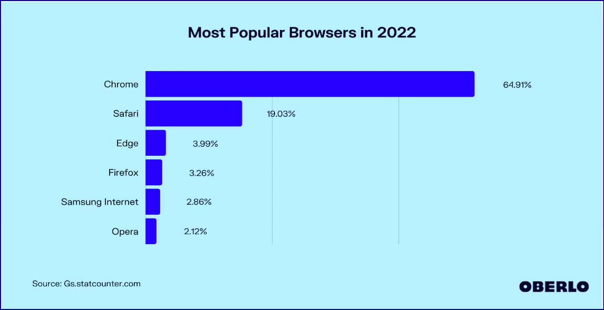
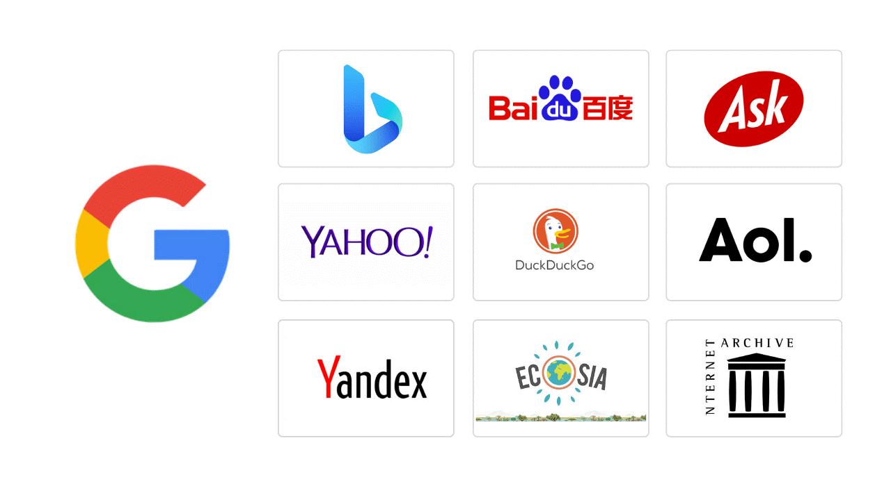
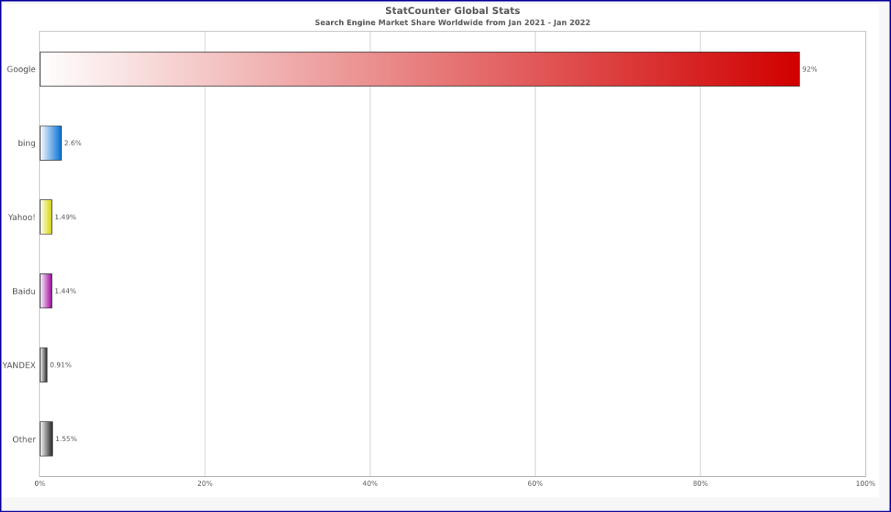

Претраживање Интернета, одабир резултата и преузимање садржаја
================================================================

У овој лекцији ћеш научити:
  •	који су уобичајени начини приступа интернету;
  •	да самостално претражујеш интернет и проналазиш информације у дигиталном окружењу;
  •	преузимаш датотеке са интернета на свој уређај;
  •	критички приступаш информацијама на интернету.

Приступање интернету
--------------------

Интернет  нам омогућава коришћење великог броја сервиса, приступ различитим датотекама, размену порука, приступ интернет страницама и сл.

Да би приступио било ком садржају на интернету, твој рачунар мора да има инсталиран неки од **веб (интернет) прегледача**.

**Веб (интернет) прегледач или Web Browers  је програм који омогућава приступ и преглед интернет страница.**

Да би приступио сајту Петље и прегледао овај курс, морао си користити неки од прегледача. 

Најпознатији прегледачи су **Google Chrome, Mozzila Firefox, Opera Browser, Microsoft Edge, Apple Safari, Vivaldi, Internet Explorer**.
Они се међусобно разликују по карактеристикама а поједини су прилагођени одређеним оперативним системима. Уколико је рачунар користи Windows оперативни систем, најбоље је инсталирати Microsoft Edge, док се Apple Safari може коритити само уз iOS.

Погледај следећи график, преузет са https://www.oberlo.com/statistics/browser-market-share.

Анализирај популарност различитих прегледача.

На `следећем линку <https://www.highspeedinternet.com/resources/best-web-browsers>`_ можеш пронаћу упоредне податке о различитим веб прегледачима.

Да би претраживали интернет користимо **интернет претраживаче. Веб (интернет) претраживачи су онлајн програми који омогућавају претрагу и приказ сортираних података на интернету.** Претраживање се врши тако што у поље за упит унесемо жељену реч или више речи или слику. Претраживач нам након врло кратког времена понуди списак **веб (интернет)** страница који садрже тражени податак.

**Свака веб страница има своју јединствену интерет адресу - URL адресу** (енгл. Uniform Resource Locator).

**Како изгледа интернет (URL) адреса?**

- https://petlja.org/
- https://www.mojasrednjaskola.gov.rs/
- https://kss.rs/
- https://nb.rs/

Један од најпопуларнијих сервиса интернета је **World Wide Web** који омогућава приступ веб страницама.

Познатији претраживачи су:
  •	Google https://www.google.rs
  •	Yahoo https://yahoo.com
  •	Bing https://www.bing.com/ 
  •	Baidu https://www.baidu.com/
  •	Ask https://www.ask.com/
  •	DuckDuckGo https://duckduckgo.com/
  •	Yandex https://yandex.ru/

Анализирај популарност веб претраживача посматрајући следећи график (преузет са https://serpstat.com/blog/which-search-engines-are-the-most-popular-on-the-internet-a-comparison-of-regions/) 

Који претраживач а који прегледач ти користиш?