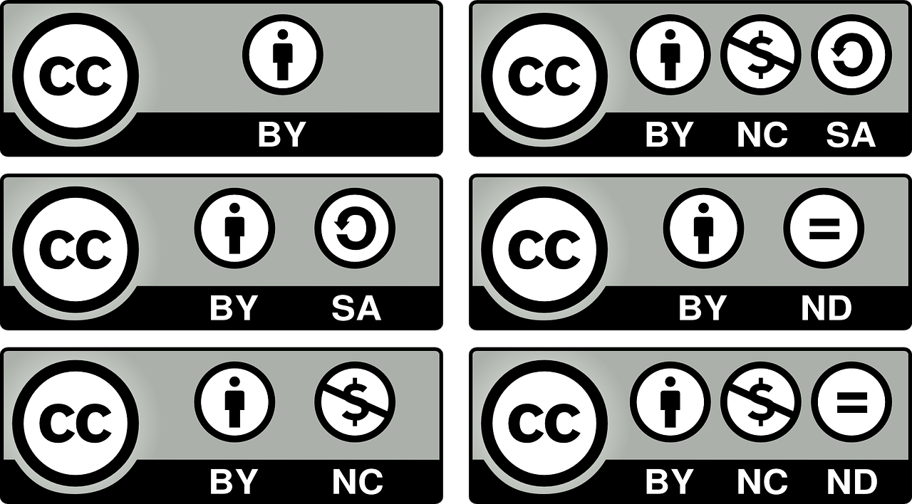

Заштита приватности личних података и ауторска права
====================================================

.. infonote::

 У овој лекцији ћеш научити:
    •	који је поступак за заштиту личних података и приватности на интернету; 
    •	шта су ауторских права и који је њихов значај;
    •	које врсте дозвола (лиценци) за заштиту ауторских права се користе на интернету.

Да би корист неку услугу на интернету често ће се од тебе тражити да унесеш неке од својих **личних података** (име, презиме, адресу, адресу електронске поште, број телефона…). Када оставиш своје личне податке на интернету, не можеш бити сигуран ко ће све имати приступ њима и како ће их користити. Због тога је веома важно да водиш рачуна о **заштити својих личних података**. 

.. infonote::
   
   **Свако има право на заштиту личних података а то право му гарантије Закон.**

Република Србија је усвојила **Закон о заштити података о личности** 2008. године са циљем да се у вези са обрадом података о личности сваком физичком лицу обезбеди остваривање и заштита права на приватност и осталих права и слобода.

Најчешће **жртве злоупотребе личних података** су појединци, корисници интернета. Можда сте приметили да, када претражујете нешто на интернету, неки производ који желите да купите или неку дестинацију на коју желите да путујете, након тога почну да вам се појављују рекламе управо за тај производ или ту дестинацију. 

Док претражујеш интернет, многи претраживачи чувају податке о твом претраживању и на тај начин **креирају твој профил**, која су твоја интересовања, посао, хобији и слично. Ти подаци се могу продати другима, на пример компанијама који се баве рекламирањем производа. Неки претраживачи чувају податке попут посећених веб-места и време проведено у претрази извесно време, нпр. Гугл их чува 90 дана. 

Из овог разлога, када два различита корисника унесу исти појам у претрагу, највероватније неће добити идентичне резултате, јер се и резулатати претраге прилагођавају подацима које претраживач чува о кориснику.

Ауторско право и основне лиценце
--------------------------------

Већина материјала који се налази на иснтернету је заштићено **ауторским правом**. Шта то значи? 

**Материјали који се налазе на интернету имају своје ауторе** (особу или особе које су их креирале) и ти материјали представљају ауторска дела – оригиналне творевине аутора које су једнинствене. **Носилац ауторског права је сам аутор**. То што одређеном садржају на интернету можеш слободно да приступиш не значи да он не подлеже ауторским правима. 

Власник ауторског дела може **заштитити свој** рад тако што га означава посебном лиценцом (дозволом за коришћење) означеном са Copyright© (Ауторско право) година, назив фирме, установе или организације након чега стоји All rights reserved (Сва права задржана). Симбол копирајта често се налази у запису на дну странице. Наведени текст показује намеру власника да заштити садржаје свог дела на интернету. Да би се избегли проблеми коришћења **заштићеног материјала**, препорука је да прочиташ страну на веб-локацији која се бави условима и начином коришћења материјала. Можда ту пише да се дозвољава преузимање и копирање дела за лично и некомерцијално коришћење.

Дела која се могу пронаћи на интернету, а могу бити предмет заштите ауторских права су:
 * књижевна дела;
 * музичка дела, заједно са текстовима песама;
 * драмска дела;
 * филмска дела;
 * фотографије;
 * рачунарски програми.

Некада аутор може, иако је заштитио своје дело, истовремено дозволити његово коришћење под одређеним условима.

Када, у које сврхе и под којим условима можемо користити материјал пронађен на интернету?

Аутор може заштитити свој рад и омогућити коришћење свог дела уз услове које сам изабере, користећи посебну врсту дозволе (лиценце) -енгл. **Creative Commons License** – срп. **стваралачка јавна дозвола**. Као последица тога на интернету постоји много материјала који се може слободно преузети и на њему се могу испробати креативне могућности прилагођавајући га својим потребама. Оно што је потребно да знате јесте да када се нађете на веб-страници са садржајима које тражите и желите да користите, потребно је да погледате да ли негде пише под којим условима се тај материјал може користити.

Непрофитна организација **Creative Commons** (http://creativecommons.org) омогућила је дефинисање правила којима се назначавају права која аутори желе да препусте другима. 
На основу нове ознаке **CC** (енгл. Creative Commons), исказ *Сва права задржана* преводи се у *Нека права задржана*. Користећи ову иницијативу, група аутора који су спремни да своја дела ставе на располагање другима постаје из дана у дан све бројнија. Услове под којим се та дела могу користити они сами одређују користећи разне варијанте исказа CC које прецизније одређују која од „неких права” су задржана. 

Права која су задржана означена су одговарајућим симболима и кратким пратећим текстовима.
И сајт Петље користи ове лиценце. Погледај пример: https://petlja.org/biblioteka/r/kursevi/microbitprojektna где је наглашено "Програмирање микробит уређаја у Микропајтону – приручник за пројектну наставу за седми и осми разред издао је British Council под лиценцом Creative Commons Attribution-NonCommercial-ShareAlike 4.0 International License."

Погледајте у кратком видео запису објашњење како можете да приступите сајту Creative Commons и упознате се са симболима и њиховим значењима. 

