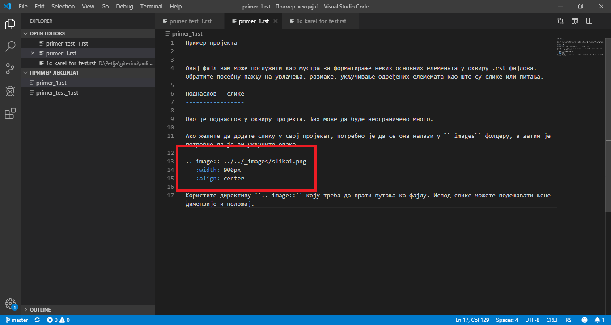

Час 1. Информатика и рачунарство у савременом животу 
=====================================================

Говорићемо о:
­	предмету изучавања информатике и рачунарства;
­	подацима и информацијама;
­	примени и утицају рачунара на свакодневни живот.   

Проналазак рачунара или компјутери  имао је огроман утицај на наш свакодневни живот, а сада су присутни свуда - код куће, на послу и у образовању.
Лако је препознати да су лични рачунари, преносни рачунари и мобилни уређаји рачунари, али су рачунари такође скривени у многим другим уређајима. Рачунари се налазе у многим уређајима које користимо свакодневно. Они се налазе унутар телефона, у сатовима, телевизорима, фрижидерима, веш машинама и аутомобилима. Рачунари контролишу ред вожње возова, семафоре на раскрсницама, лифтове у зградама, .... 

Рачунар је машина дизајнирана да следи упутства (инструкције, наредбе) и тако обавља разнородне задатке. 
Људи свакодневно користе рачунаре на послу, у школи и код куће. Рачунари се користе у фабрикама за контролу начина на који се ствари праве и у канцеларијама за вођење евиденције. Рачунари се користе и за слање е-поште, писање извештаја, куповину, банкарство, слушање музике и играње игара. Рачунари могу да обраде огромне количине података веома брзо. Такође се користе за чување и приказивање податке.

Погледајте у кратком видео запису објашњење како можете да приступите сајту Creative Commons и упознате се са симболима и њиховим значењима. 

