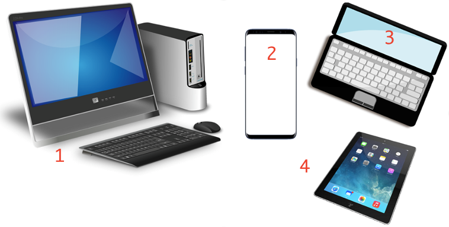

Информатика и рачунарство у савременом животу
=============================================

.. infonote::
 
    На овом часу ћемо говорити о:
        •	паметним телефонима, рачунарима и другим дигиталним уређајима;
        •	примени рачунара и њиховом утицају на свакодневни живот;
        •	информационо-комуникационим технологијама.
        •	подацима и обради података.

Комуникација
------------

Вероватно и ти примећујеш да се начин комуникације у данашње време брзо мења. Стално се појављују нови начини комуникације (или стари начини са новим могућностима). Старији то примећују много више, јер су се многе промене догодиле пред њиховим очима. Зато је старијима једноставније да одговоре на питање које следи, али можеш и ти да провериш своје знање. Да би ти било лакше да одговориш, имај на уму да су прво настајали једноставнији уређаји, а затим сложенији. 

.. parsonsprob:: redosled_pojavljivanja_uredjaja

    Поређај ове уређаје по редоследу њиховог појављивања у широкој упортеби:

    -----
    кућни телефони
    телевизори
    рачунари
    мобилни телефони
    паметни телефони

У нашем окружењу многи људи памте време без свих ових уређаја и сећају се увођења сваког од њих. Чак и у најразвијенијим земљама света, ови уређаји нису настали много раније. Примера ради, пре свега неколико деценија везе између корисника фиксне телефоније су остваривали радници у телефонској централи, ручно, на захтев, за сваки разговор појединачно. 

.. figure:: ../../_images/491px-Telephone_operators,_1952.jpg
    :width: 300px
    :align: center
    
    Телефонски оператери у Сијетлу, САД, 1952.
    
    (преузето са `*wikimedia* <https://commons.wikimedia.org/wiki/File:Telephone_operators,_1952.jpg>`_)

Када су почеле да се појављују (крај деветнаестог века), градске телефонске мреже нису биле повезане са другим градовима, а имале су типично **мање од 100 претплатника**. Данас има **више мобилних телефона него људи на Земљи**, а сви могу да међусобно комуницирају неупоредиво јефтиније, брже и једноставније него раније. При томе преко данашњих телефона можемо да шаљемо и снимљене гласовне поруке, фотографије или било какве друге датотеке. 

Овакви, паметни телефони се користе скоро у целом свету и имају многобројне намене. Поред општег приступа интернету и свим услугама које интернет нуди, постоје и многе специфичне услуге које можемо да користимо помоћу телефона. Када нисмо сигурни како да дођемо до неког места, укључимо програм за навигацију на телефону и он нам покаже пут. Помоћу телефона можемо да видимо или чујемо временску прогнозу, сазнамо када ће стићи аутобус који чекамо, да пратимо вести које нас интересују, платимо паркинг, или да уплатимо некоме новац са банковног рачуна (мобилно банкарство). У другим земљама се телефони увелико корсите и уместо платних картица за једноставно плаћање на лицу места, на пример на пијаци. Довољно је усмерити телефон ка такозваном `QR коду <https://sr.m.wikipedia.org/sr-ec/QR_kod>`_ (који је продавац изложио), мало сачекати и показати телефон продавцу.

Примети да све поменуте услуге подразумевају неку **размену информација** између нашег телефона и неког другог уређаја.

.. questionnote::

    Да ли ти користиш паметан телефон? Да ли га користе твоји родитељи, или неко други у твојој околини? Ако користиш телефон, наброј за шта све га користиш. Које од тих употреба подразумевају комуникацију, односно размену информација?

С обзиром на овако масовну и честу употребу паметних телефона, можда ти је тешко да замислиш да пре само неколико година (пре 2007.) овакви телефони нису ни постојали. Још двадесетак година раније нису постојали ни обични мобилни телефони, који су служили скоро искључиво за разговор и размену кратких текстуалних порука (енгл. *SMS, Short Message Service*). Време пре мобилних телефона је по много чему било другачије. Људи су, на пример, морали много пажљивије да се договарају чак и око најобичнијег сусрета у граду. Ономе ко касни није било једноставно да то јави, а ако не би добро знао тачно место састанка, ризиковао би да до сусрета уопште не дође. Данас би нам било тешко да се снађемо без мобилних телефона, јер смо се за кратко време веома навикли на њих.

Дигитални уређаји
-----------------

Паметни телефони су у ствари мали рачунари, који имају много тога заједничког са већим рачунарима, стоним или преносним. Постоје и други слични уређаји, као што су таблет рачунари, читачи електронских књига (енгл. *e-readers*), или паметни сатови.

Рачунаре, паметне телефоне, таблете и друге сличне уређаје једним именом зовемо **дигитални уређаји** (енгл. *digital* - цифарски; *digit* - цифра, од латинског *digitus* - прст, јер се у време настанка речи бројало на прсте). За све њих је карактеристично да у себи имају делове (микропроцесоре или микроконтролере) који **чувају, обрађују или размењују податке у дигиталном облику**, односно дигиталне податке. 

**Дигитални подаци** су низови симбола помоћу којих се могу представити све врсте података које човек користи: бројеви, текст, слика, звук, видео, рачунарски програми итд.

.. reveal:: digitalni_i_analogni
   :showtitle: Шта је дигитално, а шта не
   :hidetitle: Сакриј о дигиталним и аналогним подацима

    Шта је дигитално, а шта не:

    Насупрот дигиталним подацима су **аналогни подаци**, који обично представљају физичке величине и нису погодни за бројање, рачунање, записивање текста или рачунарских програма. Аналогне податке обично очитавамо директно на инструменту за мерење неке величине, на пример тако што казаљка показује неку вредност на скали (брзиномер у аутомобилу, вага са скалом, мерач притиска - барометар итд.). 
    
    .. figure:: ../../_images/360px-Weegschaal1.jpg
        :width: 200px
        :align: center

        Аналогни уређаји и подаци (преузето са `wikimedia <https://commons.wikimedia.org/wiki/File:Weegschaal1.jpg>`_)

    Поменимо да неки термометри, ваге и други мерни инструменти имају и мале екране, на којима цифрама приказују резултате мерења.

    .. figure:: ../../_images/digitalne_vage_i_termometri.jpg
        :width: 600px
        :align: center

        Дигитална вага и дигитални термометар

    Иако за такве ваге и термометре кажемо да су дигитални, **ипак их не убрајамо** у дигиталне **уређаје**, јер они само приказују резултат мерења у дигиталном (цифарском) облику, а немају могућност чувања, обраде, или слања дигиталних податка.

.. questionnote::

    Наведи дигиталне уређаје које користиш и опиши за шта их користиш.

Рачунари
--------

Рачунар можемо да опишемо као машину која је опремљена упутствима за обављање разних задатака и која на команду извршава та упутства. Упутства за рачунар се зову програми и они се састоје од наредби (инструкција). Наука која се бави рачунарима, начином на који они функционишу и могућностима њихове примене назива се **рачунарство** (енгл. *computer science*, рачунарска наука).

Међу дигиталним уређајима рачунари имају посебан значај, јер су рачунски моћнији од осталих дигиталних уређаја и могу да обаве више посла. Осим тога, рачунари су међу нама нешто дуже него остали дигитални уређаји. Мада су још пре неколико векова почеле да се појављују разне механичке справе које су умеле да сабирају вишецифрене бројеве (била је потребна само покретачка снага), а у деветнаестном веку електро-механичке справе које су се користиле за бројање и једноставно рачунање, први потпуно електронски рачунари се појављаују **тек седином двадесетог века**. Ти рачунари су били много већи, тежи и спорији од данашњих, трошили су много више струје и зато се брзо прегревали, више се кварили итд. Ипак, били су то рачунари који су радили у основи на исти начин као данашњи. 

Први електронски рачунари су били веома скупи, па су само институције са много новца могле да их приуште (најпре војска, затим велике пословне компаније и банке, па водећи научно-истраживачки центри у свету, неке државне службе). Током 1970-тих година почела је масовнија употреба мањих, бржих и јефтинијих компоненти за рачунаре. Захваљујући томе, рачунари су постали довољно мали и јефтини да су већ крајем 1970-тих могли да их купе чак и појединци (рачунари улазе у наше куће). Више корисника је донело веће зараде произвођачима рачунара и рачунарских програма, па се рачунарски системи све брже развијају и од тада незадрживо продиру у безмало све области живота:

- Рачунари контролишу производњу хране - прате услове за развој биљака и животиња и реагују када услови постану мање повољни;
- Рачунари управљају процесима у малим и великим фабрикама, покрећу разне врсте машина и робота који замењују људе;
- Рачунари регулишу саобраћај - управљају лифтовима, семафорима, скретницама за возове, чак и сателитима у свемиру. Све више управљају и појединачним возилима (камиони, аутомобили);
- Рачунари служе за разоноду, гледање филмова, слушање музике, читање, игргање;
- Рачунари све више служе и за учење, као што ти сада радиш;
- Рачунари се налазе и у савремениим апаратима за домаћинство: телевизорима, машинама за прање веша и судова, машнама за прављење хлеба, чак и неким фрижидерима. Рачунари у неким кућама и становима укључују светло, грејање или вентилацију, закључавају врата, проверавају ко жели да уђе и још много тога.

Са појавом интернета почетком 1990-тих, рачунари постепено, али све више замењују биоскопе, продавнице, туристичке агенције, банкарске шалтере, билетарнице и друга места за пружање услуга. Појава и других, мањих дигиталних уређаја (пре свега паметних телефона) током 2010-тих година само додатно убрзава овај процес. Многи људи су због тога принуђени да налазе **нове послове**. Пошто употреба рачунара све више и брже утиче на потребу за одређеним пословима, у овом тренутку је тешко предвидети који ће се све нови послови појавити, а који ће од постојећих постати мање потребни или сасвим непотребни. Стручне процене говоре да ће и поред све више школовања за послове у вези са рачунарима, потреба за таквим пословима да расте још брже и да ће недостатак стучњака у овим пословима бити све већи.

Информационо-комуникационе технологије
--------------------------------------

Често се може чути како се све ово о чему смо говорили догађа захваљујући развоју технологије уопште, а посебно информационо-комуникационих технологија, скраћено ИКТ. Колико разумеш тај појам? 

Да би ти појам ИКТ постао јаснији, дајемо један мали речник појмова повезаних са информационо-комуникационим технологијама.

.. infonote::

    **Информатика** је научна дисциплина која се бави прикупљањем, чувањем, обрадом и преносом података;

    **Технологија** (од грчког τεχνολογία - наука о вештини) је збир техника, вештина, метода и процеса који се користе у одређеној области људске делатности.

    **Информациона технологија (ИТ)** је технологија која се користи за прикупљање, стварање, чување (складиштење), употребу и размену података. Људи чувају, преузимају, користе и преносе податке већ 5000 година, откако су научили да пишу. Међутим, појам *информациона технологија* у свом савременом смислу се односи на последњих неколико деценија и употребу рачунара. Данас се за руковање подацима највише користе рачунари, па није чудно што се израз информациона технологија обично користи као синоним за рачунаре и рачунарске мреже. Ипак, не треба заборавити да се и даље користе и старији начини чувања и размене података (разни архиви, библиотеке, филмотеке итд.).

    **Комуникационе технологије (КТ)** су технологије које се користе за пренос података на даљину (телекомуникације). Можда си чуо/чула да се подаци преносе жицом, радио везом, оптичким кабловима и на друге начине, а сваки од тих начина преноса користи посебну технологију тј. различите поступке и опрему. Зато се појам *комуникационе технологије* често користи у множини.

    **Информационо-комуникационe технологијe (ИКТ)** је кровни назив за комбинацију свих технологија које се користе у рачунарским информационим мрежама и разним телекомуникационим мрежама. У данашње време, ове мреже се све више повезују и сједињују (интегришу), постајући једна целина. Технологије које се користе у информационим и телекомуникационим мрежама се све више преплићу и комбинују. Зато се јавила потреба за појмом који подразумева све те технологије. Тако, појам ИКТ обухвата различите комуникационе уређаје као што су радио, телевизија, мобилни телефони, рачунари, мрежна опрема, сателитски системи итд. Осим уређаја, појам ИКТ обухвата и разне услуге (сервисе) попут видео конференција или учења на даљину, а који су омогућени између осталог и употребом различитих комуникационих уређаја и рачунарских програма.

Овако обухватним појмом као што је ИКТ се додатно наглашава значај повезивања разнородних мрежа, тј. обједињених комуникација. Повезивање мрежа је у многоме олакшало размену података, а самим тим и стварање нових података из постојећих, чување на више места, разноврсне употребе података, разноврсне погледе на њих, итд.

Многе комапније су постале успешне највише захваљујући примени ИКТ. На пример, компанија *Airbnb* омогућава људима да огласе изнајмљивање својих соба или кућа, док другима омогућава да тај простор резервишу. Слично томе, компанија *Uber* омогућава људима да објаве своју потребу за превозом, док други могу да се одазову и понуде превоз. У оба случаја опис пословања ових компанија је веома поједностављен, али суштина је да компаније нуде услуге повезивања понуде и потражње и то повезивање наплаћују. При томе *Airbnb* не мора да има своје хотеле, као што ни *Uber* не мора да има своја возила. Вредност ових компанија је пре свега у њиховој употреби ИКТ, и та вредност може да буде чак и већа од вредности нечијих возила или хотела. Сличан пример је чувена компанија *Amazon*, која нема ни фабрике ни продавнице, али је применом ИКТ боље повезала продавце са купцима и од наплате те услуге за врло кратко време постала једна од највреднијих компанија на свету.

Подаци и обрада података
------------------------

Већ смо поменули да постоје различите врсте података, као што су бројеви, текст, слика и други. У зависности од тога шта подаци представљају, они се могу обрађивати на различите начине. Ево неких примера.

Пример 1
''''''''

Директор школе преко електронског дневника има непосредан увид у све оцене ученика из свих предмета. То могу бити десетине оцена за сваког од неколико стотина ученика. Пошто се ради о хиљадама бројева, ти подаци нису довољно прегледни и зато је потребно да се они сведу на мањи број података, који би били прегледнији и погоднији за извођење закључака и предузимање потребних активности. Директора, на пример, може да занима колико ученика има одличан успех (да би обезбедио награде за њих), или колико има ученика са недовољним оценама (да би се организовала продужна настава и поправни испити). Ових пар бројева се добија сабирањем, дељењем, пребројавањем и сличним радњама, које заједно представљају обраду података. 

Касније, директор може желети да сазна да ли постоји неко одељење чији просек значајно одудара од просека школе и да утврди разлоге за то. Ако је реч о веома добром одељењу, можда нека искустава могу да се пренесу и на друга одељења, а ако је одељење веома лоше, можда може да се установи у чему је проблем и да се помогне у решавању или отклањању проблема. Подаци о одкскакању од просека се такође добијају рачунањем, то јест обрадом полазних (изворних) податка, у овом случају оцена.

Пример 2
''''''''

Маша је сазнала да ће у фебруару провести недељу дана на једном далеком острву. Машу занима какво би време могло да буде тамо у то доба године, али пошто је фебруар тек за неколико месеци, она не може да нађе прогнозу времена. Уместо прогнозе, могу се наћи статистички подаци за то острво о фебруарским темпрературама из претходних 50 година. То је много бројева и на основу њих није лако стећи осећај - не знамо да ли је температура коју видимо уобичајена или изузетак. Зато треба обрадити податке, или пронаћи обрађене податке, нпр. о просечној темпрератури у недељи посете или о границама у којима се температура обично креће. То ће Маши помоћи да боље планира своје активности током посете острву.

Пример 3
''''''''

Обрадом статистичких података о томе колико се у ком делу света троше поједине врсте намирница у људској исхрани и колико се оболева од разних врста болести. На пример, може се уочити да је у неколико земаља потрошња одређене намирнице *Н* врло висока, а оболевање од болести *Б* врло ретко. Насупрот томе, у неколико других земаља може бити да се намирница *Н* скоро уопште не користи, а да се степен оболевања од болести *Б* релативно висок. Овакво слагање података (стручно се каже *корелација*) указује да вреди детаљније испитати да ли у тој намирници постоји нешто што утиче на мање оболевање од поменуте болести, или је поклапање случајно, односно проузроковано нечим другим. Истраживање може да доведе до открића лека за болест о којој је реч, или до других корисних и интересантних сазнања. Рачунање у којој мери се неки подаци слажу (рачунање коефицијента корелације између две групе података) је прецизан математички поступак, који се спроводи по одређеној формули.

Пример 4
''''''''

Александар има у свом стану електронског помоћника који разуме неке говорне команде. Када Александар каже: "Укључи ми светло у спаваћој соби", његов електронски помоћник снима говор, затим снимљене податке анализира и обрађује да би могао да растумачи команду и уради шта је Александар тражио. Дигитални запис звука се у суштини опет своди на бројеве (подсетимо се, дигитални значи цифарски), а обрада оваквих података и даље представља неке математичке поступке, само знатно сложеније него у претходним примерима.

~~~~

У свим овим примерима примећујемо да се обрадом постојећих, изворних података стварају нови подаци, којих има мање и који су на неки начин кориснији. Те добијене податке зовемо резултатима обраде. Подела података при обради на улазне и излазне (изворне податке и резултате) је везана за конкретну обраду - резултати једне обраде могу да буду полазни подаци у другој обради.

Информације
-----------

У зависности од тога шта нас интересује, сваки податак може да буде информација. Ако Милица има 4 и 5 из географије, за њене родитеље је то вероватно информација, док за директора школе није. Директора најчешће не занимају појединачне оцене ученика, него сажет приказ (обрађени подаци) - број одличних, просек разреда и слично. Исто тако, за Машу из другог примера температура 12. фебруара 2014. године као појединачан податак није информативна, а просечна температура у другој недељи фебруара у последњих неколико година јесте. Са друге стране, неког ко истражује како се нешто догодило одређеног дана, температура тог дана на том месту може да буде важна информација.

Видимо да подела на просте податке (вредности) и информације није сасвим прецизна и да зависи од контекста и интересовања. Типичан случај је да од много појединачних података немамо користи и зато их не сматрамо информацијама, док податке добијене као резултате обраде других података доживљавамо као корисније и сматрамо информацијама. 

Можемо да кажемо да су информације они подаци који су нам важни, на основу којих можемо да доносимо одлуке и предузимамо акције.

.. infonote::

    **Шта смо научили?**
        •	**дигитални уређаји** чувају, обрађују или размењују дигиталне податке;
        •	у дигиталне уређаје спадају рачунари, паметни телефони, таблети, паметни сатови и е-читачи;
        •	**рачунар** је машина која извршава унапред припремљена упутства за обављање задатака;
        •	упутство рачунару за обављање неког задатка се зове **програм**;
        •	**рачунарство** се бави рачунарима, начином на који они функционишу и могућностима њихове примене;
        •	**информатика** се бави прикупљањем, чувањем, обрадом и преносом информација;
        •	**информациона технологија** се користи за стварање, чување (складиштење), употребу и размену података;
        •	**комуникационе технологије** се користе за пренос података на даљину;
        •	**начин живота се мења** под утицајем развоја технологија и могу се очекивати и даље промене;
        •	**подаци** могу да буду бројеви, текст, слике, звукови (нпр. говор или музика), видео записи;
        •	**информације** су они подаци који су нам важни, а то су најчешће резултати обраде других података;
