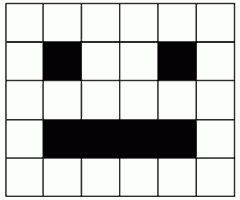
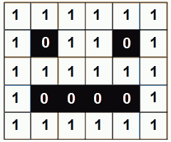

Хардвер, софтвер, подаци
========================

.. infonote::

 На овом часу ћеш научити:
    •	нешто више о физичким деловима рачунарског система (хардверу);
    •	разлику између системских и корисничких програма који припадају софтверу;
    •	шта обухвата софтвер као сервис и како се користе онлајн програми;
    •	како се одржавају и правилно употребљавају дигитални уређаји;
    •	на који начин се подаци представљају у дигиталним уређајима.

Хардвер
-------

Чим први пут седнеш за рачунар, неке његове делове одмах приметиш и брзо разумеш чему служе и како се користе. 

.. questionnote::

    Одговори на следећа питања и упореди своје одговоре са одговорима својих другова и другарица. Покушајте заједно да срочите што једноставније, а што потпуније одговоре.
    
    | Чему служи тастатура?
    | Чему служи миш?
    | Чему служи монитор (или уграђени екран)?
    | Како се користи екран осетљив на додир? Како се увећава (зумира) приказ на таквим екранима? На којим уређајима постоји такав екран?
    
Поред поменутих делова, рачунари често имају и звучнике, микрофон, штампач и друге уређаје који могу да се прикључе на њега (нпр. спољна меморија, скенер, џојстик, 3Д-миш и многи други). Неки од ових уређаја су ти вероватно познати, а неки можда и нису. 

- спољна меморија је додатна меморија на којој можеш да чуваш слике, песме, документе, програме и друго. Постоји више врста спољне меморије, а најчешће су флеш меморије и дискови.
- штампач преноси текст и слике из рачунара на папир.
- скенер служи да пренесе слику са папира у рачунар.
- џојстик (палица за игру) служи за задавање команди нагињањем ручке на разне стране и притискањем дугмади, користи се највише у рачунарским играма.
- 3Д миш (три-де миш) служи за стварање, прегледање и мењање тродимензионих слика у рачунару, сличнији је џојстику него обичном мишу.

.. questionnote::

    Разговарај са својим друговима и другарицама о употреби ових уређаја. Ако користиш штампач, скенер, или неки други уређај повезан на рачунар, или често имаш прилике да видиш некога ко их користи, испричај како се користе. Ако их лично користиш, колико ти је требало времена да научиш да их употребљаваш? Да ли ти је неко помагао? Да ли је било неких проблема приликом употребе?
    
Осим уређаја који се прикључују на рачунар и који се одмах виде, постоји и неколико важних делова у кућишту рачунара. Ти делови су прилично осетљиви, па је важно да водиш рачуна и чуваш их од прашине, течности, масноће, удараца, јаких магнета и свега другог што може да их оштети.

.. topic:: Савет

    | ☛ Немој да држиш чашу са водом или другим пићем близу рачунара и његових делова.
    | ☛ Рукуј рачунаром пажљиво, не додируј рачунар масним прстима.
    | ☛ Редовно бриши прашину са и око уређаја. За брисање екрана користе се специјалне тканине, сличне оним за брисање наочара.
    | ☛ Када замениш неки дотрајали или застарели део, не бацај га у смеће са осталим отпадом. Електронски отпад спада у материје које су врло штетне по природу и треба га одлагати на безбедан начин, или још боље - рециклирати. Постоје комуналне службе и фирме које бесплатно одвозе електронски отпад. Ако имаш електронски отпад, консултуј се са одраслима у вези са одлагањем или рециклирањем.

.. figure:: ../../_images/L2S1.png
    :width: 700px
    :align: center  

    Рачунарски систем: 1 - скенер, 2 - процесор, 3 - радна меморија, 4 - картице за проширење, 5 - напајање, 6 – оптички диск, 7 – тврди диск, 8 – матична плоча, 9 – звучник, 10 – монитор, 11 – системски програм, 12 –кориснички програм, 13 – тастатура, 14 – миш, 15 – спољни тврди диск,  16 - штампач. Преузето са `wikimedia <https://commons.wikimedia.org/wiki/File:Personal_computer,_exploded_6.svg>`_.

Рачунар не мора да има све делове који су до сада поменути или приказани на овој слици. На пример, многи рачунари сасвим нормално раде свој посао без звучника, микрофона, или штампача. Међутим, неки делови су непоходни за рад рачунара и без њих рачунар не може да постоји. 

.. infonote::

    Сваки рачунар **мора** да има следеће делове:

    - **напајање** - део рачунара који обезбеђује снабдевање осталих делова електричном енергијом;
    - **процесор** - најважнији, централни део рачунара. Он тумачи (декодира) наредбе, управља другим деловима рачунара и обавља израчунавања;
    - **радна меморија** - део из ког процесор преузима програме које извршава и податке које обрађује, а у који процесор враћа резултате.

Рачунари и други дигитални уређаји раде на струју, па је јасно да је напајање неопходно. Код неких дигиталних уређаја напајање долази из батерије која се пуни из електричне мреже, док други директно користе струју из мреже.

Суштина рада рачунара је да веома брзо извршава једну по једну једноставну наредбу, а то без процесора не би било могуће. Процесор координира радом свих делова рачунара и користи их да би извршавао наредбе програма. Осим посла око организације рада свих делова, процесор обавља сва потребна рачунања, односно обраду података. Наредбе које извршава и податке које обрађује, процесор узима из радне меморије, а у њу враћа резултате рачунања. Процесор и радна меморија размењују податке веома великом брзином.

Сви остали делови нису нужни, мада су неки врло уобичајени. Данас је тешко замислити нпр. рачунар без тастатуре или екрана, али поменимо као занимљивост да први електронски рачунари заиста нису имали ни тастатуре ни екране. Наравно, због тога коришћење тих рачунара није било удобно као данас, али и они су (као и данашњи рачунари) имали процесоре и меморију и обављали су неке послове.

Још неки важни делови рачунара који се налазе у кућишту су:

- **Матична плоча** - компонента која повезује проводницима све делове рачунарског система и омогућава им да размењују сигнале (команде и податке);
- **Диск** (каже се и тврди диск или хард диск) - компонента која памти податке и програме чак и када је рачунар искључен.
- **Читач и писач оптичких дискова** - компонента која ти омогућава да чуваш и користиш податке и програме са оптичких дискова (*CD*, *DVD*). Данас се све мање користи, јер су га замениле флеш меморије, које су удобније за употребу и отпорније на оштећења.

|

Све ове делове рачунара заједно зовемо **хардвер** (енгл. *hardware* - ствари од гвожђа).

Софтвер
-------

Да би рачунар или дигитални уређај могао да ради, неопходно је да осим физичких делова (хардвера) има и програме, који представљају упутства за рад рачунару. Све програме заједно називамо **софтвер**.

|

| 🤔 Када укључиш рачунар или паметан телефон, на екрану се појаве сличице које представљају програме или податке. Шта мислиш како су се те сличице појавиле на екрану?
| 🤔 Раније смо поменули да се у радној меморији налази програм који се у том тренутку извршава на процесору. Шта мислиш како је тај програм доспео у радну меморију?
| 🤔 Када копирамо податке са једног места у рачунару на друго, шта мислиш који програм обавља то копирање?

Одговор на сва ова питања је исти. На рачунару постоји један главни, велики програм (у ствари скуп програма), који се зове оперативни систем. Он нам омогућава да покрећемо и заустављамо друге програме, да копирамо податке или да започенемо било шта на рачунару. Без оперативног система рачунар не може да се користи. Различити дигитални уређаји користе разне оперативне системе. Неки познати оперативни системи су *Windows* (виндоуз), *Linux* (линукс), *Android* и *iOS*.

.. questionnote::

    Да ли знаш који оперативни систем користи уређај са кога ово читаш, или уређај који најчешће користиш?

Вероватно примећујеш да постоји много модела мишева, тастатура, штампача и осталих рачунарских компоненти. Сваки модел је мало другачији од осталих и можда је потребно слати му мало другачије сигнале (и другачије тумачити сигнале које он шаље) да би био исправно коришћен. Зато произвођачи уз већину компоненти праве и специјалан мали програм који се зове **драјвер**. Драјвер посредује у комуникацији између своје компоненте и осталих програма (пре свега оперативног система). Драјвери са осталим програмима комуницирају на неки стандардан начин, а са својом компонентом онако како је тој компоненти потребно. Тако, захваљујући драјверима остали програми умеју да користе сваког миша, сваки штампач и остале делове рачунара.

|

Оперативни систем, драјвере и сличне програме који омогућавају да рачунар функционише називамо **системски софтвер**. Када рачунар или телефон има системски софтвер, он је спреман за рад и може да извршава програме које смо ми додали на рачунар или телефон. 

|

Програме које свакодневно користимо за обављање различитих задатака зовемо **кориснички програми** или **кориснички софтвер**. То су програми који нам омогућавају да радимо разне спрецифичне ствари - да уређујемо текстове, слике, звучне и видео записе, да правимо интернет сајтове, да обављамо разне прорачуне и планирања, да правимо нове програме, да правимо презентације, да претражујемо интернет, да читамо, гледамо филмове, слушамо музику и још много тога. Поменимо да су и рачунарске игре такође програми. Корисничне програме можемо по потреби сами да инсталирамо на рачунар.

.. topic:: Савет

    | ☛ За програме које додаш на рачунар, потребно је да редовно инсталираш дораде (енгл. *update*). Немој да игноришеш обавештења да за програм који користиш постоји новија верзија. У новим верзијама су често отклоњени неки безбедносни пропусти и исправљене друге примећене грешке.

Погледај поново слику са почетка лекције. Примети да је не екрану рачунара бројем 11 означен један системски програм (у прозору је приказан садржај меморије рачунара), а бројем 12 један кориснички програм (рачунарска игра).

Софтвер као сервис
''''''''''''''''''

Као што вероватно знаш, на интернету постоје програми које можемо да користимо, а да их не инсталирамо на свој рачунар или телефон. Довољно је да неким прегледачем веба (као што су *Google Chrome* или *Microsoft Edge*) посетимо одговарајућу интернет адресу и програм се извршава у самом прегледачу.

Таквих програма има много, од оних за уређивање текста и прављење презентација, преко програма за рачуноводство, за учење, за размену порука, до рачунарских игара. На пример, такви програми су Гугл преводилац помоћу којег можеш потражити превод са неког страног језика на српски језик и обрнуто или Скреч, којим ћемо се бавити у другом полугодишту.

.. questionnote::

    Да ли користиш неке програме на овај начин? Ако користиш, наброј неке од њих.

Програме које не инсталирамо на свој дигитални уређај него их користимо преко интернета, зовемо софтвер као услуга, или **софтвер као сервис**. За овакве програме можеш чути назив **онлајн програми**. Сви ти програми су инсталирани на неким удаљеним рачунарима и о постављању новијих верзија програма брине неко други. Неки од тих програма - сервиса су бесплатни за употребу, а за неке се плаћа претплата. 

Програми - сервиси нам често омогућавају да оно што у њима направимо, такође чувамо на удаљеном рачунару (такве удаљене рачунаре називамо рачунарски облак). Да би сваки корисник таквих програма могао да дође до својих података, обично је потребно да се пријави програму својим корисничким именом (или е-адресом), тј. да се **улогује**. 

.. topic:: Савет

    | ☛ Да ли рачунар који користиш, осим тебе користе и други? Ако је тако, **важно је да се после употребе рачунара одјавиш** (излогујеш) са свих сервиса које користиш. Такође, треба да се одјавиш и са самог рачунара, као што после часа не остављаш своје ствари на школској клупи. На тај начин не доводиш друге у ситуацију да поспремају за тобом, а уједно ћеш сачувати своје податке од свих који после тебе користе исти рачунар.
    | ☛ Ако дуже користиш рачунар, **важно је да повремено правиш паузе**, бар неколико мунута на сваких сат времена. Када правиш паузу, не мораш да се одјављујеш са рачунара и сервиса, довољно је да закључаш рачунар. То ћеш најједноставније да урадиш притиском на тастер *L* (енгл. *lock* - закључај) док држиш притиснут тастер **⊞** (такозвани виндоуз тастер, у доњем реду тастатуре). По повратку са паузе довољно је да се улогујеш само на рачунар (сви програми су и даље отворени).

Други сервиси
'''''''''''''

Велике софтверске компаније нам поред услуге употребе програма у облаку, често нуде и услугу да на њиховим рачунарима чувамо наше податке било које врсте (нпр. слике, телефонски именик, разне документе). Таквим подацима можемо да приступимо са било ког рачунара, да их делимо са неким ако желимо, а део те услуге је и провера да подаци нису заражени рачунарским вирусима. Чување података у облаку има и ту предност да, уколико наш уређај постане неисправан и више не можемо да читамо податке са њега, подаци у облаку представљају безбедну копију којој и даље можемо да приступимо.

Представљање података
---------------------

У рачунару, као и у сваком дигиталном уређају, сви подаци су дигитални. То значи да су подаци представљени низовима симбола. За представљање свих врста података довољна су само два симбола, а обично користимо цифре **0** и **1**. Све што улази у рачунар или излази из њега, свака слика, сваки програм, сваки сајт на интернету, све су само низови нула и јединица.

На пример, у једном од најчешће коришћених начина за представљање слова (такозвано UTF-8 кодирање), мала ћириличка слова се представљају следећим низовима нула и јединица (размаци су убачени ради лакшег читања):

.. code::

    а:  1101 0000 1011 0000        ј:  1101 0001 1001 1000        с:  1101 0001 1000 0001
    б:  1101 0000 1011 0001        к:  1101 0000 1011 1010        т:  1101 0001 1000 1101
    в:  1101 0000 1011 0010        л:  1101 0000 1011 1011        ћ:  1101 0001 1001 1011
    г:  1101 0000 1011 0011        љ:  1101 0001 1001 1001        у:  1101 0001 1000 0011
    д:  1101 0000 1011 0100        м:  1101 0000 1011 1100        ф:  1101 0001 1000 0010
    ђ:  1101 0001 1001 0010        н:  1101 0000 1011 1101        х:  1101 0001 1000 0101
    е:  1101 0000 1011 0101        њ:  1101 0001 1001 1010        ц:  1101 0001 1000 0110
    ж:  1101 0000 1011 0110        о:  1101 0000 1011 1110        ч:  1101 0001 1000 0111
    з:  1101 0000 1011 0111        п:  1101 0000 1011 1111        џ:  1101 0001 1001 1111
    и:  1101 0000 1011 1000        р:  1101 0001 1000 0000        ш:  1101 0001 1000 1000

.. fillintheblank:: L2P4

    **Задатак**
    
    .. figure:: ../../_images/utf_dekodiranje.PNG
        :width: 440px
        :align: right
    
    Сваки од следећих низова нула и јединица представља по једно слово:
    
    | 1101 0001 1000 1101
    | 1101 0001 1000 0000
    | 1101 0000 1011 0000
    | 1101 0000 1011 0010
    | 1101 0000 1011 0000
    
    Покушај помоћу слике дате у тексту задатка да откријеш о којим словима се ради. Упиши та слова у поље за одговор.
    
    Ако ти је тешко да откријеш (декодираш) слова представљена помоћу нула и јединица, ево ти мала помоћ: реч која се добија има пет слова и она је уједно решење ове загонетке: `Ја сам мала зелена, зечићу сам до рамена. Мене газе ноге босе, мене оштром косом косе.`

    Одговор: |blank|

    - :^трава$: Тачно
      :x: Одговор није тачан.

Представљање слике
''''''''''''''''''

Као и текст (и све друго), и слике су у рачунару представљене низовима нула и јединица. Рачунар те нуле и јединице уме да протумачи и да на основу њих прикаже слику на екрану. Фотографије које вероватно правиш помоћу телефона или налазиш на инернету, састоје се од мноштва малих тачака које зовемо пиксели. Боја сваког пиксела на екрану представљена је низом нула и јединица. Ако на слици постоје само две боје, за сваки пиксел је довољна само једна нула или јединица. На пример, ако је слика црно-бела, црне пикселе можемо да представимо нулом, а беле јединицом. На тај начин, слика са десне стране може да се представи овако:

    
| 1 1 1 1 1 1
| 1 0 1 1 0 1
| 1 1 1 1 1 1
| 1 0 0 0 0 1
| 1 1 1 1 1 1
 
За више боја потребно је само више нула и јединица. 

Приметимо да је ширина ове слике 6 пиксела, а висина 5 пиксела. Краће кажемо да је величина слике 6 пута 5 пиксела (прво се наводи ширина, а затим висина). Према томе, слика се састоји од укупно 30 пиксела.

.. fillintheblank:: L2P5

    .. image:: ../../_images/L2S9.png
        :width: 200px
        :align: right

    У поље за одговор упиши како би помоћу нула и јединица на претходно описан начин требало представити трећи ред ове слике (означен стрелицом).

    Одговор: |blank|

    - :^001111100$: Тачно
      :x: Одговор није тачан. 

Ширина слике кућице из задатка је 9 пиксела, а висина 7 пиксела. Према томе, величина слике је 9 x 7 пиксела и слика се састоји од укупно 63 пиксела.

.. fillintheblank:: L2P1

    Ако је величина слике 1024 x 768 пиксела, колико пиксела је широка та слика? Упиши одговор цифрама.

    Одговор: |blank|

    - :^1024$: Тачно
      :x: Одговор није тачан.

.. fillintheblank:: L2P2

    Ако је величина слике 1920 x 1080 пиксела, колико пиксела је висока та слика? Упиши одговор цифрама.

    Одговор: |blank|

    - :^1080$: Тачно
      :x: Одговор није тачан.

.. fillintheblank:: L2P3

    Ако је величина слике 800 x 600 пиксела, од колико укупно пиксела се састоји та слика? Упиши одговор цифрама.
    
    Одговор: |blank|

    - :^480000$: Тачно
      :x: Одговор није тачан.

💡 Можда си имао/имала прилике да чујеш да је резолуција неке камере на пример 2240 x 1680 пиксела. То значи да камера може да забележи слику величине 2240 x 1680 пиксела.

💡 Слично томе, ако је резолуција неког екрана за мобилни телефон 1440 x 2560 пиксела, значи да екран може да прикаже слику те величине без губитка квалитета (сваки пиксел слике се приказује).

.. infonote::

 **Шта смо научили?**
    • физичке делове (компоненте) рачунара или дигиталних уређаја зовемо хардвер;
    • програме који се извршавају на рачунару (и говоре му како да нешто уради) зовемо софтвер;
    • оперативни систем је главни програм на рачунару или телефону, који омогућава функционисање рачунара и извршавање других програма;
    • драјвер је програм који помаже (посредује) оперативном систему при коришћењу појединих делова рачунара (компоненти рачунарског система);
    • сервиси представљају скуп услуга на интернету, као што је коришћење програма из рачунарског облака и чување података у облаку;
    • правилна употреба рачунара подразумева пажљиво руковање, инсталирање дорада програма, прављење пауза током рада и одјављивање по завршетку рада.
    • величина слике се изражава у пикселима по ширини и висини;
    • резолуција камере, екрана, пројектора и других уређаја показује колику слику ти уређаји могу да сниме или прикажу;

.. image:: ../../_images/L2S8.png
    :width: 800px
    :align: center

