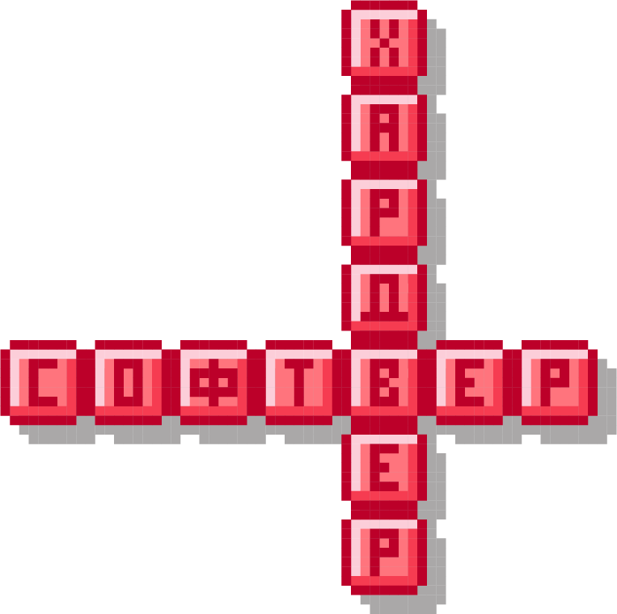

Хардвер и софтвер
=================

.. infonote::

 На овом часу ћеш научити:
 
 - нешто више о физичким деловима рачунарског система (хардверу);
 - разлику између системских и корисничких програма који припадају софтверу;
 - шта обухвата софтвер као сервис.

Хардвер
-------

Рачунар није уређај са којим се данас по први пут сусрећеш. Док читаш ову лекцију користиш неки од рачунара па тако и познајеш његове делове.

Поједини делови рачунара су лако видљиви и њихову улогу није тешко одредити. Погледај мало пажљивије рачунар који је испред тебе.

Одговори на следеће питања. Ако проучаваш ову лекцију у школи, упореди своје одговоре са одговорима других ученика а затим и са објашњењима које су дати у лекцији.

.. questionnote::

 - Наброј које све делове рачунара можеш да видиш.
 - Шта је тастатура и чему служи?
 - Шта је миш?
 - Чему служи монитор (или уграђени екран)?
 - Опиши кућиште рачунара.

**Тастатура** је уређај помоћу кога уносимо текст и податке. Она има тастере на којима су исписани или угравирани знакови (слова, бројеви, интерпункцијски знаци и сл.). За унос неких симбола довољно је притиснути само један тастер али постоји пуно ситуација када истовремено морамо притиснути два или чак три тастера. Помоћу тастатуре можемо задавати одређене наредбе (инструкције) рачунару. Тастери са знакови на тастатурама имају увек исти распоред према одређеним правилима које називамо стандард. На тај начин је омогућено да особе науче брзо да куцају. Можда си имао прилике да видиш различите тастатуре, на пример са означеним  латиничним и ћириличним словима.

**Миш** је уређај помоћу којег управљамо радом рачунара. Када померамо миша, помера се и **курсор** на екрану. На месту курсора (или показивача) на екрану појавиће се симбол који уносимо са тастатуре. Како изгледа курсор на твом екрану, ког је облика? Курсори могу имати различите облике, најчешће је то латинично велико слово I, рука са испруженим кажипрстом или стрелица. 

**Монитор** има екран и кућиште али може бити и уграђен, као код лаптопа. На екрану се приказују подаци, слике и активности које обављамо.

**Кућиште рачунара** је део рачунара у коме се налазе делови које најчешће не можемо да видимо и није препоручљиво отварати га. Уколико наставник има могућности, може ти показати како изгледа унутрашњост кућишта. 

У кућишту се налазе делови рачунара који омогућавају да он извршава врло сложене операције над подацима које уносимо, да се на екрану приказује слика, да се у њему чува велики број податак и слично. Део рачунара где се чувају подаци назива се **меморија**. При раду, рачунар се загрева па се унутар кућишта налази и вентилатор који омогућава хлађење.

Миш и тастатура се заједно називају **улазним уређајима** јер помоћу њих уносимо податке и задајемо упутства рачунару. Осим њих, ту спадају још и камера, микрофон, скенер, џојстик…

Монитор је **излазни уређај**, а осим њега у ову групу спадају још и звучник, слушалице, пројектор…

.. questionnote::

 Шта од улазних а шта од излазних уређаја имаш на рачунару који користиш?

Рачунар је врло сложена машина састављена од мноштва сложених делова, уколико се једнога дана одлучиш да твој посао буде рад повезан са рачунарима, учићеш много више о томе.

На слици је приказан **рачунарски систем** састављен од више различитих делова. Препознајеш ли неке? 

Провери своје знање спајањем назива уређаја са одговарајућим бројем који се налази поред слике тог уређаја.

.. dragndrop:: Уметање_хиперлинка
    :feedback: Tвој одговор није тачан. Покушај поново!
    :match_1: 1|||штампач
    :match_2: 2|||звучници
    :match_3: 3|||монитор
    :match_4: 4|||Веб камера
    :match_5: 5|||ЦД (компакт – диск) читач
    :match_6: 6|||кућиште
    :match_7: 7|||скенер
    :match_8: 8|||УСБ флеш меморија
    :match_9: 9|||Миш
    :match_10: 10|||Тастатура
    :match_11: 11|||Слушалице са микрофоном
	

.. questionnote::
 
 Да ли набројани делови рачунарског система припадају улазним уређајима, излазним уређајима или служе за чување и обраду података?
 
У улазне уређаје спадају веб камера, миш, тастатура и скенер.

У излазне уређаје спадају монитор, штампач и звучници.

Слушалице са микрофоном, какве се данас најчешће производе, су и улазни уређај (микрофон) и излазни (слушалице).

На УСБ флешу и ЦД чувамо податке а у кућишту рачунара се налазе бројни уређаји који врше обраду података као и њихово чување.

Напоменимо још да сваки рачунарски систем мора да има и **напајање** јер му је неопходна електрична енергија за рад. Код стоних рачунара кућиште и монитор су кабловима стално повезани на напон градске мреже. Лаптоп, таблет и телефон имају батерију која се пуни и могу се користити на различитим местима, због чега их још називамо и **преносним дигиталним уређајима**.

Све делове рачунара који заједно чине рачунарски систем зовемо **хардвер**.

Софтвер
-------

Да би рачунар или дигитални уређај могао да ради, неопходно је да осим физичких делова (хардвера) има и програме, који представљају упутства за рад рачунару. 
Све програме заједно називамо **софтвер**.

Много различитих програма користимо на рачунару. Програми могу бити за рад са текстом, сликама, филмовима, за приступ интернету, за играње видео игара, за прорачуне, за цртање и слично. 

Постоји програм чији рад не видимо директно али који омогућава да други програми несметано раде као и да рачунар ”разуме” сва упутства која му задајемо. Овај програм назива се **оперативни систем**.

Без оперативног система рачунар не може да се користи. Различити дигитални уређаји користе разне оперативне системе. Неки познати оперативни системи су *Windows*, *Linux*, *Android* и *iOS*.

    Иконице за оперативне системе: *Windows*, *Android*, *iOS*  и *Linux*.

.. questionnote::
 Који оперативни систем има рачунар који користиш?

Оперативни систем, са још неким програмима који омогућавају да рачунар функционише, називамо **системски софтвер**. Када рачунар или телефон има системски софтвер, он је спреман за рад.

Програме које свакодневно користимо за обављање различитих задатака зовемо **кориснички програми** или **кориснички софтвер**. То су програми који нам омогућавају да радимо разне спрецифичне ствари - да уређујемо текстове, слике, звучне и видео записе, да правимо интернет сајтове, да обављамо прорачуне и планирања, да правимо нове програме или презентације, да претражујемо интернет, да читамо текстове, гледамо филмове, слушамо музику и још много тога. Поменимо да су и рачунарске игре такође програми. 

Корисничне програме можемо по потреби сами да инсталирамо на рачунар док оперативни систем инсталира стручна особа или је он инсталиран фабрички.

.. infonote::
 **Рачунар је употребљив за рад само у комбинацији одговарајућег хардвера и софтвера.**

	

На интернету постоје програми које можемо да користимо, а да их не инсталирамо на свој рачунар или телефон. 

Програме које не инсталирамо на свој дигитални уређај него их користимо преко интернета, зовемо софтвер као услуга, или **софтвер као сервис**. 
Овакви програми се још називају и **онлајн програми**. Сви они су инсталирани на неким, од нас удаљеним, рачунарима и о одржавању и постављању новијих верзија 
програма брине неко други. Неки од тих програма - сервиса су бесплатни за употребу, а за неке се плаћа претплата.
Програми - сервиси нам често омогућавају да оно што у њима направимо, такође чувамо на удаљеном рачунару (такве удаљене рачунаре називамо **рачунарски облак**). 
Да би могло да дође до тих података и програма, обично је потребно да се изврши пријава **корисничким именом** тј. да се **улогује**.

	

.. infonote::
 Шта смо научили?
 
 - физичке делове (компоненте) рачунара зовемо **хардвер**;
 - програме који се извршавају на рачунару зовемо **софтвер**;
 - **оперативни систем** је главни програм на рачунару или телефону, који омогућава функционисање рачунара и извршавање других програма;
 - **сервиси** представљају скуп услуга на интернету, као што је коришћење програма из рачунарског облака и чување података у облаку;

