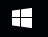

Подешавање радног окружења
===========================

.. infonote::

 На овом часу ћемо говорити о:
    •	изгледу радне површине;
    •	подешавању позадинске слике и миша;
    •	регионалним и језичким подешавањима.

Некада су људи куцали наредбе које је рачунар извршавао. Морали су да познају велики број наредби, понекад сложених и тешко разумљивих. 

Због тога су развијени **графички оперативни системи** који омогућавају да се са рачунаром комуницира путем слика. 

Први програм који се учитава када се укључи дигитални уређај је оперативни систем. На екрану ће се појавити **радна површина** (енгл. Desktop) на којој се могу наћи различити објекти (документи, фасцикле и програми), представљени малим сликама које се називају **иконе**. Радну површину можемо да прилагодимо потребама сваког корисника.
На следећој слици приказана је радна површина са најважнијим графичким елементима: прозор, икона, пречица, линија послова и информација о систему.

.. image:: ../../_images/L3S1.png
    :width: 800px
    :align: center  

На следећој слици је приказан прозор - основни визуелни елемент Windows-a и његови основни елементи.

.. image:: ../../_images/L3S2.png
    :width: 700px
    :align: center 

У овој лекцији, научићемо да променимо позадинску слику, прилагодимо карактеристике миша својим потребама и уредимо језичка и регионална подешавања. 

.. |settings| image:: ../../_images/L3S5.png
             :width: 30px

У контролној табли оперативног система који користимо, налазе се програми за системска подешавања. Постоји неколико начина како се приступа системским подешавањима. 

Први начин приступа системским подешавањима је клик на Старт дугме |start| (1). Отвара се старт мени у оквиру којег одабирамо опцију |settings| (2). Након одабира опције ``Settings`` отвара се прозор у коме се налазе различите опције за системска подешавања (3).

Поступак дат је на доњој слици.

.. image:: ../../_images/L3S3.png
    :width: 700px
    :align: center 

.. |lupa| image:: ../../_images/L3S6.png
            :width: 30px

.. |pretraga| image:: ../../_images/L3S7.png
                :width: 100px

.. |control| image:: ../../_images/L3S9.png
                :width: 100px

Други начин приступа системским подешавањима је клик на иконицу |lupa| у линији послова (1) и у пољу |pretraga| уношење речи ``Control`` (2) у листи претраге појављује се ``Control Panel`` (3). Левим кликом на |control| покрећемо прозор ``Control Panel`` (4) у коме се налазе различите опције за системска подешавања. 

Поступак дат је на доњој слици.

.. image:: ../../_images/L3S8.png
    :width: 800px
    :align: center 

Oпис поступка за приступ системским подешавањима можете погледати на доњем видеу:

.. ytpopup:: KQ8tYL31eHc
    :width: 735
    :height: 415
    :align: center

Подешавање позадинске слике 
----------------------------

Радно окружење треба да буде по твом укусу. Слика пријатног изгледа позитивно утиче на твоје расположење и мотивацију за рад.
Позадинску слику подешавамо у оквиру контролне табле оперативног система у опцији. 

.. |pozadinskaslika| image:: ../../_images/L3S10.png
                       :width: 80px

.. |pozadina| image:: ../../_images/L3S12.png
                :width: 100px

У прозору ``Settings`` је потребно да прво одаберемо опцију |pozadinskaslika|. Након тога, отвара се прозор као на доњој слици у коме подешавамо опције за постављање позадинске слике.

Прво одаберемо опцију |pozadina| (1), затим, из падајуће листе ``Background`` (2) одаберемо опцију ``Picture``. У делу ``Choose your picture`` можемо да одаберемо понуђене слике или да одаберемо жељену слику са свог рачунара, кликом на дугме ``Browse`` (3). На крају, из падајуће листе  ``Choose a fit`` (4) потребно је да одаберемо да слика попуњава цео екран одабиром опције ``Fill``.

.. image:: ../../_images/L3S11.png
    :width: 600px
    :align: center 

Опис поступка за промену позадинске слике можете погледати на доњем видеу:

.. ytpopup:: S2Vj9_j8PqU
    :width: 735
    :height: 415
    :align: center

Подешавање миша
----------------

Оперативни систем претпоставља да дигиталне уређаје користе особе које пишу десном руком. Због тога је особама које су леворуке веома тешко да користе миша подешеног за десноруке. Ако пишеш левом руком, у оквиру контролне табле оперативног система можеш да замениш функције левог и десног дугмета миша. 

.. |device| image:: ../../_images/L3S15.png
              :width: 100px
	 

.. |mouse| image:: ../../_images/L3S16.png
            :width: 150px

Потребно је да прво одаберемо опцију |device| (1), из падајуће листе |mouse| (2), затим одаберемо опцију ``Select your primary button`` (3) и на крају одаберемо опцију ``Right`` чиме смо миш прилагодили потребама леворуким особама.

.. image:: ../../_images/L3S17.png
    :width: 600px
    :align: center 

.. |advance| image:: ../../_images/L3S18.png
                :width: 150px

Други начин подешавања је одабир опције |advance| чиме се отвара прозор као на доњој слици.

.. image:: ../../_images/L3S19.png
    :width: 600px
    :align: center 

Означавањем опције Switch primary and secondary buttons миш је прилагођен потребама леворуких особа.

Да бисмо подесили брзину двоклика миша, користимо клизач како бисмо је подесили. Двокликом на фасциклу тестирамо подешавања миша. 

.. image:: ../../_images/L3S20.png
    :width: 600px
    :align: center 

Опис поступка за постављање примарног (главног) тастера миша и подешавање брзине клика можете погледати на доњем видеу:

.. ytpopup:: zw2ZJGQmEHI
    :width: 735
    :height: 415
    :align: center

Регионална и језичка подешавања 
-------------------------------

.. |dugme1| image:: ../../_images/L3S23.png
              :width: 50px

.. |jezik| image:: ../../_images/L3S21.png
              :width: 50px

.. |jezik1| image:: ../../_images/L3S22.png
              :width: 150px

Оперативни систем омогућава да тастатуру подесимо на писмо и језик који желимо. Тако, на пример, ако су на тастатури приказана слова енглеског алфабета, а језик подешен на српски, латинично писмо, након притиска тастера |dugme1| на екрану ће се приказати знак **č**. 
Језик и писмо подешавамо у оквиру контролне табле оперативног система.

Потребно је да у прозору ``Settings`` одаберемо опцију |jezik|. Отвариће се прозор као на доњој слици у коме је потребно да подесимо опције за регионална и језичка подешавања.

Након тога, потребно је да одаберемо опцију |jezik1| и у делу ``Languages`` са десне стране прозора, кликнемо на дугме ``Add a language``. Отвориће се прозор у коме можемо одабрати језик и писмо које желимо да додамо.

.. image:: ../../_images/L3S24.png
    :width: 600px
    :align: center 

Језик и писмо бирамо у делу обавештења и индикатора (енг. System tray), приказано на доњој слици:

.. image:: ../../_images/L3S23.png
    :align: center 

Опис поступка за промену језика тастатуре можете погледати на доњем видеу:

.. ytpopup:: 9jLy9okd1O4
    :width: 735
    :height: 415
    :align: center

.. infonote::

 **Шта смо научили?**
    •	да је радна површина место на коме постављаш програме и податке које често користиш;
    •	да су најважнији графички елементи: прозор, икона, пречица, линија послова и информација о систему
    •	да пречица има улогу да покаже путању до неког другог фајла или фолдера на диску или неког објекта у систему;
    •	да је икона визуелна репрезентација фајлова и фолдера.

