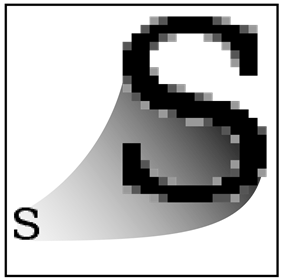
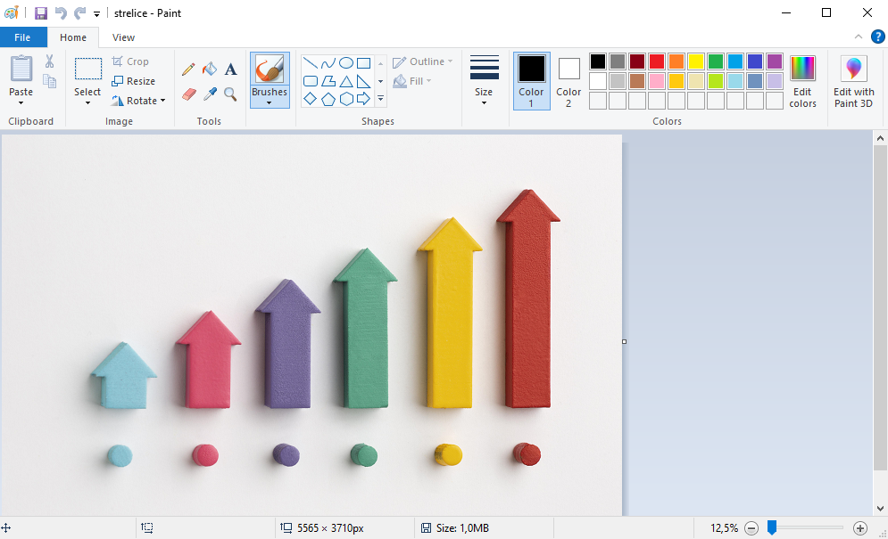

Рад са сликама 
==============

.. infonote::

 На овом часу ћемо говорити о:
    •	појму рачунарска графика;
    •	начину представљања слика у меморији рачунара (растерска графика);
    •	основним могућностима програма за уређивање слика;
    •	основним техникама рада у програму GIMP 2.

Скоро свакодневно можеш видети људе који користе паметне телефоне за фотографисање себе и своје околине. Осим помоћу паметног телефона дигиталне слике се могу преузети са интернета, настати као резултат поступка скенирања, снимак изгледа екрана или као резултат обраде и измена на већ постојећој слици.

За креирање, измене и чување слика користе се посебни програми. На пример, програм Paint је део оперативног система Windows и намењен је за рад са сликама. Помоћу ових програма можеш да промениш величину слике, додаш или обришеш неки облик или текст на слици, одсечеш део слике и слично. Осим програма инсталираних на рачунарима, данас често користимо програме инсталиране на паметним телефонима за уређивање слика и додавање различитих ефеката.

Посебна област рачунарства која се бави креирањем и обрадом слика и анимација у дигиталном облику назива се **рачунарска графика**.

Постоје два веома различита начина дигиталног записа слика. Један начин да слика буде записана у меморији дигиталног уређаја је да буде подељена у мале делове који су распоређени у редове и колоне. Овакав начин записивања слике познат је као **растерска графика**. Основни елемент слике код растерске графике назива се **пиксел**. У меморији се памти боја сваког појединачног пиксела слике. Слике креиране паметним телефоном су сачуване у растерском облику.

Број пиксела одређује квалитет дигиталне слике. Што је број пиксела на слици већи, слика је бољег квалитета. Број пиксела од којих се састоји слика назива се **резолуција**. Дакле, резолуција одређује квалитет слике, али и количину меморије коју слика заузима у дигиталном уређају.

Растерска слика је састављена од пиксела (понекад можеш чути и да се каже да је слика састављена од тачака) различитог нивоа осветљености или различитих боја. Што је већи број пиксела, то је квалитет слике бољи. Међутим, када се растерска слика увећа, број пиксела се не мења, тј. број пиксела остаје исти, а димензије слике су се промениле. Због тога слика губи на квалитету и често постаје мутна.
 

На доњој слици је дат приказ увећане растерске графика.

За рад са растерском графиком можемо користити програме као што су Microsoft Paint, Gimp, Adobe Photoshop и многе друге.

У петом разреду, бавићемо се основним техникама измене дигиталних слика у програму за растерску графику Gimp 2. Овај програм пружа бројне могућности за обраду слике, због чега га често упоређују са програмом Adobe Photoshop који користе професионални фотографи. Програм Gimp је бесплатан за преузимање и коришћење. Може се користити и под оперативним системима Windows и под оперативним системом Linux.

Да бисмо инсталирали Gimp 2 на кућном рачунару, потребно је да посетимо интернет страницу https://www.gimp.org/downloads/ и одатле покренемо инсталацију. 

Опис поступка инсталације програма за растерску графику Gimp 2 можете погледати на доњем видеу:

.. ytpopup:: -jSiYBv9WeU
    :width: 735
    :height: 415
    :align: center

На овом часу ћемо се бавити обрадом (уређивањем) дигиталне слике користећи постојеће слике или слике које сте направили употребом дигиталног уређаја. 

Отварање дигиталне слике 
------------------------

Поступак за отварање постојеће дигиталне слике је следећи:

1. Покрени програм Gimp 2;

2. Кликни на File → Open, а затим одабери жељену слику са рачунара;

3. Кликни на дугме Open.

Опис поступка отварања дигиталне слике у програму за растерску графику Gimp 2 можете погледати на доњем видеу:

.. ytpopup:: KK0tRQ26kN8
    :width: 735
    :height: 415
    :align: center

Сада ћемо на већ отвореној слици да применимо неколико техника. 

Промена димензија слике
-----------------------

Димензије слике могу бити изражене на различите начине (бројем пиксела, у центиметрима, милиметрима,..). 

Промену димензије слике вршимо тако што у изаберемо мени ``Image`` и у њему опцију ``Scale Image``. Где опција ``Width`` означава број пиксела по ширини, а ``Height`` број пиксела по висини слике.

.. image:: ../../_images/L5S8.png
    :width: 400px
    :align: center

Напомена: Ланчић, који се налази са десне стране димензија слике, омогућава да се обе димензије равномерно мењају (ако је ланчић укључен истовремено се мењају и ширина и висина слике). Кликом на ланчић раскидаш/повезујеш мењање димензија слике.

Опис поступка промене димензије слике у програму за растерску графику Gimp 2 можете погледати на доњем видеу:

.. ytpopup:: aulKLLd7Xk8
    :width: 735
    :height: 415
    :align: center

Промена оријентације слике
--------------------------

Често се дешава да дигитална слика није окренута онако како желимо.

Оријентацију слике мењамо у дијалогу ``Image`` користећи опцију ``Transform``.

.. image:: ../../_images/L5S9a.png
    :width: 750px
    :align: center

Опис поступка промене оријентације слике у програму за растерску графику Gimp 2 можете погледати на доњем видеу:

.. ytpopup:: v6XkSDLHIc8
    :width: 735
    :height: 415
    :align: center

Опсецање (кроповање) слике
--------------------------

Врло често се дешава да нам није потребна читава дигитална слика, већ само један њен део. Тада треба да применимо технику опсецања (кроповања слике). 

У програму Gimp, слику можемо да одсечемо на више начина. 

.. |krop| image:: ../../_images/L5S4.jpg
            :width: 30px

Овде су представљена два начина:

• Први начин: Одаберемо алатку за кроповање |krop|, означимо део слике који желимо да опсечемо и, на тастатури, притиснемо тастер Enter.
• Други начин: Означимо део слике коришћењем алатке за селекцију , а затим у менију ``Image`` одаберемо опцију ``Crop to Selection``.

Опис поступка одсецања дела слике у програму за растерску графику Gimp 2 можете погледати на доњем видеу:

.. ytpopup:: ckFV4T7Zlp0
    :width: 735
    :height: 415
    :align: center

Чување дигиталне слике
----------------------

Као и у већини програма, слику можемо да сачувамо и коришћењем опције ``File`` → ``Save Аs``. Слика је тада сачувана у формату **.xcf** и можемо да је отворимо само у програму Gimp. Ако је потребно наставити рад на слици онда је можеш сачувати на овај начин. Међутим, овај формат није погодан за убацивање слике у друге текстуалне документе и мулитимедијалне презентације или за објављивање на интернету.

За чување слике у .jpg или .png формату у програму Gimp користи се опција ``File`` → ``Export Аs``. Код примене ове опције потребно је поставити квалитет слике (на пример на 100), а затим кликнути на дугме ``Export``.

Препоручујемо ти да за чување слика користиш опцију ``File`` → ``Export Аs``. Након што изабереш ову опцију отвара се прозор у којем бираш име слике и место у рачунару на којем ће слика бити сачувана. Када кликнеш на дугме ``Export`` (1), отвориће се прозор у оквиру којег бираш ниво квалитета слике. У зависности од вредности коју постављамо коришћењем клизача (2) одређујемо квалитет слике. Кликом на дугме ``Export`` (3), слика ће бити сачувана на одабраном месту.

.. image:: ../../_images/L5S7.png
    :width: 600px
    :align: center

Опис поступка чувања дигиталне слике у програму за растерску графику Gimp 2 можете погледати на доњем видеу:

.. ytpopup:: qQ6cMiMe-Q4
    :width: 735
    :height: 415
    :align: center

Веома је важно нагласити да квалитетна дигитална слика заузима више меморијског простора од мање квалитетнe.

Онлајн програми за уређивање слика
----------------------------------

Понекад ти може затребати да измениш слику на рачунару на којем нема инсталираног програма Gimp, а немаш ни дозволу да инсталираш нови програм. На пример, ако радиш на пројекту у школској библиотеци или користиш рачунар родитеља за израду презентације.

Уколико на рачунару постоји инсталиран програм Paint онда у њему можеш урадити основне корекције слике: отварање дигиталне слике (опција ``File`` → ``Open``), промена димензија (опција ``Resize``), промена оријентације слике (``Rotate``), опсецање (опција ``Crop``) и чување дигиталне слике у одабраном формату (опција ``File`` → ``Save As``).

Такође, основне измене слике можеш урадити у неком од онлајн програма за уређивање дигиталних слика. Ове програме није потребно инсталирати и доступни су са било ког рачунара који има приступ интернету. Неки од ових програма су бесплатни за коришћење (на пример, програм Pixlr који је доступан на веб-адреси https://pixlr.com/rs/)

.. image:: ../../_images/L5S10.png
    :width: 700px
    :align: center

.. infonote::

 **Шта смо научили?**
    •	да је рачунарска графика стварање и приказивање слика уз помоћ рачунара;
    •	да број пиксела одређује квалитет дигиталне слике;
    •	да је растерска графика изграђена је од пиксела;
    •	да програм Gimp даје бројне могућности за обраду слика и бесплатан је за коришћење;
    •	да се у онлајн програмима за уређивање слика могу урадити основне измене слике: промена димензија, промена оријентације слике, опсецање (кроповање) и чување дигиталне слике у одабраном формату.

