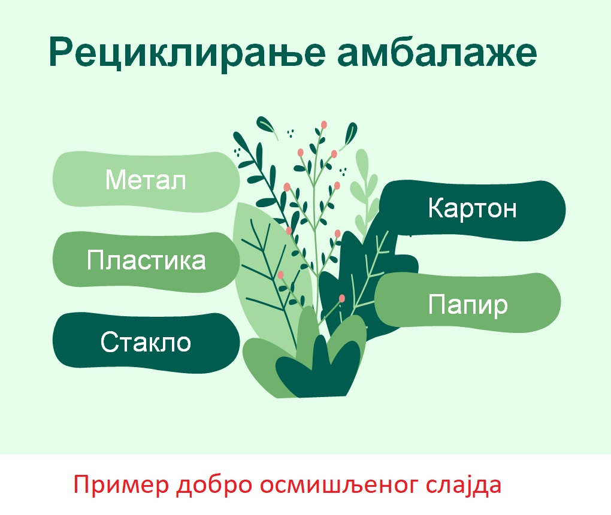
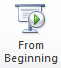
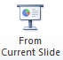

Мултимедијалне презентације
============================

.. infonote::

 На овом часу ћемо говорити о:
    •	појму мултимедијaлана презентација;
    •	одликама квалитетне мултимедијaлане презентације;
    •	креирању мултимедијaлних презентација.

Појам презентација означава процес представљања неке теме публици. Током презентације, презентер користи помоћна средства (најчешће рачунар) да би што боље објаснио садржај о коме говори и појачао утисак који оставља на публику. Рачунар доприноси квалитету презентације зато што обезбеђује мултимедијалност – омогућава представљање информација не само у виду текста и графике (слика), већ и у облику звука, видео-записа и анимираних (покретних) слика.

На овом часу ћемо се бавити дигиталним мултимедијалним презентацијама у смислу њиховог садржаја и начина на који се могу креирати.

Програми за креирање мултимедијалних презентација настали су као подршка и допуна излагању презентера. У овим програмима креирамо слајдове (енг. Slides). **Слајд** представља једну страницу презентације. Због тога се за мултимедијалне презентације користи и назив **слајд-презентације**.

Презентација може да садржи више слајдова. Важно је нагласити да слајдови не смеју да буду важнији од презентера. Присутна публика је дошла са намером да чује оно што презентер говори. Способност да презентер исприча причу и пренесе основну поуку приче не треба да остане у сенци компликованих и претрпаних слајдова.

Да би презентација заиста допринела квалитету представљања неке идеје, тј. преношењу одређене поруке, пожељно је да садржи 10 до 12 слајдова. Број слајдова ипак зависи од намене презентације, дужине трајања излагања, као и публике којој је презентација намењена.

При њеном креирању, треба да поштујеш следећа четири принципа:

•	користи слике уместо текста;
   
•	један слајд, једна порука; 

•	избегавати набрајања;
  
•	нека буде што једноставније.

Међутим, не значи да је презентација квалитетна, ако је једноставна.

Мултимедијална презентација има сврху само ако на примерен начин подржава твоје усмено излагање. На следећим сликама можеш видети пример једног лоше направљеног слајда са превише текста и један добро осмишљен слајд.

.. image:: ../../_images/L9S18.png
    :width: 300px
    

    
Ипак успех презентације зависи не само од изгледа, већ и од начина на који је садржај презентован. Код примера добро направљеног слајда презентер може само да прочита материјале који се могу рециклирати што би био лош начин презентовања. Боље је да за сваки материјал наброји примере амбалаже која се може рециклирати, а уколико жели да укључи публику може да тражи од слушалаца да и они кажу неке примере амбалаже која се може рециклирати.

Да би порука оставила на публику жељени утисак, потребно је да:

•	добро проучимо тему коју презентујемо, тачније о којој говоримо;

•	увежбамо усмено излагање, најбоље пред укућанима или огледалом (текст не треба да се учи напамет);

•	током излагања важно је остварити контакт очима са публиком, да се осмехујемо и гестикулирамо;

•	не читамо са слајдова;

•	током презентације не окрећемо леђа публици;

•	оставимо публици довољно времена за питања (ако не знамо одговор на неко питање, покушаћемо да пронађемо одговоре).

У петом разреду креираћемо једноставне мултимедијалне презентације. Оне ће се састојати од слајдова који садрже текст, слике, звучне и видео-записе.

Програми за креирање презентација су бројни. Најчешће коришћен је Microsoft Power Point из пакета MS Оffice. 

Као и за MS Word, за коришћење MS Power Point-а потребна је лиценца (програм се плаћа). Поред Power Point-а, често се користи бесплатни програм Libre Office Impress, као и сервис Гугл Презентације (енг. Google Slides). 

Јако је важно разумети да, ако знамо да радимо у једном од оваквих програма, стичемо знања и вештине за рад у другим програмима исте намене.

Програм MS Power Point у Windows оперативном систему покрећемо кликом на Start → All Programs → Microsoft Office → Microsoft Office Power Point.

Отвориће се радно окружење које садржи само један, празан слајд. 

На слајд можемо да поставимо текст, слике, звучне и видео-записе.

Нови слајд додајеш кликом на дугме **New Slide**. У падајућој листи, испод дугмета New Slide, можемо да одаберемо распоред елемената (текста, слика, звучних и видео-записа) на слајду. На пример, можемо изабрати да слајд садржи само наслов и поднаслов или слику и текст и слично.
 
.. image:: ../../_images/L9S1.png
    :width: 800px
    :align: center

Текст који се уноси на слајд можемо да едитујемо и форматирамо на исти начин као и у програму за обраду текста.

Слику (1), видео-запис (2) и звук (3) додајемо на слајд користећи опције на картици **Insert**.
 
.. image:: ../../_images/L9S3.png
    :width: 800px
    :align: center

Опис поступка додавања новог слајда и уређивање слајдова у мултимедијалној презентацији можете погледати на доњем видеу:

.. ytpopup:: PYx59pBNloo
    :width: 735
    :height: 415
    :align: center

Слику у презентацију додајемо на исти начин као и у програму за обраду текста.

Опис поступка додавања слика у мултимедијалној презентацији можете погледати на доњем видеу:

.. ytpopup:: 2o-tzRQJOeg
    :width: 735
    :height: 415
    :align: center

Аудио фајл можемо додати из фасцикле са рачунара или неког спољњег уређаја:
 
.. image:: ../../_images/L9S4.png
    :width: 800px
    :align: center
  	
У презентацију можемо да додамо глас који смо снимили помоћу паметног телефона, али можемо и да снимимо глас директно из програма коришћењем опције ``Record Audio``. Да бисмо снимили глас потребно је да имамо микрофон. 

.. image:: ../../_images/L9S5.png
    :width: 600px
    :align: center

Када једном уметнемо аудио датотеку, можемо је мењати. На пример, можемо да подесимо да се звук пушта на свим слајдовима, а не само на једном. То се ради опцијама које се налазе у менију Playback.
 
.. image:: ../../_images/L9S6.png
    :width: 800px
    :align: center

Опис поступка за уметање звука у програму за креирање мултимедијалних презентација можете погледати на доњем видеу:

.. ytpopup:: OwAUUkZo3yA
    :width: 735
    :height: 415
    :align: center

На сличан начин у презентацију се може додати видео-запис. Видео датотеку можемо да додамо из фасцикле са рачунара или неког спољњег уређаја:

.. image:: ../../_images/L9S7.png
    :width: 800px
    :align: center
 
Неки сајтови, као што је Youtube дозвољавају да се видео запис дода (угради) на слајдове. Овај начин додавања видео датотека је погодан ако желимо да смањимо величину датотеке презентације. Међутим, сваки пут када користимо презентацију у којој је уграђен видео-запис, рачунар мора да буде повезан са интернетом како би видео могао да буде пуштен. 
Као и код звука и видео датотеку можеш да репродукујеш аутоматски или кликом на њу.

Опис поступка за уметање видео-записа у програму за креирање мултимедијалних презентација можете погледати на доњем видеу:

.. ytpopup:: y-7Qp_FWNuM
    :width: 735
    :height: 415
    :align: center

Кликом на картицу **File**, која се налази у горњем левом углу прозора, добијаш могућност да сачуваш презентацију, али и да креираш нову или отвориш постојећу.

.. image:: ../../_images/L9S8.png
    :width: 500px
    :align: center

Опис поступка за чување мултимедијалне презентације можете погледати на доњем видеу:

.. ytpopup:: p6ImC-1gr0k
    :width: 735
    :height: 415
    :align: center

**Напомена:** Да би презентација радила и на другим дигиталним уређајима, пожељно је да звучне и видео записе сместимо у исту фасциклу где се налази презентација. 

Презентацију чувамо пратећи поступак као на доњој слици File (1) → Save & Send (2) → Package Presentation for CD (3) → Package for CD (4) → именујемо презентацију (5) → одаберемо дугме Copy to Folder (6).  

Опис поступка за чување мултимедијалне презентације за рад на различитим дигиталним уређајима можете погледати на доњем видеу:

.. ytpopup:: xKui0wev_QM
    :width: 735
    :height: 415
    :align: center

.. image:: ../../_images/L9S9.png
    :width: 700px
    :align: center

.. |googletaster| image:: ../../_images/L9S12.png
            :width: 100px

Презентацију покрећемо:

•	помоћу тастатуре, притиском на тастер ``F5``

•	одабиром опције ``Slide Show`` → ``From Beginning`` |taster1| 

•	одабиром опције ``Slide Show`` → ``From Current Slide`` |taster2|

Креирање презентација могуће је и на мобилном уређају. На пример, помоћу апликације Гугл презентације |googletaster|.

Апликацију можеш преузети и инсталирати на свом мобилном уређају. Ипак да би коришћење ове апликације било могуће, неопходно је да ти помогне наставник, родитељ или одрасла теби блиска особа тако што ће да унесе адресу електронске поште (енг. email). 

На доњој слици су приказане акције креирања нове презентације, додавања слајдова,  уметања слике, текста и именовање фајла у апликацији Гугл презентације.

.. image:: ../../_images/L9S13.png
    :width: 700px
    :align: center

Ова презентација аутоматски се чува и на уређају и у облаку података везаном за имејл адресу која се користи. 

Презентацију приказујеш кликом да дугме |play|.

Као и у случају апликације Гугл Документи, рад на презентацији може да буде сараднички. Довољно је да унесемо имејл адресу друга или другарице, доделимо право мењања презентације и пошаљемо позив за заједнички рад. 

.. image:: ../../_images/L9S15.png
    :width: 250px
    :align: center

Презентације креирану на овај начин можемо да сачувамо у различитим форматима. 

.. image:: ../../_images/L9S16.png
    :width: 250px
    :align: center
 
Опис поступка креирања мултимедијалне презентације у Гугл презентацији можете погледати на доњем видеу:

.. ytpopup:: UzCy4AcyzYg
    :width: 735
    :height: 415
    :align: center

.. infonote::

 **Шта смо научили?**
    •	да je презентација процес представљања неке теме публици;
    •	да је мултимедијална презентација представљање информација у виду текста, графике (слика), звука, видео-записа и анимираних (покретних) слика;
    •	да се презентације састоје од слајдова;
    •	да je слајд страница презентације;
    •	да успех презентације не зависи само од изгледа, већ и од начина на који је садржај презентован;
    •	да садржаји слајдова треба да су у складу са следећа четири принципа: користи слику уместо текста, један слајд, једна порука, избегавати набрајања и да буде што једноставнија.