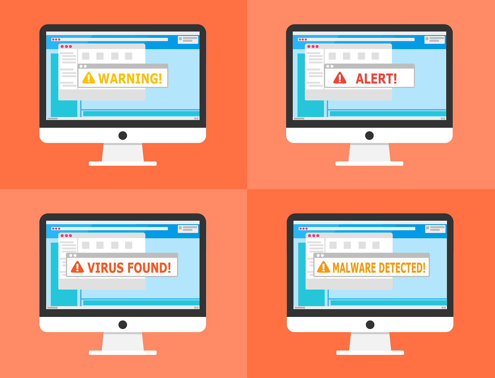
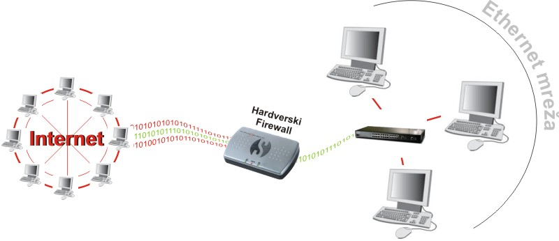

Функције антивирус програма и заштитног зида
=============================================

.. infonote::

 У овој лекцији ћемо говорити о:
    •	злонамерним програмима којима смо изложени док смо на интернету;
    •	начинима заштите програма и података од злонамерних програма и функцији заштитног зида;
    •	разликовању безбедног од небезбедног и пожељног од непожељног понашања на Интернету;
    •	исправном реаговању када се дође у контакт са непримереним садржајем или са непознатим особама путем Интернета.

Све време док смо повезани на интернет изложени смо претњи по нашу безбедност од стране злонамерних програма – малвера (енгл. Malware) који могу изазвати различита оштећења на нашем рачунару, попут брисања датотека или дестабилизације и квара оперативног система.
У злонамерне програме спадају рачунарски вируси, црви, тројанци, шпијунски програми и друге врсте злонамерних програма.

**Рачунарски вируси** су програми који имају способност самореплицирања, односно сами се умножавају у другим датотекама са којима долазе у контакт. Могу се налазити у било којој датотеци или програму и заразити их, тако да измене садржај тих датотека и у њих копирају свој програмски кôд. 
У овом случају каже се да је рачунар „инфициран”, а након тога вируси могу лако да се прошире и на друге рачунаре у мрежи, често користећи електронску пошту. Рачунарски вируси су названи по биолошким вирусима зато што у почетку инфицирају мало ресурса, реплицирају се и не могу да постоје без “домаћина”. 
Рачунарски вируси представљају озбиљан проблем безбедности рада на рачунару. Познати вирус „Мелиса”, први вирус који се налазио у прилогу електронске поруке, од свог првог издања 1991. године проузроковао је штету која се мери десетинама милиона долара. 
Сваке године се појављује десетине хиљада нових вируса које креирају хакери како би демонстрирали своју моћ над системом, а и најбезазленији вируси могу да проузрокују несагледиве штете које се могу мерити милионима долара.

**Црви** су злонамерни софтвер који се често преноси путем електронске поште и који узрокују озбиљна загушења мреже, а могу да униште датотеке. Досад најразорнији црв који је изазвао  осамдесет седам милијарди долара штете познат је под именом „Ајлавју”(ILOVEYOU). 

Постоје бројне врсте вируса и црва. Злонамерни софтвер који често користе криминалци да би приступили другим рачунарима и проузроковали проблеме познат је под именом “Тројански коњ” или “тројанац”. 
**Тројанац** је програм који криминалци постављају на наш рачунар без нашег знања да би преузели управљање нашим рачунаром, шпијунирали наше личне датотеке, брисали садржаје са нашег рачунара или укључили веб-камеру а да ми то не желимо.

**Шпијунски програми** познати под називом **спајвер** (енгл. spyware) представљају бројне штетне програме са наменом да делимично пресрећу или преузимају контролу над рачунаром без нашег знања или дозволе. 
Иако нам сам назив говори да је реч о програмима који надгледају рад корисника, овај назив означава бројне врсте програма који искоришћавају наш рачунар за стицање користи за неку трећу особу, који без наше дозволе шаљу информације неком о томе шта радимо на мрежи, прате наше активности док претажујемо интернет, инсталирају се сами на наш рачунар и могу мењати датотеке на њему. 
Шпијунски програми се разликује од вируса и од црва по томе што се обично не реплицирају. Као многи нови вируси, шпијун је створен да искоришћава заражене рачунаре ради комерцијалне добити. Обично се манифестује као приказивање искачућих огласа (нежељена порука рекламног садржаја зове се спам), крађа личних података (укључујући и финансијске податке као што су бројеви кредитних картица и лозинке), праћење активности на интернету за маркетиншке сврхе или преусмеравање наших претрага на странице са огласима и рекламама. 
У неким случајевима, шпијун се користи за проверавање придржавања услова лиценце за коришћење програма. Инфицирање се у највећем броју случајева догађа приликом отварања страница са нелегалним или порнографским садржајем.
Постоје програми који се користе за неутрализовање шпијунских програма, попут Microsoft Antispyware, Adware CE Proffesional и других.

.. image:: ../../_images/virus.jpg
   :width: 450px   
   :align: center 

Ради заштите од нежељеног малициозног софтвера потребно је да на нашем рачунару имамо инсталиран **програм за заштиту од вируса** који се назива **антивирус** а представља програм који је покренут на рачунару и ради у позадини и све време проверава све долазне и одлазне датотеке на вирусе. Антивирус програми који пружају висок степен заштите од свих малициозних софтвера нису бесплатни већ се морају купити. 
Међутим, постоје и неке бесплатне верзије тих програма са ограниченом функционалношћу које пружају само основну заштиту и које се обично могу надоградити плаћањем до већих нивоа заштите. Без обзира на то о ком антивирусном програму се ради, он се треба стално ажурирати односно свакодневно допуњавати новим допунама у борби против нових вируса. 
У познатије антивирусне програме спадају Симантек антивирус (Symantec Anti-Virus) http://www.symantic.com, Мекафи Вирусскен® (McAfee VirusScan®) http://us.mcafee.com и АВГ антивирус (AVG Anti-Virus) http://www.grisoft.com. Бесплатни антивирусни програм јесте Avast. Препоручују га као сасвим солидну заштиту рачунара од вируса и другог злонамерног софтвера (https://www.avast.com/index).

Поред коришћење неког од доступних антивирус програма, потребно је придржавати се мера безбедног начина рада на интернету. Неке од њих су:
* Антивирусни програм треба да је увек укључен и да је ажуриран. Програм сетреба подесити да аутоматски скенира рачунар у време када се мање користи како не би успоравао рад рачунара,
* Не треба отварати прилоге електронских порука уколико они нису нешто што очекујемо да добијемо,
* Софтвер треба куповати само од проверених добављача односно преузимати са поузданих сајтова. Треба проверити компанију пре него што се од ње купи или преузме било који софтвер.
* Оперативни систем који се користи треба да буде ажуриран са безбедносним закрпама.

У оквиру оперативног система Виндоуз 10 (Windows 10) постоји компонента за борбу против злонамерних програма Виндоуз дифендер антивирус (Windows Defender Antivirus – Заштитник од вируса) која штити рачунар од вируса, шпијунског софтвера и другог злонамерног софтвера. Заштитник се покреће из Центра за безбедност Windows заштитника.

Заштитни зид
------------

**Заштитни зид** (енгл. firewall – пожарни, заштитни зид) у рачунарству је добио назив по пожарним зидовима који штите од пожара. У рачунарској мрежи заштитни зид је софтвер и/или хардвер који се инсталира да би заштитио мрежу од претњи са интернета. 
Он прати саобраћај на мрежи у којој се налази и дозвољава само одређеним информацијама да прођу кроз мрежу чиме спречава све опасне програме да са интернета продру у наш рачунар.
Заштитни зидови могу бити:
* Програми (софтверски зид, лични заштитни зид, десктоп зид). Основни заштитни зид јесте Заштитни зид Windows. У оквиру оперативног система Виндоуз 10 (Windows 10) постоји компонента Заштитни зид Windows (Windows Firewall) која помаже да се наш рачунар заштити од тога да му преко интернета или мреже приступају друге особе или злонамерни програми. 
Центар за безбедност Windows има три компоненте: Заштитни зид и мрежна заштита, Заштита од вируса и претњи и Перформансе и исправност уређаја. 
Центру за безбедност Windows приступа се на следећи начин: Поставке/Windows Defender/Отвори Центар за безбедност Windows заштитника (енгл. Settings/Windows Defender/Open Windows Defender Security Center).
Заштитни зид Windows може се заменити другим личним заштитним зидом по избору који се може преузети са интернета и који може бити и бесплатан.
Заштитни зид у облику програма може се наћи на следећим локацијама:
Symantec Firewall: http://www.symantec.com, 
McAfee Personal Firewall: http://us.mcafee.com, 
Kerio Personal Firewall: http://www.kerio.com 
и другим.

* Хардверски заштитни зидови се постављају као додатак личним заштитним зидовима, обично у пословним мрежама.

Добро је знати да постојање само заштитног зида није довољно да пружи пуну безбедност, али представља прву линију одбране. Неке од ситуација у којима заштитни зид не штити јесу:
 * од корисника других рачунара којима је дозвољен приступ твом рачунару,
 * ако је искључен,
 * од већине вируса,
 * од нежељене поште,
 * од шпијунских програма и друге.

Због тога наш рачунар мора увек бити заштићен и антивирусним програмом и заштитним зидом. Данас су те компоненте су постале делови оперативних система.